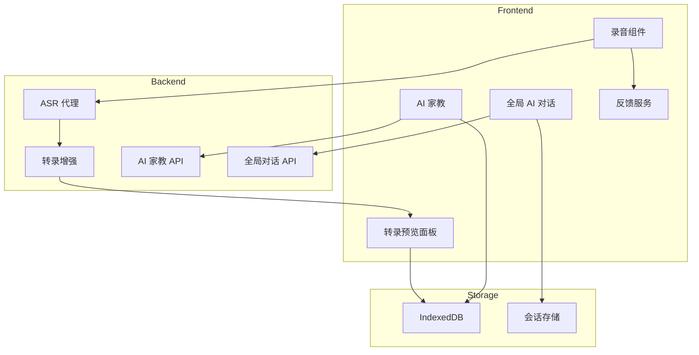

## 用户需求

用户需要对 MeetMind 课堂录音助手进行全面的用户体验升级，解决以下核心问题：

## 产品概述

MeetMind 是一款课堂对齐的 AI 家教应用，帮助学生在课堂上实时录音、标记困惑点，并通过 AI 辅导解决学习问题。当前存在多处影响用户体验的设计问题，需要系统性优化。

## 核心问题

### 1. 录音页面转录显示限制

- 实时转录预览区只显示最近 8 句（`transcript.slice(-8)` 硬编码）
- 预览区高度固定 160px（`max-h-40`），无法查看完整内容
- 用户录音时无法回看之前的转录内容

### 2. ASR 转录准确率不足

- 直接使用阿里云百炼 ASR 输出，无后处理机制
- 缺乏文本纠错、断句优化、标点修正等增强手段
- 专业术语和口语化表达识别准确率较低

### 3. AI 对话功能限制

- 只有标记困惑点后才能开始 AI 对话（必须有 breakpoint）
- 上下文仅取困惑点前 90 秒 + 后 60 秒（共 2.5 分钟），缺乏完整课堂上下文
- 没有全局 AI 对话入口，用户必须先标记困惑点

### 4. 复习页面体验问题

- 无困惑点时 AI 家教区显示空状态，缺乏引导
- 移动端 AI 入口隐藏在菜单中，发现成本高
- 复习模式空状态无明确提示和操作引导

### 5. 其他体验细节

- 困惑点标记无即时反馈（缺少音效或振动）
- 录音结束后无明确引导去复习
- 会话历史无法删除/重命名
- 访客模式数据无法迁移到登录用户

## 技术栈

- **前端框架**: Next.js 14 + React 18 + TypeScript
- **状态管理**: Zustand + SWR
- **样式方案**: Tailwind CSS + CSS Variables
- **本地存储**: IndexedDB (Dexie.js)
- **ASR 服务**: 阿里云百炼 ASR + 后端 WebSocket 代理
- **LLM 服务**: 通义千问系列模型

## 实现方案

### 1. 录音页面转录显示优化

**问题根因**: `Recorder.tsx` 第 732 行硬编码 `slice(-8)` 限制显示数量，预览区固定高度不可扩展。

**解决方案**:

- 添加可展开的转录预览面板，默认显示最近 5 条
- 点击展开可查看全部转录，支持滚动和搜索
- 使用虚拟滚动优化大量转录时的渲染性能
- 添加「当前 N 条」指示器和一键回到最新按钮

### 2. ASR 转录增强服务

**问题根因**: `dashscope-asr-service.ts` 直接使用 ASR 原始输出，无后处理。

**解决方案**:

- 新建 `transcript-enhancer.ts` 转录增强服务
- 后端调用 LLM 进行批量转录优化（非流式场景）
- 实现文本纠错、标点修正、断句优化
- 流式场景下在句子结束时进行轻量优化
- 保持原始文本与优化文本的映射关系

### 3. 全局 AI 对话功能

**问题根因**: `AITutor.tsx` 第 666-677 行在无 breakpoint 时显示空状态，`route.ts` 仅取 2.5 分钟上下文。

**解决方案**:

- 新增全局 AI 聊天入口，无需困惑点即可开始对话
- 创建 `GlobalAIChat` 组件，支持基于完整课堂上下文的自由对话
- 扩展 `tutor/route.ts` API，支持全局上下文模式
- 采用分段上下文策略：优先使用完整转录摘要 + 相关段落
- 智能上下文选择：根据用户问题动态检索相关转录片段

### 4. 用户体验细节优化

**即时反馈**:

- 困惑点标记添加音效（`public/sounds/anchor-mark.mp3`）
- 移动端添加振动反馈（`navigator.vibrate`）
- 添加视觉动画反馈（脉冲动画）

**引导优化**:

- 录音结束后显示引导弹窗，引导进入复习模式
- 复习模式空状态添加功能说明和操作入口
- 移动端首页添加悬浮 AI 对话入口

**会话管理**:

- 会话历史支持重命名和删除
- 添加确认弹窗防止误删

### 5. 数据迁移支持

**访客数据迁移**:

- 登录后检测本地匿名数据
- 提供一键迁移功能，将访客数据关联到登录用户
- 迁移完成后清理匿名数据

## 实现注意事项

### 性能优化

- 转录列表使用虚拟滚动，避免大量 DOM 节点
- LLM 转录优化采用批量处理，避免频繁请求
- 全局上下文使用摘要 + 检索策略，控制 token 消耗

### 向后兼容

- 所有 API 扩展保持向后兼容，不传新参数时行为一致
- 数据库升级使用 Dexie 版本迁移机制
- 渐进增强：新功能作为可选项，不强制用户使用

### 日志与错误处理

- 复用现有 console.log 日志模式
- 转录增强失败时静默降级到原始文本
- 用户操作错误给出友好提示

## 架构设计



## 目录结构

```
src/
├── components/
│   ├── Recorder.tsx                    # [MODIFY] 优化转录预览面板，添加展开/收起功能，添加困惑点标记反馈
│   ├── AITutor.tsx                     # [MODIFY] 优化空状态显示，添加全局对话入口提示
│   ├── GlobalAIChat.tsx                # [NEW] 全局 AI 对话组件，支持无困惑点自由对话
│   ├── TranscriptPreviewPanel.tsx      # [NEW] 可展开的转录预览面板组件，支持虚拟滚动
│   ├── RecordingCompleteModal.tsx      # [NEW] 录音完成引导弹窗组件
│   ├── SessionHistoryList.tsx          # [MODIFY] 添加重命名和删除功能
│   └── mobile/
│       ├── MobileAIFab.tsx             # [NEW] 移动端悬浮 AI 对话按钮
│       └── DedaoMenu.tsx               # [MODIFY] 优化 AI 助教入口可见性
├── lib/
│   ├── services/
│   │   ├── transcript-enhancer.ts      # [NEW] 转录文本增强服务，LLM 纠错优化
│   │   ├── feedback-service.ts         # [NEW] 用户反馈服务（音效、振动）
│   │   └── data-migration-service.ts   # [NEW] 访客数据迁移服务
│   └── db/
│       └── schema.ts                   # [MODIFY] 添加数据迁移状态表
├── app/
│   ├── api/
│   │   ├── tutor/
│   │   │   └── route.ts                # [MODIFY] 扩展支持全局上下文模式
│   │   └── transcript-enhance/
│   │       └── route.ts                # [NEW] 转录增强 API
│   └── (main)/
│       └── app/
│           └── page.tsx                # [MODIFY] 集成全局对话入口、录音完成引导
└── public/
    └── sounds/
        └── anchor-mark.mp3             # [NEW] 困惑点标记音效文件
```

## 关键代码结构

```typescript
// 全局 AI 对话 API 扩展参数
interface GlobalChatRequest {
  sessionId: string;
  segments: TranscriptSegment[];
  model?: string;
  studentQuestion: string;
  // 新增：全局对话模式，使用完整上下文
  globalMode?: boolean;
  // 新增：上下文策略
  contextStrategy?: 'full' | 'summary' | 'retrieval';
}

// 转录增强服务接口
interface TranscriptEnhancer {
  // 批量优化转录文本
  enhanceBatch(segments: TranscriptSegment[]): Promise<TranscriptSegment[]>;
  // 单句优化（轻量级）
  enhanceSingle(text: string): Promise<string>;
}

// 反馈服务接口
interface FeedbackService {
  // 播放音效
  playSound(type: 'anchor-mark' | 'success' | 'error'): void;
  // 触发振动
  vibrate(pattern: number | number[]): void;
}
```

## Agent Extensions

### Skill

- **frontend-design**
- Purpose: 设计新增的全局 AI 对话组件、转录预览面板和录音完成引导弹窗的 UI
- Expected outcome: 生成符合现有项目风格的高质量组件代码

- **vercel-react-best-practices**
- Purpose: 确保新增组件遵循 React/Next.js 性能最佳实践
- Expected outcome: 虚拟滚动、代码分割、状态管理等方面符合性能标准

### SubAgent

- **code-explorer**
- Purpose: 在实现过程中探索相关代码依赖和调用链
- Expected outcome: 确保修改不会破坏现有功能，找到复用机会