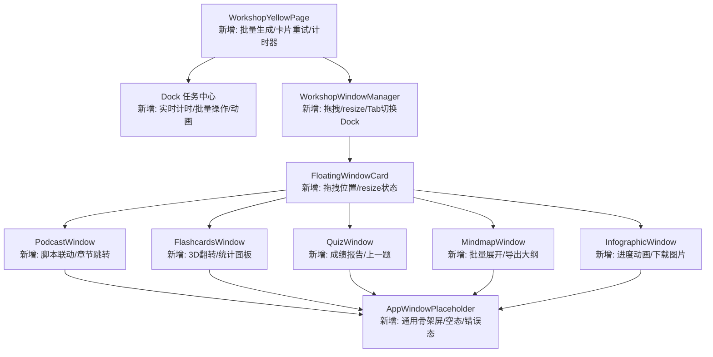

## 产品概述

全面优化 MeetMind AI工坊（应用矩阵）的用户体验，以功能完整度为优先，补齐各环节缺失的交互能力，同时提升视觉质感和状态反馈的丰富度。

## 核心特性

### 1. 黄页卡片交互增强

- 卡片增加"一键全部生成"批量操作按钮，可同时触发所有未生成应用的后台任务
- 生成中状态显示已耗时计时器（如"生成中 12s"），让用户对进度有预期
- 卡片已生成状态支持直接点击卡片区域快速进入应用窗口
- 失败状态在卡片内直接提供"重试"按钮，无需通过任务中心操作

### 2. 加载态/空态/错误态体验升级

- 所有5个应用窗口（播客/闪卡/测验/导图/信息图）的 loading 状态替换为骨架屏动画，取代纯文字"正在生成..."
- 空态提供友好引导文案和操作按钮（如"返回黄页重新生成"），取代简单的"未获得...请重新生成"
- 独立应用页 `/app/matrix/[appKey]` 的 loading/empty/error 三种状态增加图标和更完善的引导

### 3. 任务中心 Dock 增强

- 运行中的任务显示实时耗时计数和预估剩余时间提示（普通应用约90s，播客约300s）
- Dock 面板增加"全部重试失败任务"和"清除已完成"批量操作
- 运行中任务增加脉冲动画指示器

### 4. 浮动窗口交互增强

- 浮动窗口支持拖拽标题栏移动位置（mousedown/mousemove 实现，记忆位置到 state）
- 浮动窗口支持通过右下角拖拽调整大小
- 多窗口间增加标签页式切换 Dock，快速在已打开窗口间切换焦点

### 5. 应用窗口内容渲染优化

- **播客窗口**：脚本面板默认展开；增加当前播放进度与脚本行高亮联动；播放器下方增加章节快速跳转按钮组
- **闪卡窗口**：增加翻转卡片动画（CSS 3D transform）；训练完成后显示统计总结面板（掌握/一般/待加强分布）
- **测验窗口**：全部作答完成后显示成绩报告面板（正确率、用时、错题分布）；增加"上一题"导航按钮
- **思维导图窗口**：增加全部展开/全部收起切换按钮；增加导出文本大纲功能
- **信息图窗口**：生图过程增加进度提示动画；支持下载生成的图片

## 技术栈

- **框架**：Next.js 14 + React 18 + TypeScript
- **样式**：Tailwind CSS 3.4 + CSS Modules（黄页使用 module.css，窗口组件使用 Tailwind）
- **组件库**：Radix UI 原语（项目已安装完整 Radix UI 套件）+ Lucide React 图标
- **状态管理**：React hooks + localStorage 缓存 + storage 事件跨 Tab 同步
- **动画**：Tailwind 内置 animation + 自定义 keyframes（项目已有 fade-in、slide-up、scale-in 等）
- **提示库**：sonner toast

## 实现方案

### 整体策略

以"功能完整度优先"为指导，按组件层级自底向上优化：先建立通用的骨架屏/空态/错误态复用组件，再逐个增强各应用窗口的交互，最后统一提升黄页和浮动窗口管理器的能力。

### 关键技术决策

**1. 通用状态占位组件**
新建 `AppWindowPlaceholder` 通用组件，接收 `status: 'loading' | 'empty' | 'error'` 和可选的 `onRetry`/`onBack` 回调，统一 5 个窗口的非正常态渲染。骨架屏使用 Tailwind `animate-pulse` + 圆角色块模拟内容布局，避免引入额外依赖。

**2. 浮动窗口拖拽**
在 `FloatingWindowCard` 的 header 区域注册 `onMouseDown` 启动拖拽，通过 `useState` 维护 `{x, y}` 偏移量，`useEffect` 在 document 上监听 mousemove/mouseup。使用 `transform: translate(dx, dy)` 而非修改 top/left，确保 GPU 加速不触发 layout reflow。窗口大小调整使用右下角 resize handle 同理实现。

**3. 播客脚本联动**
在 `PodcastWindow` 中监听 audio `timeupdate` 事件，通过二分查找匹配当前播放时间对应的脚本行 index，使用 `scrollIntoView({ behavior: 'smooth', block: 'center' })` 自动滚动并高亮当前行。

**4. 闪卡翻转动画**
使用 CSS `perspective` + `rotateY(180deg)` 实现 3D 翻转效果，正面/背面分别作为 `backface-visibility: hidden` 的两层，通过 `flipped` state 切换 transform class。

**5. 批量操作**
黄页的"一键全部生成"遍历 `visibleApps`，过滤掉已在运行中和已生成的应用，对剩余应用依次调用 `runInBackground`，每个调用间增加 200ms 延迟避免瞬间并发压力过大。

**6. Dock 实时计时**
运行中任务在 `DockTask` 中记录 `startedAt` 时间戳（已有），通过 `useEffect` + `setInterval(1000)` 每秒更新已耗时显示，格式为"已耗时 Xs"。

## 实现注意事项

- **性能**：浮动窗口拖拽的 mousemove 使用 `requestAnimationFrame` 节流，避免高频 setState 导致卡顿；Dock 计时器在面板未展开时不启动 interval
- **向后兼容**：所有新增功能为渐进增强，不改变 `useAppExecution` 的接口签名和 localStorage 缓存结构
- **blast radius**：通用占位组件为独立新文件，各窗口组件的修改限定在 loading/empty 分支和新增交互区域，不影响正常渲染逻辑
- **中文文本**：遵循项目 AGENTS.md 规则，所有新增文案使用可读简体中文，提交前检查无乱码

## 架构设计



## 目录结构

```
src/components/apps/
├── WorkshopYellowPage.tsx              # [MODIFY] 新增"一键全部生成"按钮、卡片内重试按钮、生成中计时显示、卡片点击直接进入
├── WorkshopYellowPage.module.css       # [MODIFY] 新增批量生成按钮样式、计时器样式、卡片可点击样式、脉冲动画
├── hooks/
│   └── useAppExecution.ts              # [MODIFY] AppTaskState 增加 startedAt 可选字段用于精确计时（向后兼容）
├── windows/
│   ├── AppWindowPlaceholder.tsx         # [NEW] 通用状态占位组件：骨架屏(loading)、友好空态引导(empty)、错误态+重试(error)。接收 appName、status、onRetry、onBack 等 props，使用 Tailwind animate-pulse 实现骨架屏。
│   ├── WorkshopWindowManager.tsx        # [MODIFY] FloatingWindowCard 新增拖拽移动和 resize 能力（useDrag hook）；底部最小化 Dock 增强为 Tab 切换栏，显示窗口状态图标
│   ├── AppWindowShell.tsx               # [MODIFY] 无重大改动，兼容新增 props
│   ├── PodcastWindow.tsx                # [MODIFY] 脚本面板默认展开；增加 audio timeupdate 监听实现脚本行高亮联动和自动滚动；章节快速跳转按钮组
│   ├── FlashcardsWindow.tsx             # [MODIFY] CSS 3D 翻转动画替代简单文字切换；训练全部完成后显示统计总结面板（掌握/一般/待加强饼图文字分布）
│   ├── QuizWindow.tsx                   # [MODIFY] 增加"上一题"导航按钮；全部作答后显示成绩报告面板（正确率/用时/错题列表）
│   ├── MindmapWindow.tsx                # [MODIFY] 增加"全部展开/收起"切换按钮；增加"导出文本大纲"功能（生成纯文本复制到剪贴板）
│   └── InfographicWindow.tsx            # [MODIFY] 生图过程增加进度提示动画；增加"下载图片"按钮（触发浏览器下载）
└── evidence/
    ├── EvidenceChip.tsx                 # 不修改
    └── EvidencePopoverCard.tsx          # 不修改

src/app/(main)/app/matrix/[appKey]/
└── page.tsx                             # [MODIFY] loading/empty/error 状态使用 AppWindowPlaceholder 组件替代纯文字，增加图标和引导按钮
```

## Agent Extensions

### Skill

- **frontend-design**
- 用途：优化黄页卡片和各应用窗口的视觉设计质量，确保骨架屏、动画效果、状态组件等达到高质量前端设计标准
- 预期效果：生成的 UI 代码具备现代感和精致度，避免粗糙的最小可行设计

- **vercel-react-best-practices**
- 用途：确保拖拽、计时器、audio timeupdate 等高频交互场景的 React 性能优化符合最佳实践（避免不必要的 re-render、正确使用 useCallback/useMemo/useRef）
- 预期效果：所有交互流畅无卡顿，组件生命周期管理正确，无内存泄漏

- **ui-ux-pro-max**
- 用途：为骨架屏、翻转动画、拖拽窗口、成绩报告等新增 UI 元素提供专业级 UI/UX 设计指导
- 预期效果：新增的交互元素和状态组件在设计上与现有项目风格统一且具备高质量的用户体验

### SubAgent

- **code-explorer**
- 用途：在实现各步骤时深入探索相关依赖和调用链，确保修改不遗漏关联文件
- 预期效果：完整定位所有需要修改的文件和上下游影响