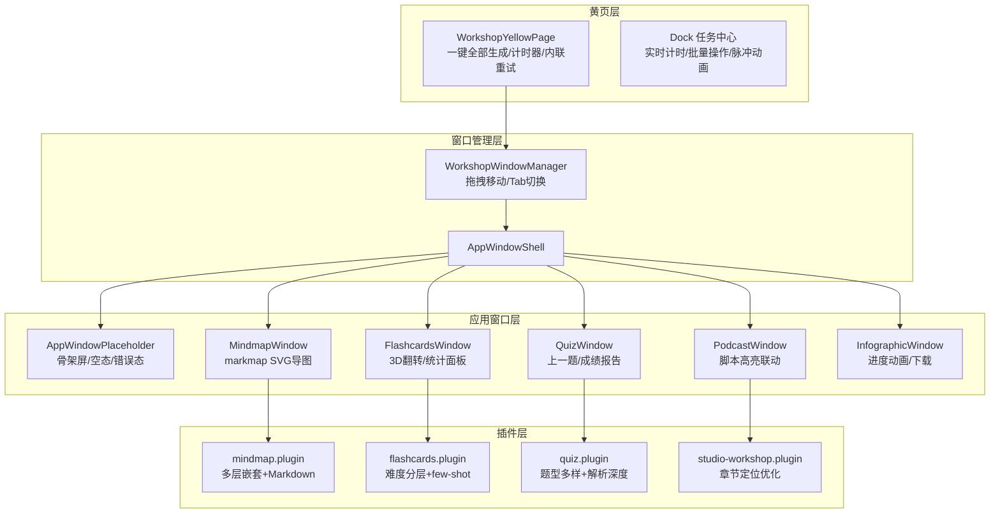

## 产品概述

全面优化 MeetMind AI工坊（应用矩阵）的用户体验，以功能完整度为优先，涵盖黄页导航、5个应用窗口渲染、后台任务管理、浮动窗口交互、加载/空态引导以及各插件提示词效果。

## 核心特性

### 1. 思维导图 - 真正的可视化导图（最高优先级）

- 引入 markmap（markmap-lib + markmap-view）渲染真正的 SVG 交互式思维导图
- 支持缩放、平移、节点展开/收起
- 改造提示词支持 3-4 层嵌套结构，输出 Markdown 层级格式
- 保留证据芯片和回放能力，同时在导图节点旁显示证据锚点
- 提供"大纲视图"和"导图视图"双模式切换
- 支持导出文本大纲

### 2. 黄页卡片交互增强

- 新增"一键全部生成"按钮，并行触发所有未生成应用
- 卡片增加失败时的内联重试按钮
- 生成中状态显示实时计时器（已用时间）
- 整张卡片可点击进入应用窗口
- 已生成卡片显示微预览摘要（首行 result 概要）

### 3. 后台任务 Dock 增强

- 运行中任务显示实时已用时间（秒级计数器）
- 新增"全部重试失败任务"批量按钮
- 新增"清除已完成任务"按钮
- 运行中任务脉冲动画指示器

### 4. 浮动窗口交互增强

- 实现拖拽移动功能（通过 header 拖拽）
- 优化底部最小化 Dock 的信息展示（显示状态徽章）
- 多窗口支持 Tab 快速切换

### 5. 通用加载/空态/错误态组件

- 新建 AppWindowPlaceholder 通用占位组件
- 骨架屏模式：模拟各窗口内容布局的骨架动画
- 空态引导：友好的说明文案 + 操作引导按钮
- 错误态：错误原因 + 重试按钮 + 返回链接
- 替换所有5个窗口和独立页面的简陋文字占位

### 6. 各应用窗口渲染优化

- **播客窗口**：脚本区默认展开，播放进度与脚本行高亮联动（audio timeupdate），章节快速跳转按钮组
- **闪卡窗口**：增加3D翻转动画效果，完成所有闪卡后显示训练统计面板（掌握/一般/待加强分布），增加"上一张"按钮
- **测验窗口**：增加"上一题"按钮，完成全部题目后显示成绩报告面板（正确率、耗时、错题列表）
- **信息图窗口**：生图过程增加进度动画，生成完成后提供"下载图片"按钮

### 7. 各插件提示词效果优化

- **思维导图**：输出格式从扁平 JSON 改为多层嵌套 JSON（支持 children 递归），增加 maxTokens 到 2800，增加 few-shot 示例
- **闪卡**：增加难度分层引导（基础/进阶/迁移），增加 few-shot 示例提升题面质量
- **测验**：增加题型多样性引导（选择/判断/简答混合），增加解析深度要求
- **播客**：优化脚本章节结构，确保每章有明确 startMs/endMs 定位

## 技术栈

- **前端框架**: Next.js 14 + React 18 + TypeScript
- **样式**: Tailwind CSS 3.4 + CSS Modules（黄页部分沿用现有 module.css）
- **导图可视化**: markmap-lib（Markdown 解析为导图树）+ markmap-view（SVG 渲染）
- **组件库**: Radix UI（已在项目中使用）、Lucide React（图标）
- **状态管理**: React Hooks + localStorage 缓存（沿用现有模式）
- **音频库**: 原生 HTMLAudioElement API（已在 PodcastWindow 使用）

## 实现方案

### 核心技术决策

**1. 思维导图渲染方案：markmap**

- 选用 `markmap-lib`（~15KB gzipped）解析 Markdown 为导图树 + `markmap-view`（~30KB gzipped）渲染为交互式 SVG
- 理由：与现有 `buildTreeBody()` 的 Markdown 输出天然兼容；零配置即可获得缩放/平移/展开收起；SSR 友好（纯 SVG）
- 对比其他方案：react-mindmap/d3-mindmap 需要大量手写布局逻辑；xmind-embed 体积过大且商业授权
- 数据流：后端 mindmap.plugin.ts 输出多层嵌套 JSON → 前端转为 Markdown → markmap 渲染为 SVG

**2. 浮动窗口拖拽：原生 pointer events**

- 不引入新的拖拽库（如 react-draggable），使用 `onPointerDown/Move/Up` 实现轻量拖拽
- 理由：只需 header 拖拽移动，无需复杂的拖拽排序/snap/resize，原生实现更轻量
- 位置存储在组件 state 中，不持久化

**3. 提示词改造策略**

- mindmap.plugin.ts：输出从扁平 `branches[]` 改为嵌套 `branches[].children[]`（支持 3-4 层）
- 后端 `buildTreeBody()` 适配递归结构生成 Markdown
- 前端 `MindmapWindow` 同时保留旧扁平数据兼容（渐进升级，不 break 已缓存结果）
- 其他插件（flashcards/quiz）：增量优化 prompt，不改变输出 JSON 结构

**4. 通用占位组件设计**

- 新建 `AppWindowPlaceholder` 组件，接收 `mode: 'loading' | 'empty' | 'error'` + 可选 props
- 骨架屏使用 Tailwind `animate-pulse` + 模拟布局块
- 错误态接收 `error?: string` + `onRetry?: () => void`

## 实现要点

### 性能注意

- markmap SVG 渲染在独立 `useEffect` 中执行，result 变化时才重建，避免不必要的 DOM 操作
- 浮动窗口拖拽使用 `useRef` 存储坐标，`requestAnimationFrame` 节流 style 更新
- 黄页的 `refreshState` 定时器间隔 1500ms 不变，已足够
- 播客脚本行高亮通过 `audio.ontimeupdate` + `scrollIntoView({ block: 'nearest' })` 实现，不触发 re-render（用 ref 操作 DOM）

### 向后兼容

- 思维导图：旧缓存结果（扁平 branches）仍可渲染为导图，`normalizeBranches` 函数增加 children 递归适配
- 所有窗口 props 接口不变，只增加可选参数
- 不修改 `AppExecutionResult`、`AppRenderSpec` 等核心类型
- `useAppExecution` Hook 接口不变

### 日志

- 插件 trace 字段增加 `prompt_version` 标记，便于 A/B 对比新旧 prompt 效果

## 架构设计



## 目录结构

```
src/
├── components/apps/
│   ├── WorkshopYellowPage.tsx          # [MODIFY] 添加"一键全部生成"、卡片内计时器、内联重试、卡片可点击、微预览摘要
│   ├── WorkshopYellowPage.module.css   # [MODIFY] 添加计时器、一键生成按钮、脉冲动画等新样式
│   ├── AppWindowPlaceholder.tsx         # [NEW] 通用占位组件：骨架屏(loading)/空态引导(empty)/错误态+重试(error)
│   ├── hooks/
│   │   └── useAppExecution.ts          # [MODIFY] 无接口变更，仅添加 readCachedResultPreview 方法供黄页微预览使用
│   ├── evidence/
│   │   ├── EvidenceChip.tsx            # [KEEP] 不修改
│   │   └── EvidencePopoverCard.tsx     # [KEEP] 不修改
│   └── windows/
│       ├── WorkshopWindowManager.tsx    # [MODIFY] 添加 header 拖拽移动、最小化 Dock 状态徽章、Tab 切换
│       ├── AppWindowShell.tsx           # [KEEP] 不修改
│       ├── PodcastWindow.tsx           # [MODIFY] 脚本默认展开、audio timeupdate 联动脚本行高亮、章节跳转按钮组
│       ├── FlashcardsWindow.tsx        # [MODIFY] 3D翻转动画、"上一张"按钮、完成后训练统计面板
│       ├── QuizWindow.tsx              # [MODIFY] "上一题"按钮、完成后成绩报告面板(正确率/错题列表)
│       ├── MindmapWindow.tsx           # [MODIFY] 引入 markmap 渲染 SVG 导图、双模式(导图/大纲)切换、导出大纲、兼容旧数据
│       └── InfographicWindow.tsx       # [MODIFY] 生图进度动画、"下载图片"按钮
├── lib/ai-native/
│   ├── plugins/
│   │   ├── mindmap.plugin.ts           # [MODIFY] 提示词输出多层嵌套结构(children递归)、few-shot示例、maxTokens提升到2800、buildTreeBody递归
│   │   ├── flashcards.plugin.ts        # [MODIFY] 提示词增加难度分层引导和few-shot示例
│   │   ├── quiz.plugin.ts             # [MODIFY] 提示词增加题型多样性和解析深度要求
│   │   └── studio-workshop.plugin.ts   # [MODIFY] 播客章节结构提示词优化，确保每章有 startMs/endMs
│   ├── app-catalog.ts                  # [KEEP] 不修改
│   ├── types.ts                        # [KEEP] 不修改
│   └── prompt-context.ts               # [KEEP] 不修改
└── app/(main)/app/matrix/[appKey]/
    └── page.tsx                        # [MODIFY] 替换简陋的loading/empty/error文字为AppWindowPlaceholder组件
```

## 关键代码结构

```typescript
// MindmapWindow 新增的嵌套分支节点接口
interface MindmapBranchNode {
  id: string;
  title: string;
  points: string[];         // 叶子要点
  children?: MindmapBranchNode[]; // 递归子分支（新增，兼容无此字段的旧数据）
  startMs?: number;
}

// mindmap.plugin.ts 新增的输出嵌套契约
interface MindMapNestedOutput {
  rootTitle: string;
  branches: Array<{
    title: string;
    points?: string[];
    children?: Array<{
      title: string;
      points: string[];
      startMs?: number;
      endMs?: number;
    }>;
    startMs?: number;
    endMs?: number;
  }>;
}

// AppWindowPlaceholder 组件接口
interface AppWindowPlaceholderProps {
  mode: 'loading' | 'empty' | 'error';
  appName?: string;         // 显示应用名
  message?: string;         // 自定义消息
  error?: string;           // 错误详情
  onRetry?: () => void;     // 重试回调
  backHref?: string;        // 返回链接
}
```

## Agent Extensions

### Skill

- **frontend-design**
- 用途: 设计 AppWindowPlaceholder 通用占位组件的视觉效果（骨架屏动画、空态引导插图、错误态布局），以及闪卡3D翻转动画、成绩报告面板等新增 UI 元素
- 预期效果: 产出高品质的加载态骨架屏、友好的空态引导界面和清晰的错误态布局

- **vercel-react-best-practices**
- 用途: 优化浮动窗口拖拽实现的性能（避免不必要 re-render）、markmap SVG 渲染的 useEffect 管理、以及播客窗口 timeupdate 事件的 ref-based DOM 操作
- 预期效果: 确保所有交互增强不引入性能回退，拖拽和音频联动流畅无卡顿

- **ui-ux-pro-max**
- 用途: 优化黄页卡片的交互设计（一键全部生成、计时器、微预览）、Dock 任务中心的脉冲动画和批量操作布局、以及各窗口的交互细节
- 预期效果: 交互体验达到产品级水准，所有新增按钮和状态反馈符合现代 UI 设计规范

### SubAgent

- **code-explorer**
- 用途: 在实现各步骤时深入探索相关文件的依赖关系和调用链，确保修改不遗漏
- 预期效果: 准确定位所有需要联动修改的文件和代码路径