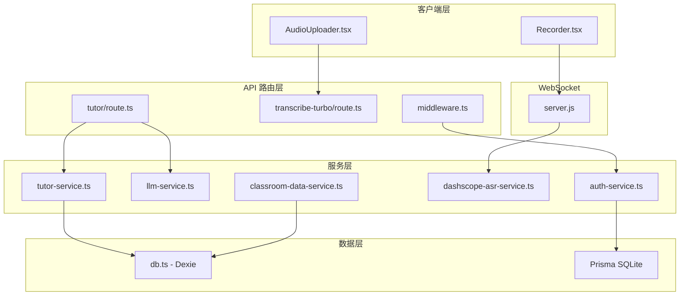
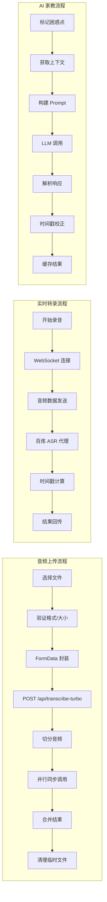

## 产品概述

对 MeetMind 课堂助手代码库进行全面的逻辑审查，系统性地识别代码中的潜在缺陷、条件判断漏洞和不兼容问题，并提供针对性的修复方案。

## 核心审查范围

1. **核心服务层审查** - auth-service、llm-service、tutor-service、dashscope-asr-service、classroom-data-service 的逻辑正确性
2. **API 路由层审查** - tutor/route.ts、transcribe-turbo/route.ts 的请求处理和错误处理
3. **组件层审查** - Recorder.tsx、AudioUploader.tsx 的状态管理和异步操作
4. **数据库层审查** - db.ts (Dexie IndexedDB) 和 auth-service (Prisma SQLite) 的数据一致性
5. **中间件层审查** - middleware.ts 的认证逻辑和路由匹配
6. **WebSocket 服务器审查** - server.js 的连接管理和资源清理

## 问题分类

- 逻辑缺陷：异步操作时序问题、状态管理竞态条件
- 条件判断漏洞：边界情况处理不足、null/undefined 检查
- 潜在不兼容：数据格式转换、API 响应结构不一致
- 资源管理问题：内存泄漏风险、临时文件清理

## 技术栈

- **前端框架**: Next.js 14.2 + React 18 + TypeScript 5.3
- **样式方案**: Tailwind CSS 3.4
- **状态管理**: Zustand 4.5 + React Hooks
- **数据持久化**: 
- 前端: Dexie.js 4.2 (IndexedDB)
- 后端: Prisma 7.2 + SQLite
- **实时通信**: WebSocket (ws 8.19)
- **AI 服务**: DashScope ASR、通义千问 LLM

## 审查架构



## 审查模块划分

### 1. 认证服务模块 (auth-service.ts)

- **审查重点**: JWT 验证、密码哈希、登录限流、CSRF 保护
- **潜在问题**: 
- 管理员初始化竞态条件 (L89-95)
- 登录限流窗口计算边界问题 (L141-171)
- refreshToken 验证缺少签名校验 (L356-375)

### 2. LLM 服务模块 (llm-service.ts)

- **审查重点**: 多模态消息处理、API 调用错误处理、流式响应
- **潜在问题**:
- Gemini base64 解析正则表达式边界情况 (L191-200)
- 流式响应 reader 未正确关闭 (L386-410)
- API 配置空值处理 (L71-89)

### 3. Tutor 服务模块 (tutor-service.ts, tutor/route.ts)

- **审查重点**: 上下文提取、时间戳校正、响应解析
- **潜在问题**:
- 转录索引未初始化时的空指针风险 (L85-93)
- 时间戳校正逻辑过于激进 (L852-898)
- 正则表达式匹配失败处理不足 (L375-396)

### 4. ASR 服务模块 (dashscope-asr-service.ts, server.js)

- **审查重点**: WebSocket 连接管理、音频队列处理、时间戳同步
- **潜在问题**:
- 端口回退逻辑中的超时竞态 (L100-168)
- audioQueue 内存累积风险 (L50, L287)
- VAD 时间戳队列与完成事件不匹配 (server.js L224-296)

### 5. 课堂数据服务模块 (classroom-data-service.ts)

- **审查重点**: localStorage 操作、广播同步、数据聚合
- **潜在问题**:
- JSON 解析异常处理 (L148-156, L169-177)
- 批量操作原子性问题 (L385-434)
- BroadcastChannel 兼容性处理 (L609-651)

### 6. 数据库层模块 (db.ts)

- **审查重点**: IndexedDB 事务、复合索引、数据迁移
- **潜在问题**:
- 版本升级时的数据兼容性 (L186-243)
- 事务嵌套导致死锁风险 (L766-777)
- bulkAdd 返回类型断言风险 (L844)

### 7. API 路由模块 (transcribe-turbo/route.ts)

- **审查重点**: 文件处理、并行任务管理、临时文件清理
- **潜在问题**:
- 分片切割异常后残留文件 (L106-131)
- 并行任务限流不足 (L267-286)
- 错误响应后临时文件未清理 (L373-378)

### 8. 中间件模块 (middleware.ts)

- **审查重点**: 路由匹配、JWT 验证、请求头注入
- **潜在问题**:
- 路由匹配通配符处理不完整 (L46-53)
- JWT payload 解码异常处理 (L58-76)
- 静态路径匹配可能被绕过 (L82-84)

## 核心数据流审查



## 关键代码结构

### 问题清单数据结构

```typescript
interface CodeIssue {
  id: string;
  file: string;
  line: number | [number, number];
  severity: 'critical' | 'high' | 'medium' | 'low';
  category: 'logic' | 'condition' | 'compatibility' | 'resource';
  description: string;
  impact: string;
  suggestedFix: string;
}
```

### 修复方案数据结构

```typescript
interface FixPlan {
  issueId: string;
  approach: 'refactor' | 'patch' | 'guard';
  codeChanges: Array<{
    file: string;
    action: 'modify' | 'add' | 'delete';
    description: string;
  }>;
  testStrategy: string;
}
```

## Agent Extensions

### SubAgent

- **code-explorer**
- Purpose: 深度探索代码库中的跨文件依赖关系、调用链路和数据流
- Expected outcome: 识别服务间的隐式耦合、发现潜在的循环依赖和未处理的边界情况