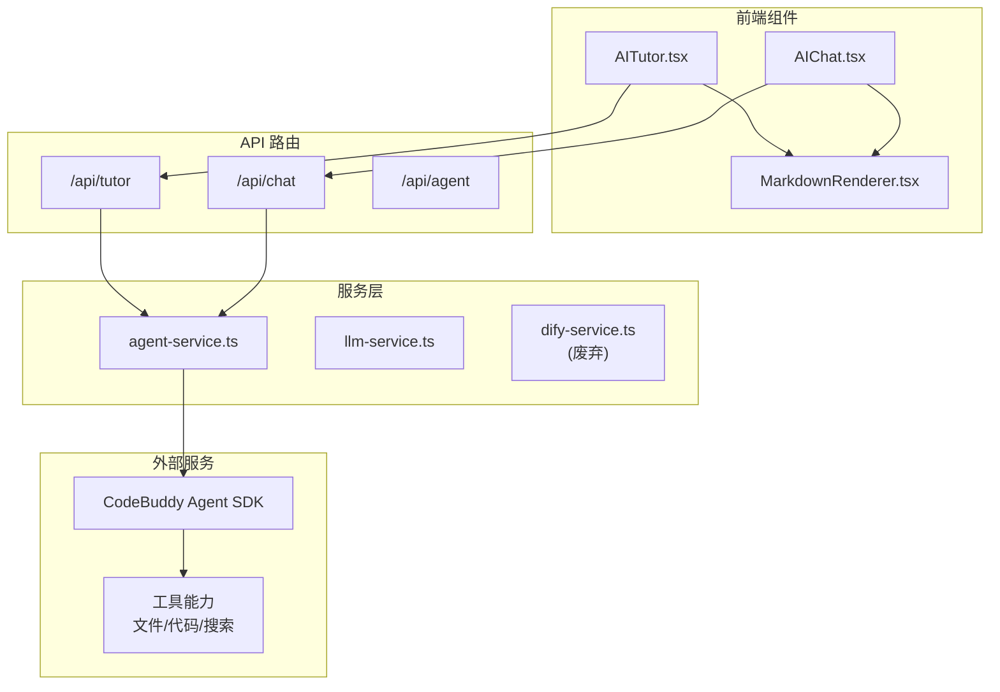
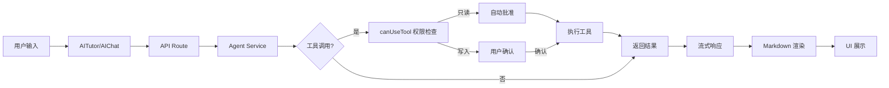

## 产品概述

集成 CodeBuddy Agent SDK 升级 MeetMind 的 AI 对话能力，替换现有 Dify 联网搜索实现，新增 Markdown 渲染支持，全面增强 AITutor 和 AIChat 组件的工具调用能力。

## 核心功能

1. **CodeBuddy Agent SDK 集成**

- 安装并集成 `@tencent-ai/agent-sdk`，替代现有手动封装的 LLM 调用
- 实现宽松模式权限控制（只读操作自动批准，写入操作需用户确认）
- 支持流式响应和异步生成器 `query()` API

2. **工具调用能力**

- 文件读写：允许 AI 读取/修改学生笔记、课堂资料
- 代码执行：支持数学公式计算、代码演示
- 联网搜索：替换 Dify 的 `enable_web` 功能，提供更强大的实时搜索

3. **Markdown 渲染支持**

- 新增 Markdown 渲染组件，替换现有的 `whitespace-pre-wrap` 直接显示
- 保留现有时间戳 `[MM:SS]` 解析为可点击链接的功能
- 保留引用格式 `[引用 xx:xx]` 的特殊渲染

4. **AITutor 组件增强**

- 集成 Agent SDK 的工具调用能力
- 保持现有引导问题、行动清单等功能
- 支持多模态输入（已有）+ Markdown 输出

5. **AIChat 组件增强**

- 同步集成 Agent SDK
- 添加 Markdown 渲染支持
- 保持对话历史持久化功能

## 技术栈

- **现有技术栈**：Next.js 14 + TypeScript + Tailwind CSS
- **新增依赖**：
- `@tencent-ai/agent-sdk` - CodeBuddy Agent SDK
- `react-markdown` - Markdown 渲染
- `remark-gfm` - GitHub 风格 Markdown 扩展
- `rehype-highlight` - 代码高亮

## 技术架构

### 系统架构



### 模块划分

#### 1. Agent 服务模块

- **文件**：`src/lib/services/agent-service.ts`
- **职责**：封装 CodeBuddy Agent SDK，提供统一的 AI 对话接口
- **核心接口**：
- `agentQuery()` - 异步生成器，流式返回响应
- `canUseTool()` - 权限控制回调
- **依赖**：`@tencent-ai/agent-sdk`

#### 2. Markdown 渲染模块

- **文件**：`src/components/MarkdownRenderer.tsx`
- **职责**：渲染 AI 响应的 Markdown 内容
- **特殊处理**：
- 时间戳 `[MM:SS]` 转为可点击链接
- 引用 `[引用 xx:xx]` 保留特殊样式
- **依赖**：`react-markdown`, `remark-gfm`, `rehype-highlight`

#### 3. API 路由模块

- **修改文件**：`src/app/api/tutor/route.ts`, `src/app/api/chat/route.ts`
- **职责**：接入 Agent SDK，替换现有 LLM 直接调用
- **保持兼容**：保留现有请求/响应格式

### 数据流



## 实现细节

### 核心目录结构

```
src/
├── lib/
│   └── services/
│       └── agent-service.ts      # 新增：Agent SDK 封装
├── components/
│   ├── MarkdownRenderer.tsx      # 新增：Markdown 渲染组件
│   ├── AITutor.tsx               # 修改：集成 Markdown 渲染
│   └── AIChat.tsx                # 修改：集成 Markdown 渲染
└── app/
    └── api/
        ├── tutor/route.ts        # 修改：使用 Agent Service
        └── chat/route.ts         # 修改：使用 Agent Service
```

### 关键代码结构

**Agent Service 接口定义**

```typescript
// agent-service.ts
import { AgentSDK } from '@tencent-ai/agent-sdk';

interface AgentOptions {
  enableFileAccess?: boolean;
  enableCodeExecution?: boolean;
  enableWebSearch?: boolean;
}

interface ToolPermission {
  tool: string;
  action: 'read' | 'write';
  resource?: string;
}

// 权限控制回调
type CanUseToolCallback = (permission: ToolPermission) => Promise<boolean>;

// 流式查询接口
async function* agentQuery(
  messages: ChatMessage[],
  options?: AgentOptions,
  canUseTool?: CanUseToolCallback
): AsyncGenerator<AgentResponse>;
```

**Markdown 渲染组件接口**

```typescript
// MarkdownRenderer.tsx
interface MarkdownRendererProps {
  content: string;
  onTimestampClick?: (timeMs: number) => void;
  className?: string;
}
```

### 技术实现方案

#### 1. Agent SDK 集成

- **问题**：替换现有 Dify 联网搜索，统一工具调用入口
- **方案**：封装 Agent SDK 的 `query()` 异步生成器，实现流式响应
- **关键技术**：AsyncGenerator、Server-Sent Events
- **实现步骤**：

1. 安装 `@tencent-ai/agent-sdk`
2. 创建 `agent-service.ts` 封装 SDK
3. 实现 `canUseTool` 宽松模式权限控制
4. 修改 API 路由使用新服务

- **测试策略**：单元测试权限控制逻辑，集成测试工具调用流程

#### 2. Markdown 渲染

- **问题**：现有组件直接显示文本，不支持格式化
- **方案**：使用 react-markdown + 自定义插件处理时间戳
- **关键技术**：react-markdown、remark/rehype 插件
- **实现步骤**：

1. 安装 markdown 相关依赖
2. 创建 `MarkdownRenderer` 组件
3. 实现时间戳自定义渲染
4. 替换 AITutor/AIChat 中的文本显示

- **测试策略**：快照测试渲染输出，交互测试时间戳点击

### 集成点

- **现有 LLM 服务**：保留 `llm-service.ts` 作为备选，Agent SDK 不可用时降级
- **Dify 服务**：废弃 `dify-service.ts` 的联网搜索功能，保留引导问题生成
- **对话历史**：复用现有 `conversation-service.ts`

## 技术考量

### 性能优化

- 流式响应避免长等待
- Markdown 渲染使用 memo 优化
- 工具调用结果缓存

### 安全措施

- 写入操作强制用户确认
- 敏感文件访问白名单
- API 调用频率限制

### 可扩展性

- Agent Service 支持动态工具注册
- Markdown 渲染支持自定义插件

## Agent Extensions

### SubAgent

- **code-explorer**
- Purpose：在集成过程中探索现有代码结构，确保修改不破坏现有功能
- Expected outcome：准确定位需要修改的文件和函数，理解现有数据流

### Skill

- **vercel-react-best-practices**
- Purpose：确保 React 组件（MarkdownRenderer、AITutor、AIChat）遵循 Next.js 最佳实践
- Expected outcome：组件性能优化，避免不必要的重渲染

- **frontend-design**
- Purpose：设计 Markdown 渲染组件的样式，确保与现有 UI 风格一致
- Expected outcome：美观、一致的 Markdown 渲染效果