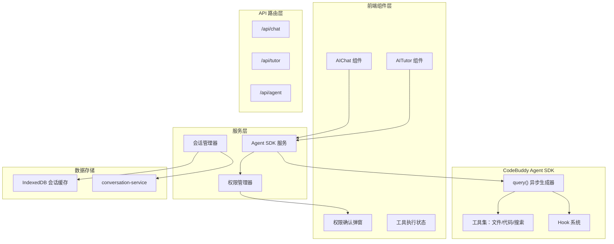
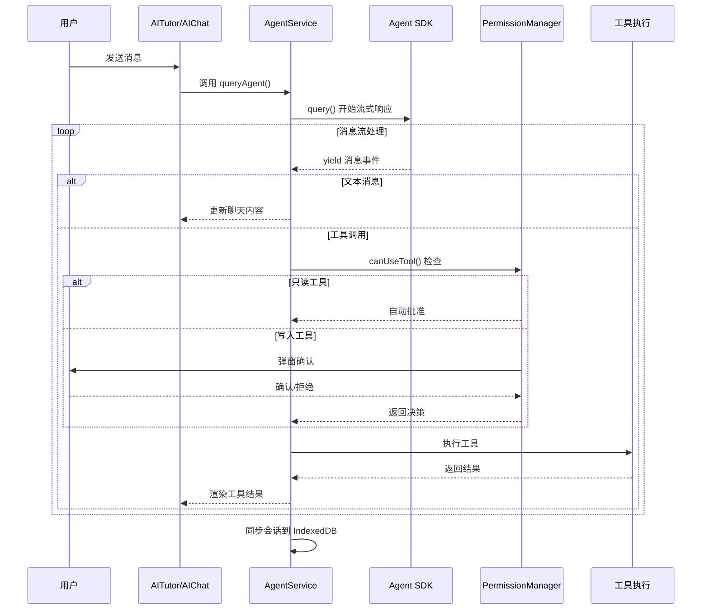

## 产品概述

为 MeetMind 项目集成 CodeBuddy Agent SDK，增强现有的 AITutor（AI 家教）和 AIChat（AI 对话）组件功能。通过 SDK 提供的工具能力（文件读写、代码执行、联网搜索），让 AI 助手能够更好地帮助学生理解课堂内容，执行实际操作。采用宽松权限模式，只读操作自动批准，写入操作需用户确认，确保安全性与便捷性的平衡。

## 核心功能

1. **Agent SDK 服务层集成**：封装 `@tencent-ai/agent-sdk` 的 `query()` API，支持异步消息流处理、会话管理和工具调用
2. **权限控制系统**：实现宽松模式的权限回调，只读工具（文件读取、搜索）自动批准，写入工具（文件创建/修改、代码执行）弹窗确认
3. **工具能力扩展**：

- 文件读取：读取用户上传的学习资料、笔记
- 文件写入：保存 AI 生成的学习笔记、练习题
- 代码执行：运行代码示例、验证算法
- 联网搜索：检索相关学习资料、知识百科

4. **组件功能增强**：AITutor 和 AIChat 组件接入 SDK，支持工具调用状态展示、权限确认弹窗、执行结果渲染
5. **会话持久化**：利用 SDK 的 `persistSession` 能力与现有 IndexedDB 会话系统集成

## 技术栈

- **框架**：Next.js 14 + TypeScript
- **样式**：Tailwind CSS
- **状态管理**：Zustand + React Hooks
- **数据存储**：IndexedDB (Dexie)
- **新增依赖**：`@tencent-ai/agent-sdk`

## 技术架构

### 系统架构



### 模块划分

| 模块 | 职责 | 核心技术 | 依赖关系 |
| --- | --- | --- | --- |
| agent-sdk-service | 封装 SDK query() 调用、消息流处理 | @tencent-ai/agent-sdk | llm-service |
| permission-manager | 权限判断与用户确认逻辑 | React Context + Dialog | agent-sdk-service |
| tool-renderer | 工具调用结果渲染组件 | React + Tailwind | UI 组件库 |
| session-sync | SDK 会话与 IndexedDB 同步 | Dexie | conversation-service |


### 数据流



## 实现详情

### 核心目录结构

```
src/
├── lib/
│   ├── services/
│   │   ├── agent-sdk-service.ts      # 新增：SDK 封装服务
│   │   ├── permission-manager.ts     # 新增：权限管理
│   │   └── llm-service.ts            # 修改：集成 SDK 调用
│   └── hooks/
│       └── useAgentQuery.ts          # 新增：Agent 查询 Hook
├── components/
│   ├── AIChat.tsx                    # 修改：集成 Agent 能力
│   ├── AITutor.tsx                   # 修改：集成 Agent 能力
│   ├── PermissionDialog.tsx          # 新增：权限确认弹窗
│   └── ToolResultRenderer.tsx        # 新增：工具结果渲染
├── app/
│   └── api/
│       ├── agent/
│       │   └── route.ts              # 新增：Agent API 路由
│       ├── chat/route.ts             # 修改：支持 Agent 模式
│       └── tutor/route.ts            # 修改：支持 Agent 模式
└── types/
    └── agent.ts                      # 新增：Agent 相关类型
```

### 关键代码结构

**Agent SDK 配置接口**：定义 SDK 初始化参数和权限配置结构

```typescript
// types/agent.ts
interface AgentConfig {
  /** 权限模式: default-默认, plan-计划模式, acceptEdits-接受编辑, bypassPermissions-绕过权限 */
  permissionMode: 'default' | 'plan' | 'acceptEdits' | 'bypassPermissions';
  /** 启用的工具列表 */
  enabledTools: ('file_read' | 'file_write' | 'code_execute' | 'web_search')[];
  /** 会话持久化配置 */
  sessionConfig: {
    persist: boolean;
    storageKey?: string;
  };
}

interface ToolCallEvent {
  toolName: string;
  toolId: string;
  args: Record<string, unknown>;
  isReadOnly: boolean;
}

interface PermissionDecision {
  approved: boolean;
  reason?: string;
}
```

**Agent SDK 服务类**：封装 SDK 核心调用逻辑，处理消息流和工具调用

```typescript
// lib/services/agent-sdk-service.ts
class AgentSDKService {
  private config: AgentConfig;
  private permissionCallback: (tool: ToolCallEvent) => Promise<PermissionDecision>;
  
  async *queryAgent(
    messages: ChatMessage[],
    context?: string
  ): AsyncGenerator<AgentStreamEvent>;
  
  setPermissionCallback(cb: typeof this.permissionCallback): void;
  
  // Hook 注册
  onPreToolUse(handler: (tool: ToolCallEvent) => void): void;
  onPostToolUse(handler: (tool: ToolCallEvent, result: unknown) => void): void;
}
```

**权限管理器**：实现宽松模式的权限判断逻辑

```typescript
// lib/services/permission-manager.ts
class PermissionManager {
  /** 只读工具列表（自动批准） */
  private readonly readOnlyTools = ['file_read', 'web_search', 'list_files'];
  
  /** 判断工具是否为只读 */
  isReadOnlyTool(toolName: string): boolean;
  
  /** 权限检查回调 - 供 SDK canUseTool 使用 */
  async canUseTool(tool: ToolCallEvent): Promise<PermissionDecision>;
  
  /** 请求用户确认（用于写入工具） */
  async requestUserConfirmation(tool: ToolCallEvent): Promise<boolean>;
}
```

### 技术实现计划

**1. SDK 服务层封装**

- 问题：需要封装 `@tencent-ai/agent-sdk` 的异步生成器 API
- 方案：创建 `AgentSDKService` 类，包装 `query()` 调用，处理流式响应
- 关键技术：AsyncGenerator、EventEmitter 模式
- 实现步骤：

1. 安装 SDK 依赖
2. 创建服务类骨架
3. 实现 `queryAgent()` 方法
4. 添加 Hook 注册机制

- 测试策略：模拟 SDK 响应，验证消息流处理

**2. 权限控制实现**

- 问题：需要区分只读和写入工具，实现不同的确认流程
- 方案：创建 `PermissionManager`，通过 `canUseTool` 回调实现细粒度控制
- 关键技术：React Context、Dialog 组件、Promise 确认模式
- 实现步骤：

1. 定义只读/写入工具分类
2. 实现自动批准逻辑
3. 创建确认弹窗组件
4. 集成到服务层

- 测试策略：单元测试权限判断，E2E 测试确认流程

**3. 组件增强集成**

- 问题：AITutor 和 AIChat 需要支持工具调用和结果展示
- 方案：通过 `useAgentQuery` Hook 集成 SDK 能力，添加状态展示组件
- 关键技术：React Hooks、流式渲染、条件渲染
- 实现步骤：

1. 创建 `useAgentQuery` Hook
2. 修改 AITutor 组件接入
3. 修改 AIChat 组件接入
4. 实现工具结果渲染器

- 测试策略：组件测试验证渲染逻辑

### 集成点

- **与现有 LLM 服务集成**：`agent-sdk-service` 作为 `llm-service` 的增强层，可选择使用
- **与会话系统集成**：SDK 会话状态同步到 `conversation-service` 的 IndexedDB 存储
- **与 API 路由集成**：新增 `/api/agent` 路由，同时修改 `/api/chat` 和 `/api/tutor` 支持 Agent 模式

## 技术考量

### 性能优化

- 工具调用结果缓存，避免重复执行
- 流式渲染减少首屏等待时间
- 按需加载权限弹窗组件

### 安全措施

- 写入操作强制用户确认
- 工具调用参数校验
- 敏感操作日志记录
- 文件操作限制在允许的目录范围内

## Agent Extensions

### Skill

- **frontend-design**
- 用途：设计权限确认弹窗、工具执行状态指示器等新增 UI 组件
- 预期结果：生成符合项目设计风格的高质量 UI 组件代码

- **vercel-react-best-practices**
- 用途：确保 React Hooks 和组件实现遵循最佳性能实践
- 预期结果：优化 useAgentQuery Hook 和组件渲染性能

### SubAgent

- **code-explorer**
- 用途：深入探索项目现有的服务层、Hook 和组件实现模式
- 预期结果：确保新代码与项目现有架构保持一致