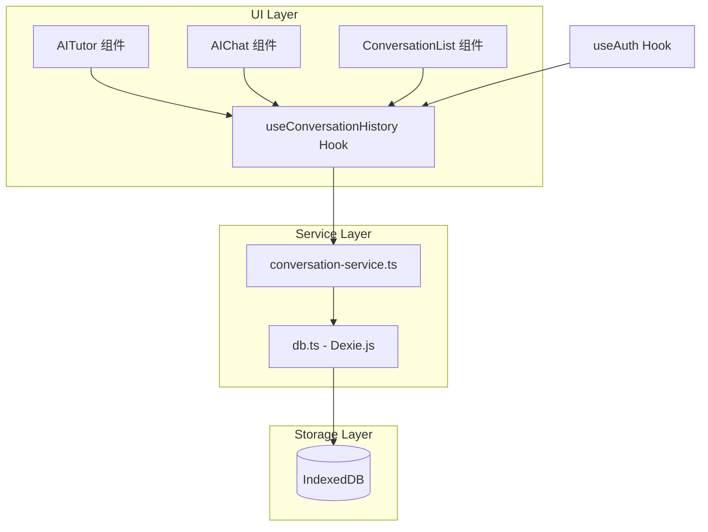
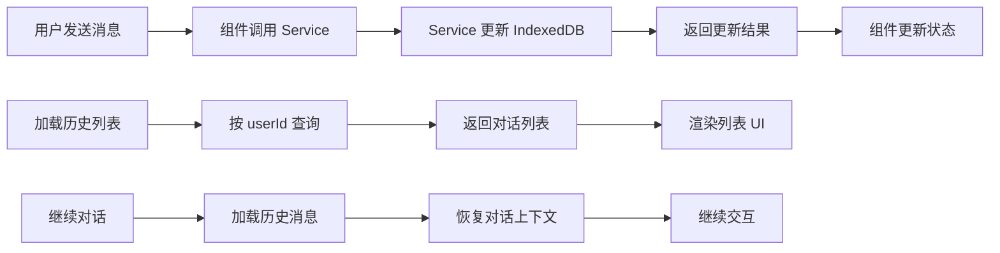

## 产品概述

在现有 IndexedDB 数据库中新增统一的对话历史存储功能，支持 AITutor（困惑点辅导）和 AIChat（简化聊天）两个对话场景的历史记录持久化。用户可按 ID 隔离查看自己的对话历史列表、继续之前未完成的对话、删除指定对话记录。

## 核心功能

1. **对话历史表设计**：在 IndexedDB 中新增 `conversationHistory` 表，存储对话元数据和消息内容
2. **用户数据隔离**：通过 `userId` 字段实现不同用户的对话数据完全隔离
3. **对话列表展示**：提供对话历史列表视图，支持按时间排序、关键词搜索
4. **继续对话功能**：从历史记录恢复对话上下文，无缝继续之前的交流
5. **对话管理操作**：支持删除单条对话、清空历史等管理功能
6. **组件接入改造**：AITutor 和 AIChat 组件接入统一存储服务

## 技术栈

- 前端框架：Next.js + React + TypeScript（复用现有技术栈）
- 数据库：Dexie.js（IndexedDB 封装，复用现有 `src/lib/db.ts`）
- 状态管理：React Hooks（useState、useEffect、useCallback）
- 样式：Tailwind CSS

## 技术架构

### 系统架构



### 模块划分

- **数据模型模块**：`ConversationHistory`、`ConversationMessage` 接口定义
- **数据访问模块**：扩展 `db.ts`，新增对话历史表及 CRUD 操作
- **服务模块**：`conversation-service.ts` 提供业务逻辑封装
- **Hook 模块**：`useConversationHistory` 提供组件级数据访问
- **UI 组件模块**：对话列表展示、对话恢复交互组件

### 数据流



## 实现细节

### 核心目录结构

```
src/
├── lib/
│   ├── db.ts                           # 修改：新增 conversationHistory 表定义
│   └── services/
│       └── conversation-service.ts     # 新增：对话历史服务
├── lib/hooks/
│   └── useConversationHistory.ts       # 新增：对话历史 Hook
├── components/
│   ├── AITutor.tsx                     # 修改：接入对话历史存储
│   ├── AIChat.tsx                      # 修改：接入对话历史存储
│   └── ConversationHistory/            # 新增：对话历史相关组件
│       ├── ConversationList.tsx        # 对话列表组件
│       └── ConversationItem.tsx        # 单条对话项组件
└── types/
    └── conversation.ts                 # 新增：对话历史类型定义
```

### 关键数据结构

**ConversationHistory 接口**：定义对话会话的元数据，包含唯一标识、用户归属、对话来源类型、标题摘要、关联的音频会话、消息数量统计及时间戳。

```typescript
// 对话历史记录
interface ConversationHistory {
  id?: number;
  conversationId: string;      // UUID
  userId: string;              // 用户ID，用于数据隔离
  type: 'tutor' | 'chat';      // 对话类型
  title: string;               // 对话标题（自动生成或首条消息摘要）
  sessionId?: string;          // 关联的音频会话ID
  anchorId?: string;           // 关联的困惑点ID（tutor类型）
  anchorTimestamp?: number;    // 困惑点时间戳
  messageCount: number;        // 消息数量
  lastMessage?: string;        // 最后一条消息预览
  metadata?: Record<string, unknown>;
  createdAt: Date;
  updatedAt: Date;
}
```

**ConversationMessage 接口**：定义单条对话消息，关联到对话会话，记录发送角色、内容、多模态附件及时间戳。

```typescript
// 对话消息
interface ConversationMessage {
  id?: number;
  messageId: string;           // UUID
  conversationId: string;      // 关联对话ID
  role: 'user' | 'assistant' | 'system';
  content: string;
  attachments?: Array<{        // 多模态附件
    type: 'image' | 'file';
    url: string;
    name?: string;
  }>;
  createdAt: Date;
}
```

**ConversationService 类**：提供对话历史的完整 CRUD 操作，包括创建/更新对话、添加消息、查询列表、删除对话等功能。

```typescript
// 服务层接口
class ConversationService {
  // 创建或获取对话
  async getOrCreateConversation(params: CreateConversationParams): Promise<ConversationHistory>
  // 添加消息
  async addMessage(conversationId: string, message: Omit<ConversationMessage, 'id' | 'messageId' | 'createdAt'>): Promise<void>
  // 获取用户对话列表
  async getUserConversations(userId: string, options?: { type?: string; limit?: number; offset?: number }): Promise<ConversationHistory[]>
  // 获取对话消息
  async getConversationMessages(conversationId: string): Promise<ConversationMessage[]>
  // 删除对话
  async deleteConversation(conversationId: string): Promise<void>
  // 搜索对话
  async searchConversations(userId: string, keyword: string): Promise<ConversationHistory[]>
}
```

### 技术实现要点

1. **数据库版本升级**

- 在 `db.ts` 中新增 version(4)，定义 `conversationHistory` 和 `conversationMessages` 表
- 索引设计：`[userId+type]`、`[userId+updatedAt]`、`conversationId`

2. **用户隔离策略**

- 所有查询操作必须携带 `userId` 参数
- 未登录用户使用固定 `anonymous` 标识

3. **AITutor 组件改造**

- 复用现有 `TutorResponseCache` 缓存机制
- 新增对话历史同步逻辑
- 支持从历史恢复完整对话上下文

4. **AIChat 组件改造**

- 移除内存态消息存储
- 接入 `useConversationHistory` Hook
- 支持对话列表选择和继续

### 集成方案

**组件与服务集成**

- AITutor：困惑点解析完成后自动创建对话记录，后续追问同步更新
- AIChat：每次对话开始时检查是否继续历史对话，消息实时持久化

**状态同步**

- 使用 `useConversationHistory` Hook 统一管理对话状态
- 支持跨组件共享对话上下文（如从列表跳转到对话详情）