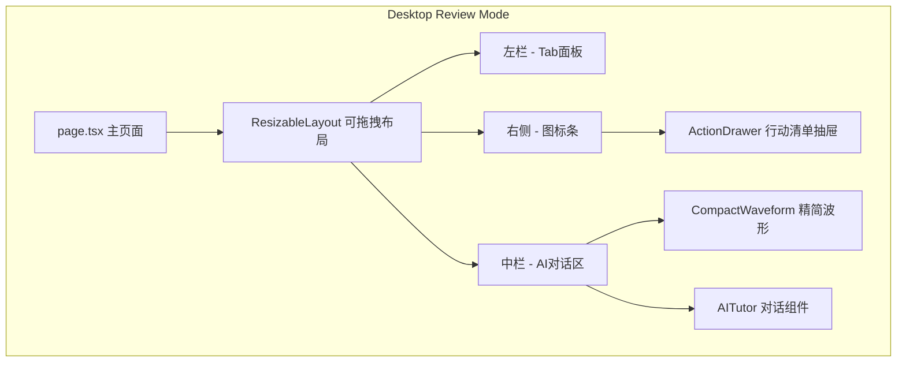
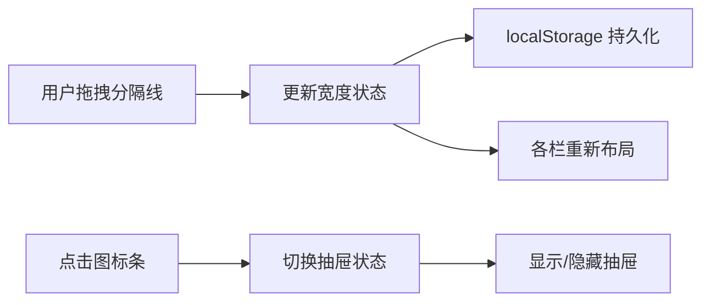

## 产品概述

优化桌面端复习模式的 UI 布局，提升学习效率和用户体验。通过将右侧行动清单改为侧边图标条+抽屉形式，减少波形图占用空间，支持三栏拖拽调整宽度，让 AI 对话区获得更大的聚焦空间。

## 核心功能

1. **侧边图标条+抽屉式行动清单**：将右侧固定宽度（w-80）的行动清单折叠为紧凑的图标条，点击图标展开抽屉面板显示完整内容
2. **精简波形播放器**：波形图高度从当前值减半，移除顶部空白区域，整体上移，参考移动端 MiniPlayer 的精简设计
3. **可拖拽三栏布局**：左栏（时间轴/困惑点等 tab 面板）和中栏（AI 对话区）支持拖拽分隔线调整宽度
4. **AI 对话区聚焦优化**：通过上述改动释放的空间，让 AI 对话区默认获得更大的显示面积

## 技术栈

- 前端框架：Next.js + React + TypeScript
- 样式：Tailwind CSS
- 现有组件复用：MenuDrawer（抽屉组件）、MiniPlayer（精简播放器参考）

## 技术架构

### 系统架构



### 模块划分

- **ResizableLayout**：可拖拽分隔线的三栏布局容器，管理各栏宽度状态
- **ActionSidebar**：右侧图标条组件，包含行动清单图标及未完成数量badge
- **ActionDrawer**：行动清单抽屉组件，复用现有 MenuDrawer 和 ActionList
- **CompactWaveform**：精简版波形播放器，高度减半，去除冗余空白

### 数据流



## 实现细节

### 核心目录结构

```
src/
├── components/
│   ├── layout/
│   │   └── ResizablePanel.tsx     # 新增: 可拖拽面板组件
│   ├── ActionSidebar.tsx          # 新增: 侧边图标条
│   ├── ActionDrawer.tsx           # 新增: 行动清单抽屉
│   ├── WaveformPlayer.tsx         # 修改: 支持 compact 模式
│   └── ActionList.tsx             # 复用: 行动清单内容
├── app/
│   └── page.tsx                   # 修改: 桌面端复习模式布局
└── hooks/
    └── useResizable.ts            # 新增: 拖拽调整宽度hook
```

### 关键代码结构

**ResizablePanel Props 接口**

```typescript
interface ResizablePanelProps {
  children: React.ReactNode[];
  direction: 'horizontal' | 'vertical';
  defaultSizes: number[];    // 各面板初始宽度/高度百分比
  minSizes?: number[];       // 最小尺寸
  maxSizes?: number[];       // 最大尺寸
  storageKey?: string;       // localStorage 持久化 key
  onResize?: (sizes: number[]) => void;
}
```

**ActionSidebar 接口**

```typescript
interface ActionSidebarProps {
  actionCount: number;       // 未完成任务数
  isDrawerOpen: boolean;
  onToggleDrawer: () => void;
}
```

**WaveformPlayer compact 模式**

```typescript
interface WaveformPlayerProps {
  // ... 现有属性
  compact?: boolean;         // 新增: 紧凑模式
  height?: number;           // 修改默认值: compact 时为 40
}
```

### 技术实现方案

**1. 可拖拽布局实现**

- 使用 CSS flex + mouse/touch 事件实现拖拽
- 分隔线显示可拖拽光标，hover 时高亮
- 拖拽时记录起始位置，计算偏移量更新宽度
- 支持双击分隔线重置为默认宽度

**2. 侧边图标条+抽屉**

- 图标条固定宽度 48px，垂直居中显示图标
- 复用 MenuDrawer 组件作为抽屉容器
- ActionList 作为抽屉内容
- 支持 ESC 键和点击遮罩关闭

**3. 波形播放器精简**

- 新增 compact prop，默认 false
- compact 模式下：height 从 80 减为 40，隐藏图例区域
- 移除波形容器的 padding，去除顶部空白
- 控制栏简化，仅保留核心播放控件

## 技术考量

### 性能优化

- 拖拽时使用 requestAnimationFrame 节流
- 宽度变化使用 CSS transform 避免 reflow
- localStorage 操作防抖，避免频繁写入

### 布局约束

- 左栏最小宽度 280px，最大 480px
- 中栏最小宽度 400px，保证 AI 对话可用性
- 图标条固定 48px，不参与拖拽

## 设计风格

延续现有应用的现代简约风格，优化桌面端复习模式的空间利用率和视觉层次。

## 页面规划

### 桌面端复习模式布局优化

**区块1：顶部模式切换栏**
保持现有设计，录音/复习模式切换、数据源状态、困惑点统计

**区块2：主内容区 - 可拖拽三栏**

- 左栏：Tab 面板（时间轴/困惑点/精选/摘要/笔记），默认宽度 384px，可拖拽调整
- 中栏：AI 对话聚焦区，flex-1 自适应，包含精简波形播放器和 AITutor
- 右侧：垂直图标条 48px 固定宽度

**区块3：精简波形播放器**
高度 40px，紧凑单行设计，播放控件 + 进度条 + 时间显示，无图例区域

**区块4：侧边图标条**
垂直排列图标按钮，行动清单图标带 badge 显示未完成数量，hover 显示 tooltip

**区块5：行动清单抽屉**
从右侧滑入，宽度 320px，包含完整的 ActionList 内容，半透明遮罩背景

### 交互设计

- 分隔线 hover 时显示拖拽光标和高亮线条
- 拖拽过程中显示当前宽度数值提示
- 抽屉展开/收起使用 300ms ease-out 过渡动画
- 图标条按钮 hover 时显示 tooltip 和轻微放大效果