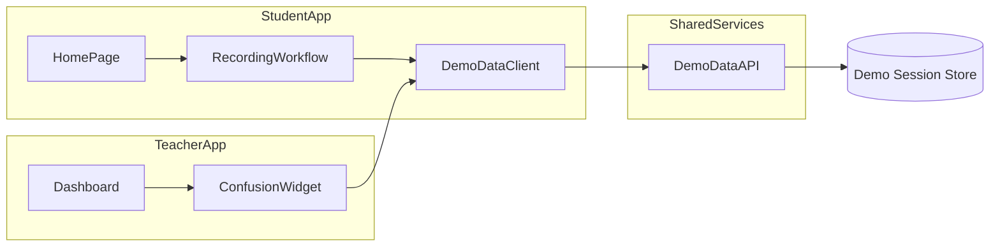
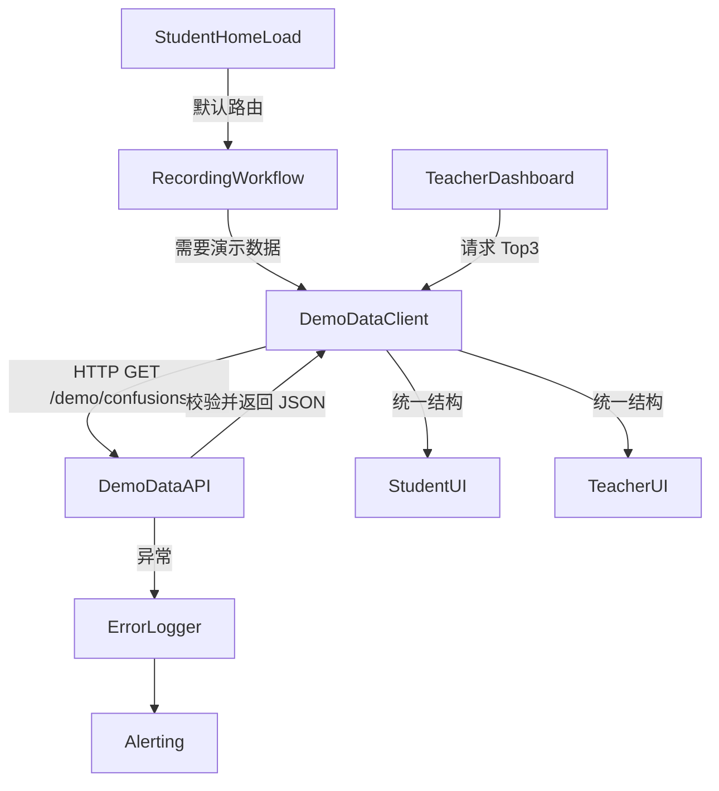

## Product Overview

MeetMind 平台需确保学生端首次进入课程时立即呈现录音工作流，并让教师端课后反馈页稳定展示与学生端一致的演示困惑点数据，以便双方同步定位问题并验证录音标注效果。

## Core Features

- 学生首页自动落在录音流程：页面加载直接聚焦录音卡片，提供明显的录制引导与可视化进度状态，避免用户再手动切换。
- 演示困惑点数据统一：复用学生端演示数据源，将困惑点列表、热度数值及标签状态在教师仪表板中以卡片式视觉呈现，确保“困惑热点 Top3”不再为空。

## Tech Stack

- 前端：沿用现有 React + TypeScript 项目结构，使用 Zustand/Redux（若已有）管理录音工作流状态。
- 后端：复用 Node.js + Express/BFF 层接口，统一 demo-session 困惑点数据服务，必要时添加缓存层。
- 数据存储：继续使用项目现有 JSON Mock 或云数据库集合，保证 teacher/student 读取相同集合。

## Tech Architecture

### 总体结构



- StudentApp 与 TeacherApp 通过共享 DemoDataClient 访问 DemoDataAPI，避免重复解析逻辑。
- DemoDataAPI 从 Demo Session Store 提供统一数据结构（困惑点数组 + 汇总指标）。

### 模块划分

1. **学生录音工作流模块**

- 负责首页加载逻辑、录音状态管理、默认视图切换。
- 依赖 UI 组件层与状态管理层。

2. **演示困惑数据编排模块**

- 提供 `fetchDemoConfusion()` 服务，封装数据校验、字段映射、缓存。
- 供学生与教师前端以及 BFF 复用。

3. **教师困惑展示模块**

- 渲染困惑点 Top3、统计面板与状态提示。
- 依赖演示困惑数据编排模块。

4. **观测与回放模块**

- 负责接口日志、埋点事件与错误提示。
- 依赖平台既有监控方案。

### 数据流



- 数据返回格式：`{ sessionId, updatedAt, confusionPoints: ConfusionPoint[] }`。
- 错误流：API 捕获异常写入 ErrorLogger，并在 UI 显示回退提示。

## 实施细节

### 目录结构（增量）

```
student-app/
└── src/
    ├── pages/
    │   └── Home/
    │       ├── index.tsx         # 调整默认路由及录音工作流挂载
    │       └── recordingConfig.ts # 新增默认视图配置
    ├── services/
    │   └── demoDataClient.ts     # 抽离演示困惑数据访问
teacher-app/
└── src/
    ├── widgets/
    │   └── ConfusionTop.tsx      # 重用 demo 数据渲染
    └── hooks/
        └── useDemoConfusion.ts   # 统一数据钩子
shared/
└── api/
    └── demoSessions.ts           # BFF/SDK：fetchDemoConfusion
```

### 核心代码结构

```typescript
// shared/types/demoSession.ts
export interface ConfusionPoint {
  id: string;
  title: string;
  timestamp: number;
  severity: 'low' | 'medium' | 'high';
  resolved: boolean;
  tags: string[];
}

export interface DemoSessionSnapshot {
  sessionId: string;
  updatedAt: string;
  confusionPoints: ConfusionPoint[];
}
```

```typescript
// student/services/demoDataClient.ts
export async function fetchDemoConfusion(sessionId: string): Promise<DemoSessionSnapshot> { /* ... */ }

// student/pages/Home/recordingConfig.ts
export const defaultStudentEntry: StudentEntry = {
  primaryTab: 'recording',
  scrollAnchor: '#recording-flow',
  autoplayGuide: true,
};
```

```typescript
// teacher/hooks/useDemoConfusion.ts
export function useDemoConfusion(sessionId: string) {
  const [data, setData] = useState<DemoSessionSnapshot | null>(null);
  useEffect(() => { /* 调用 fetchDemoConfusion 并做字段映射 */ }, [sessionId]);
  return { top3: data?.confusionPoints.slice(0,3) ?? [], stats: computeStats(data) };
}
```

### 技术实施计划

1. **问题：学生首页未默认进入录音视图**

- 方案：在路由守卫 / Home 初始化中注入默认入口配置，并根据 URL 参数降级。
- 关键技术：路由守卫、状态管理、持久化首选项。
- 步骤：

    1. 收集现有 Home 页签逻辑与路由参数。
    2. 新增 `defaultStudentEntry` 配置，优先级高于本地缓存。
    3. 初始化时调用 `setActiveTab('recording')` 并滚动到锚点。
    4. 若录音组件加载失败，回退到原逻辑并提示。

- 测试：E2E 打开主页验证自动切换；单测确保配置优先级。

2. **问题：教师端无法显示演示困惑点**

- 方案：抽离演示数据客户端，确保教师端与学生端共用数据及映射。
- 关键技术：共享 API SDK、React hooks。
- 步骤：

    1. 分析学生端演示数据来源与字段。
    2. 在 shared/api 中封装 `fetchDemoConfusion`，并在教师端引入。
    3. 重构教师端 `ConfusionTop` 组件读取统一结构、渲染空状态。
    4. 添加字段兼容（如 severity 缺省时给默认）。

- 测试：Mock demo 数据，确保教师端列表显示；快照测试空态。

3. **问题：缺少监控导致数据异常难以定位**

- 方案：在 DemoDataClient 中添加日志、重试及告警钩子。
- 关键技术：现有日志 SDK。
- 步骤：

    1. 统一错误码与 message。
    2. API 超时添加 fallback 数据。
    3. 教师端提示“暂无演示数据”并给检查链接。

- 测试：注入错误响应，验证日志与 UI 文案。

### 集成要点

- Student/Teacher 前端通过共享 `shared/api` SDK 访问 `GET /demo/confusions?sessionId=xxx`，数据格式 JSON。
- 需要沿用平台登录态 cookie / token，确保教师端有权限读取 demo 数据。
- 日志上报依然使用项目原有埋点服务（如 Sentry/Arms）。

### 日志与监控

- 在 DemoDataClient 捕获异常并使用现有 `logger.error`。
- 加入关键路径埋点：学生默认路由成功/失败、教师端 demo 数据加载成功/失败。

### 性能优化

- 利用内存缓存（例如 `Map<sessionId, DemoSessionSnapshot>`）减少重复请求。
- Teacher Dashboard 使用骨架屏 + lazy 渲染，避免加载空白。
- 录音视图默认加载时推迟非关键组件（如历史记录）渲染。

### 安全措施

- 校验 sessionId 来自允许的 demo 列表。
- 后端响应中剔除敏感字段，只传困惑点必要信息。
- 防止 XSS：在教师端渲染 tags/标题前进行转义。

### 可扩展性

- Demo 数据 SDK 支持切换到真实课堂 session，仅需调整 sessionId。
- 录音默认入口配置化，未来可以按用户角色/实验分流。