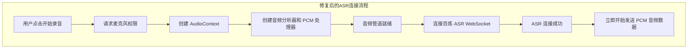
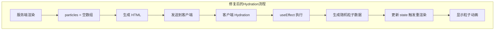

## 产品概述

修复 MeetMind 录音组件的两个技术问题，确保 ASR 语音转录服务稳定连接，以及加载页面动画正确渲染。

## 核心功能

1. **ASR 连接时序优化**：调整录音组件中百炼 ASR 的连接时机，确保麦克风初始化完成后再建立 WebSocket 连接，避免因音频未就绪导致的 Idle timeout 断开
2. **Hydration 不匹配修复**：修复加载页面粒子动画在服务端渲染与客户端渲染不一致的问题，确保页面正确水合

## 技术栈

- 前端框架：Next.js + React + TypeScript
- 样式：Tailwind CSS
- 音频处理：Web Audio API + MediaRecorder
- 语音识别：百炼 ASR（WebSocket 实时转录）

## 技术架构

### 问题分析与解决方案

#### 问题一：ASR Idle timeout

**根因分析**：
当前 `Recorder.tsx` 的 `startRecording` 函数执行流程：

1. 获取麦克风权限（可能耗时较长）
2. 创建 AudioContext 和音频分析器
3. 连接百炼 ASR WebSocket（此时还没设置音频发送）
4. 设置 PCM 处理器发送音频

问题在于第 3 步连接 ASR 后，到第 4 步设置音频发送之间存在时间差。如果用户首次授权麦克风较慢，ASR 服务端会因长时间未收到音频数据而主动断开连接（1007 Idle timeout）。

**解决方案**：
调整连接时序，确保音频处理器完全就绪后再连接 ASR：

1. 完成麦克风权限获取
2. 创建 AudioContext 和音频分析器
3. 创建 PCM 处理器并连接音频源
4. 最后连接百炼 ASR WebSocket
5. ASR 连接成功后立即开始发送音频

#### 问题二：Hydration 不匹配

**根因分析**：
`AppLoading.tsx` 使用 `useMemo` 在组件顶层调用 `Math.random()` 生成粒子数据。由于：

- 服务端渲染时会执行一次 `Math.random()`
- 客户端 hydration 时会再执行一次 `Math.random()`
- 两次生成的随机数不同，导致 DOM 结构不匹配

**解决方案**：
使用 `useState` + `useEffect` 延迟生成粒子数据：

1. 初始状态返回空数组
2. 在 `useEffect` 中（仅客户端执行）生成随机粒子
3. 这样服务端渲染时粒子为空，客户端 hydration 后再生成粒子

### 数据流程





## 实现细节

### 修改文件结构

```
src/
├── components/
│   ├── Recorder.tsx      # 修改：调整 ASR 连接时序
│   └── AppLoading.tsx    # 修改：延迟生成粒子数据
```

### 关键代码结构

**Recorder.tsx 修改要点**：

```typescript
// 修改 startRecording 函数的执行顺序
const startRecording = async () => {
  // 1. 获取麦克风权限
  const stream = await navigator.mediaDevices.getUserMedia({...});
  
  // 2. 创建 AudioContext 和音频处理器
  const audioContext = new AudioContext({ sampleRate: 16000 });
  const source = audioContext.createMediaStreamSource(stream);
  
  // 3. 创建 PCM 处理器（但暂不发送数据）
  const pcmProcessor = audioContext.createScriptProcessor(4096, 1, 1);
  source.connect(pcmProcessor);
  pcmProcessor.connect(audioContext.destination);
  
  // 4. 最后连接 ASR，连接成功后 PCM 处理器开始发送数据
  const asrClient = new DashScopeASRClient(...);
  await asrClient.start();
  
  // 5. 在 onaudioprocess 中检查连接状态后发送
  pcmProcessor.onaudioprocess = (e) => {
    if (asrClient.isConnected()) {
      // 发送音频数据
    }
  };
};
```

**AppLoading.tsx 修改要点**：

```typescript
// 使用 useState + useEffect 替代 useMemo
const [particles, setParticles] = useState<Particle[]>([]);

useEffect(() => {
  // 仅在客户端执行，避免 hydration 不匹配
  const generatedParticles = Array.from({ length: 20 }, (_, i) => ({
    id: i,
    x: Math.random() * 100,
    y: Math.random() * 100,
    size: Math.random() * 4 + 2,
    opacity: Math.random() * 0.3 + 0.1,
    speed: Math.random() * 20 + 10,
    angle: Math.random() * 360,
  }));
  setParticles(generatedParticles);
}, []);
```

### 技术实现计划

#### ASR 连接时序修复

1. **问题定位**：当前 ASR 连接在音频处理器设置之前完成
2. **解决方案**：重构 `startRecording` 函数，将 ASR 连接移到音频管道完全就绪之后
3. **关键技术**：确保 `pcmProcessorRef` 已连接后再调用 `asrClient.start()`
4. **验证方式**：测试首次麦克风授权场景，确认不再出现 1007 错误

#### Hydration 修复

1. **问题定位**：`useMemo` 中的 `Math.random()` 导致服务端/客户端不一致
2. **解决方案**：改用 `useState` 初始化为空数组，`useEffect` 中生成粒子
3. **关键技术**：利用 `useEffect` 仅在客户端执行的特性
4. **验证方式**：检查控制台无 hydration 警告