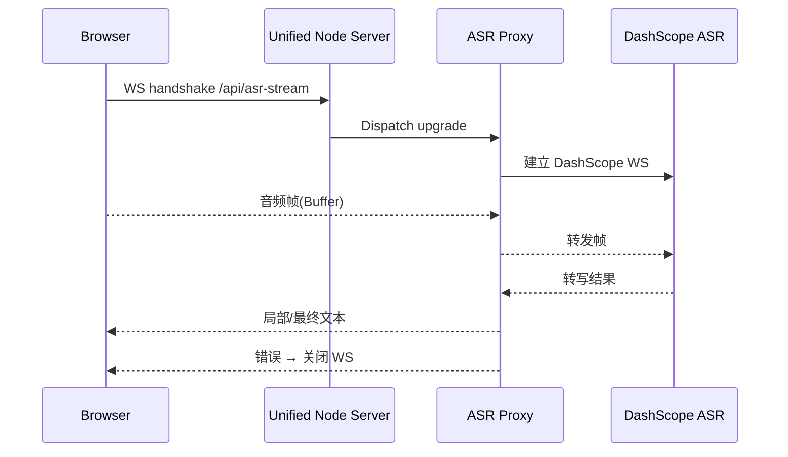

## Product Overview

- 修复 Next.js 开发服务器与自定义 ASR 代理 `server.js` 在 WebSocket upgrade 流程上的冲突，确保浏览器端实时录音与流式转写重新连通，控制台不再抛出 `AbortError`/`WS 1006`。

## Core Features

- 统一 WebSocket upgrade 入口：由单一 HTTP 服务器托管 Next.js 与 ASR 代理，避免重复监听 `upgrade`。
- 稳定的实时录音反馈：前端录音卡片可持续显示录音时长与状态提示，错误时弹出友好警示。
- 健壮的代理错误处理：当上游 DashScope 断连或凭证失效时，向前端返回清晰错误消息并安全关闭连接。

## Tech Stack

- 现有框架：Next.js（前端与 API 路由）、Node.js `server.js`（自定义 ASR WebSocket 代理）。
- 通讯格式：浏览器 WebSocket → 本地代理 → DashScope ASR WebSocket。
- 首选改造：复用单个 Node 进程，使用 `http.createServer` 托管 Next.js 请求并手动分派 `upgrade`。

## 技术架构

- 采用统一 HTTP 服务器层，Next.js 通过 `nextApp.prepare()` 后挂载到自定义服务器；`upgrade` 事件根据路径切换到 ASR 代理或交给 Next.js dev server。
- WebSocket 代理模块负责鉴权、音频帧流式转发及错误封装。

```mermaid
flowchart LR
A[Browser Recorder UI] -->|MediaStream WS| B[/api/asr-stream (Proxy Handler)]
B -->|Upgrade dispatch| C[ASR Proxy Core]
C -->|WS tunnel| D[DashScope ASR Service]
B -->|HTTP/WS| E[Next.js Dev Server]
```

## 模块划分

1. **Server Bootstrap 模块**

- 职责：创建 HTTP 服务器、挂载 Next.js 请求处理器、统一监听端口与 upgrade。
- 依赖：Next.js app、ASR Proxy 模块。
- 接口：`initServer(nextApp, proxy)`。

2. **Upgrade Dispatcher 模块**

- 职责：在 `server.on('upgrade')` 中根据 `req.url` 分流到 ASR 代理或 Next.js。
- 依赖：Proxy Handler、Next 内部 `app._hotReloader`.
- 接口：`handleUpgrade(req, socket, head)`.

3. **ASR Proxy Handler**

- 职责：校验请求来源、创建到 DashScope 的 WebSocket、转发音频/结果、处理异常关闭。
- 依赖：环境变量密钥、DashScope SDK。
- 接口：`createAsrProxy(req, socket, head)`.

4. **Front Recorder Integration**

- 职责：通过 `ws://localhost:3001/api/asr-stream` 与代理通信，展示实时状态与错误提示。
- 依赖：现有 React 录音组件。

## 数据流



## 核心目录（增改部分）

```
project-root/
├── server.js                # 改造：统一 HTTP/WS upgrade
├── lib/
│   └── asrProxy.js          # 新增：封装 DashScope 代理逻辑
├── next.config.js           # 确认自定义服务器模式
└── pages/api/asr-stream.ts  # 若需, 转发占位
```

## 关键代码结构

```javascript
// asrProxy.js
export function createAsrProxy({ dashScopeUrl, credentials }) {
  return (req, socket, head) => {
    const upstream = new WebSocket(dashScopeUrl, { headers: { Authorization: credentials } });
    upstream.on('open', () => socket.pipe(upstream));
    upstream.on('message', data => socket.write(data));
    upstream.on('close', () => socket.end());
    upstream.on('error', err => {
      socket.end(JSON.stringify({ type: 'error', message: err.message }));
    });
  };
}

// server.js
const server = http.createServer((req, res) => handleNextRequest(req, res));
server.on('upgrade', (req, socket, head) => {
  if (req.url === '/api/asr-stream') return asrProxy(req, socket, head);
  return nextApp.getUpgradeHandler()(req, socket, head);
});
```

## 技术实施计划

1. **问题定位**

- 确认 Next.js dev server 与自建 server 同时监听 3000/3001 造成 upgrade 冲突。

2. **统一服务器**

- 以 `http.createServer` 托管 Next.js，移除 `next dev` 自带服务器。

3. **升级分发**

- 新建 dispatcher，先判断路径再调用 `asrProxy` 或 Next.js upgrade。

4. **健壮错误处理**

- 在 proxy 中捕获 upstream `error/close`，向前端发送 JSON 错误并关闭。

5. **测试策略**

- 本地录音端到端测试。
- 使用 `webapp-testing` 工具或 Playwright（如后续需要）验证多次重连。
- 监控 Node 日志确保无 `undefined.bind`。

## 集成要点

- 与 DashScope ASR WebSocket 对接，保持 JSON 帧格式一致。
- 浏览器端使用 `ws://` URL；错误消息使用 `{ type, message, code }` JSON。
- 鉴权：优先在服务器端使用 `.env` 中的 API Key，避免前端暴露。
- 若需代理多环境，抽象可配置端口与路径。

## 性能 & 安全

- 复用单个服务器减少端口冲突，减轻 upgrade 开销。
- 使用背压控制与 `socket.pause/resume` 保护 Node 进程。
- 校验 `Origin` 和自定义 token，防止任意站点滥用录音接口。
- 对 DashScope 返回的文本进行长度/频率控制，避免前端阻塞。

## 可扩展性

- 统一 dispatcher 便于未来增加 `/api/tts-stream` 等路径。
- 模块化 proxy 方便接入不同 ASR 服务。
- 通过负载均衡或扩容 Node 进程满足更多并发。

## Agent Extensions

- **subagent:code-explorer**
- Purpose: 全局检索 `server.js`、Next.js dev server 配置与录音前端逻辑，找出 upgrade 处理冲突点。
- Expected outcome: 明确现有代码路径与依赖，为合并服务器与重写 upgrade 提供准确依据。