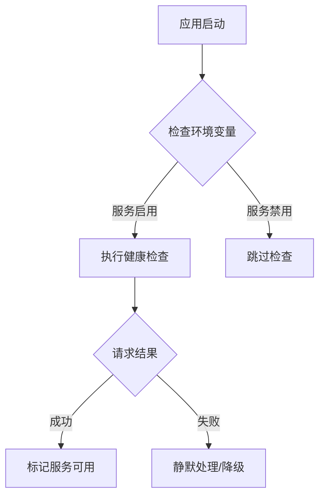

## 产品概述

修复 MeetMind 应用控制台中显示的连接错误，优化外部服务健康检查逻辑，确保在外部服务未部署时不会产生不必要的网络请求错误。

## 核心功能

- 添加环境变量控制外部服务健康检查的启用/禁用
- 优化健康检查逻辑，避免对未部署服务的无效请求
- 检查并修复潜在的 React Hydration 问题
- 提供优雅的降级处理，当外部服务不可用时静默处理

## 技术栈

- 现有项目技术栈（需探索确认）
- 环境变量配置管理

## 技术架构

### 问题分析

根据控制台错误信息：

- `localhost:4000/sessions/health` - Discussion API 健康检查
- `localhost:5055/health` - Notebook API 健康检查

这些请求在服务未部署时会产生 `ERR_CONNECTION_REFUSED` 错误。

### 解决方案

1. **环境变量控制**：添加配置项控制是否启用各服务的健康检查
2. **条件检查逻辑**：在发起健康检查前先判断是否启用
3. **错误静默处理**：对于预期可能失败的请求，避免在控制台输出错误

### 数据流



## 实施细节

### 需修改的目录结构

```
project-root/
├── .env.example          # 添加新环境变量示例
├── .env.local           # 本地环境配置
└── src/
    ├── config/          # 服务配置相关
    ├── services/        # 健康检查服务
    └── hooks/           # 相关 hooks（如有）
```

### 关键代码结构

**环境变量配置**

```typescript
// 服务启用配置
NEXT_PUBLIC_ENABLE_DISCUSSION_API=false
NEXT_PUBLIC_ENABLE_NOTEBOOK_API=false
DISCUSSION_API_URL=http://localhost:4000
NOTEBOOK_API_URL=http://localhost:5055
```

**健康检查优化逻辑**

```typescript
async function checkServiceHealth(serviceUrl: string, enabled: boolean): Promise<boolean> {
  if (!enabled) return false;
  try {
    const response = await fetch(`${serviceUrl}/health`);
    return response.ok;
  } catch {
    return false; // 静默处理连接错误
  }
}
```

## Agent Extensions

### SubAgent

- **code-explorer**
- Purpose: 探索项目结构，定位健康检查相关代码、环境变量配置文件、以及可能存在 Hydration 问题的组件
- Expected outcome: 找到所有涉及 localhost:4000 和 localhost:5055 请求的代码位置，以及项目的配置管理方式