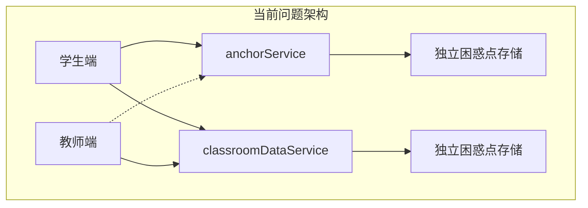
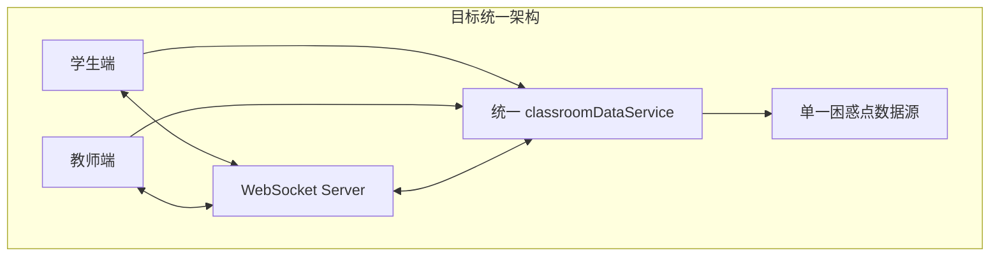

## 产品概述

修复 MeetMind 课堂系统的数据架构冗余问题，统一学生端和教师端的困惑点数据存储机制，确保演示数据和实时数据能够正确同步显示。同时修复实时录音功能的 WebSocket 连接失败问题。

## 核心功能

- 修复 WebSocket 连接问题：解决实时录音按钮点击无反应，WebSocket 连接 localhost:3081 失败的问题
- 统一数据存储架构：合并 anchorService 和 classroomDataService 的困惑点存储，消除数据冗余
- 修复数据同步机制：确保学生端标记的困惑点能够实时同步到教师端显示
- 演示数据正确加载：确保演示模式下的困惑点数据在学生端和教师端都能正确显示

## 技术栈

- 前端框架：React + TypeScript
- 状态管理：React Context + 自定义 Hooks
- 实时通信：WebSocket
- 样式：Tailwind CSS

## 技术架构

### 系统架构

当前架构存在数据存储冗余问题，需要重构为统一的数据流：





### 模块划分

- **数据服务模块**：统一 classroomDataService 作为唯一数据源
- **锚点服务模块**：anchorService 仅负责 UI 交互，不存储数据
- **WebSocket 模块**：修复连接配置，确保实时通信正常
- **同步模块**：实现学生端到教师端的数据同步逻辑

### 数据流

用户标记困惑点 -> anchorService 处理 UI -> classroomDataService 存储 -> WebSocket 广播 -> 教师端接收更新

## 实现细节

### 核心目录结构

```
src/
├── services/
│   ├── anchorService.ts        # 修改：移除独立存储，改为调用 classroomDataService
│   ├── classroomDataService.ts # 修改：作为唯一数据源，增加同步方法
│   └── websocketService.ts     # 修改：修复连接配置
├── contexts/
│   └── ClassroomContext.tsx    # 修改：统一数据订阅
└── components/
    ├── student/
    │   └── ConfusionMarker.tsx # 修改：使用统一数据源
    └── teacher/
        └── ConfusionList.tsx   # 修改：订阅统一数据源
```

### 关键代码结构

**统一困惑点数据接口**：定义困惑点的标准数据结构，确保学生端和教师端使用一致的数据格式。

```typescript
interface ConfusionPoint {
  id: string;
  timestamp: number;
  content: string;
  studentId: string;
  resolved: boolean;
  source: 'demo' | 'realtime' | 'upload';
}
```

**数据服务统一接口**：classroomDataService 作为唯一数据源，提供增删改查和订阅能力。

```typescript
class ClassroomDataService {
  addConfusionPoint(point: ConfusionPoint): void;
  getConfusionPoints(): ConfusionPoint[];
  subscribe(callback: (points: ConfusionPoint[]) => void): () => void;
  syncFromAnchor(anchorPoints: AnchorPoint[]): void;
}
```

### 技术实现方案

#### 问题1：WebSocket 连接失败

1. **问题定位**：WebSocket 尝试连接 localhost:3081 失败
2. **解决方案**：检查并修复 WebSocket 服务端口配置，确保服务启动
3. **实现步骤**：

- 检查 websocketService 中的连接 URL 配置
- 验证后端 WebSocket 服务是否正确启动
- 添加连接失败的重试机制和错误提示

#### 问题2：数据存储冗余

1. **问题定位**：anchorService 和 classroomDataService 各自独立存储困惑点
2. **解决方案**：将 anchorService 改为仅处理 UI 逻辑，数据存储统一由 classroomDataService 管理
3. **实现步骤**：

- 移除 anchorService 中的困惑点存储逻辑
- 在 anchorService 中添加对 classroomDataService 的调用
- 确保数据变更时触发统一的事件通知

#### 问题3：教师端看不到学生端数据

1. **问题定位**：教师端未订阅正确的数据源
2. **解决方案**：教师端组件订阅 classroomDataService 的数据变更
3. **实现步骤**：

- 修改教师端组件使用统一的数据订阅
- 确保演示数据也写入 classroomDataService
- 添加数据同步的调试日志

## Agent Extensions

### SubAgent

- **code-explorer**
- 用途：深入探索项目代码库，分析 anchorService、classroomDataService、websocketService 的实现细节和数据流关系
- 预期结果：完整理解当前数据架构，找出数据不同步的根本原因

### Skill

- **webapp-testing**
- 用途：测试修复后的 WebSocket 连接和数据同步功能
- 预期结果：验证实时录音功能正常工作，学生端困惑点能同步到教师端