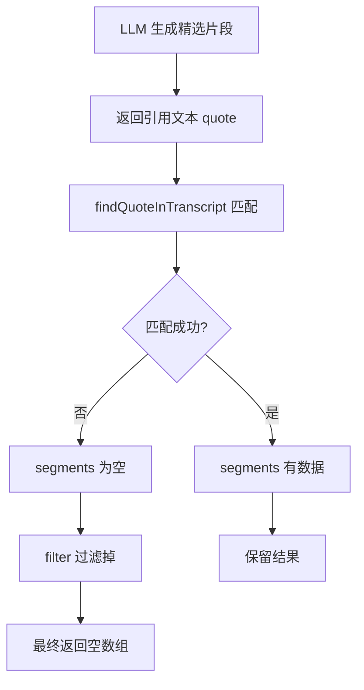
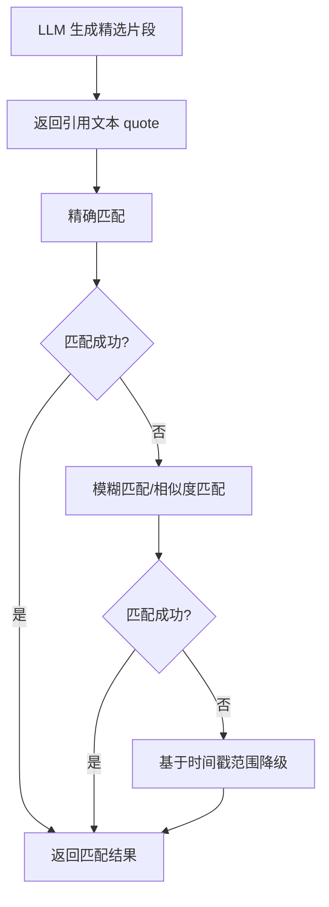

## Product Overview

修复 MeetMind 精选片段生成功能，解决 LLM 生成的引用文本与转录匹配失败导致结果为空的问题。

## Core Features

- 优化引用文本匹配算法：改进 `findQuoteInTranscript` 函数，支持模糊匹配和容错处理
- 增强匹配失败的降级策略：当精确匹配失败时，尝试基于时间戳或语义相似度的备选方案
- 改进过滤逻辑：避免因匹配失败而过滤掉所有有效结果
- 添加调试日志：便于定位匹配失败的具体原因

## Tech Stack

- 现有项目技术栈：TypeScript
- 核心修改模块：精选片段生成服务

## Tech Architecture

### 问题分析



### 解决方案架构



### 模块划分

- **匹配算法模块**：负责引用文本与转录的匹配逻辑
- 精确匹配：现有逻辑
- 模糊匹配：支持标点符号差异、空格差异、部分文本匹配
- 相似度匹配：基于编辑距离或 n-gram 相似度
- **降级策略模块**：匹配失败时的备选方案
- **结果过滤模块**：优化过滤逻辑，保留部分匹配结果

## Implementation Details

### 核心修改文件

```
project-root/
├── src/
│   └── services/
│       └── highlights/
│           ├── findQuoteInTranscript.ts  # 修改：增强匹配算法
│           └── highlightGenerator.ts     # 修改：优化过滤逻辑
```

### 关键代码结构

**改进的匹配函数接口**：支持多种匹配策略和配置选项

```typescript
interface MatchOptions {
  fuzzyMatch?: boolean;      // 启用模糊匹配
  similarityThreshold?: number; // 相似度阈值 (0-1)
  ignoreWhitespace?: boolean;   // 忽略空格差异
  ignorePunctuation?: boolean;  // 忽略标点差异
}

interface MatchResult {
  segments: TranscriptSegment[];
  confidence: number;  // 匹配置信度
  matchType: 'exact' | 'fuzzy' | 'similarity' | 'fallback';
}

function findQuoteInTranscript(
  quote: string,
  transcript: TranscriptSegment[],
  options?: MatchOptions
): MatchResult;
```

**文本预处理函数**：标准化文本以提高匹配成功率

```typescript
function normalizeText(text: string): string {
  return text
    .toLowerCase()
    .replace(/[，。！？、；：""''【】（）]/g, '') // 移除中文标点
    .replace(/[,.!?;:'"()\[\]]/g, '')  // 移除英文标点
    .replace(/\s+/g, ' ')  // 合并空格
    .trim();
}
```

### 技术实现方案

#### 1. 增强 findQuoteInTranscript 匹配逻辑

- **问题**：LLM 生成的引用文本可能与原始转录存在细微差异
- **方案**：

1. 文本预处理：移除标点、统一空格、大小写归一化
2. 滑动窗口匹配：在转录文本中寻找最相似的片段
3. 相似度计算：使用 Levenshtein 距离或 Jaccard 相似度

- **实现步骤**：
- 添加文本标准化函数
- 实现滑动窗口搜索
- 设置合理的相似度阈值（建议 0.7-0.8）

#### 2. 优化过滤逻辑

- **问题**：`.filter(t => t.segments.length > 0)` 过于严格
- **方案**：

1. 保留部分匹配结果，标记置信度
2. 对于完全无法匹配的结果，使用 LLM 返回的时间戳作为降级
3. 添加最小结果数保证，避免返回空数组

#### 3. 添加调试日志

- 记录每次匹配的输入文本和匹配结果
- 记录匹配失败的具体原因
- 便于后续问题排查

## Agent Extensions

### SubAgent

- **code-explorer**
- Purpose：探索现有代码库，定位 `findQuoteInTranscript` 函数和精选片段生成相关代码的具体位置和实现细节
- Expected outcome：获取完整的代码上下文，包括函数签名、调用链、数据结构定义，为修复提供准确的代码基础