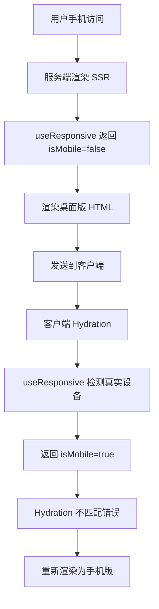
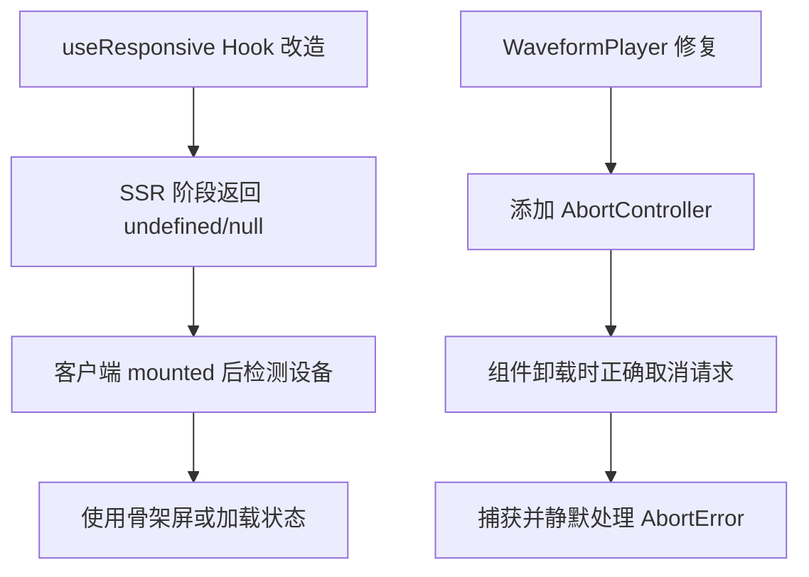

## 产品概述

修复 MeetMind 网站在手机端访问时出现的两个关键错误：React Hydration 错误和 WaveformPlayer AbortError。当前问题导致手机用户先看到桌面版页面，然后才切换到手机版，用户体验不佳。

## 核心功能

- 修复 SSR/CSR Hydration 不匹配问题：确保服务端和客户端渲染的响应式状态一致
- 修复 WaveformPlayer 组件的 AbortError：正确处理组件销毁时的异步操作取消
- 优化响应式布局的首屏渲染：避免手机端先显示桌面版再闪烁切换的问题

## 技术栈

- 框架：Next.js (基于现有项目)
- 语言：TypeScript
- 样式：现有项目样式方案

## 技术架构

### 问题分析



### 解决方案架构



## 实现细节

### 核心目录结构

```
src/
├── hooks/
│   └── useResponsive.ts      # 修改：解决 SSR hydration 问题
├── components/
│   └── WaveformPlayer.tsx    # 修改：修复 AbortError
```

### 关键代码结构

**useResponsive Hook 改造方案**

```typescript
// 改造前（问题代码）
const useResponsive = () => {
  const [isMobile, setIsMobile] = useState(window.innerWidth < 768);
  // SSR 时 window 不存在，或返回固定值导致不匹配
};

// 改造后（解决方案）
const useResponsive = () => {
  const [isMobile, setIsMobile] = useState<boolean | undefined>(undefined);
  const [mounted, setMounted] = useState(false);

  useEffect(() => {
    setMounted(true);
    const checkMobile = () => setIsMobile(window.innerWidth < 768);
    checkMobile();
    window.addEventListener('resize', checkMobile);
    return () => window.removeEventListener('resize', checkMobile);
  }, []);

  return { isMobile, mounted };
};
```

**WaveformPlayer AbortError 修复方案**

```typescript
// 添加 AbortController 管理
const abortControllerRef = useRef<AbortController | null>(null);

useEffect(() => {
  abortControllerRef.current = new AbortController();
  
  const loadWaveform = async () => {
    try {
      // 使用 signal 进行可取消的请求
      await someAsyncOperation({ signal: abortControllerRef.current?.signal });
    } catch (error) {
      if (error instanceof DOMException && error.name === 'AbortError') {
        // 静默处理取消错误，这是预期行为
        return;
      }
      throw error;
    }
  };

  return () => {
    abortControllerRef.current?.abort();
  };
}, []);
```

**组件条件渲染模式**

```typescript
// 在使用响应式的组件中
const { isMobile, mounted } = useResponsive();

// 未挂载时显示骨架屏或空状态，避免 hydration 不匹配
if (!mounted) {
  return <Skeleton />;
}

return isMobile ? <MobileView /> : <DesktopView />;
```

### 技术实现要点

1. **SSR Hydration 修复**

- useResponsive 在 SSR 阶段不返回具体的 isMobile 值
- 使用 mounted 状态标识客户端是否已挂载
- 组件在未挂载时渲染占位符或骨架屏

2. **AbortError 修复**

- 为 WaveformPlayer 中的异步操作添加 AbortController
- 组件卸载时调用 abort() 取消进行中的操作
- 捕获 AbortError 并静默处理，不向上抛出