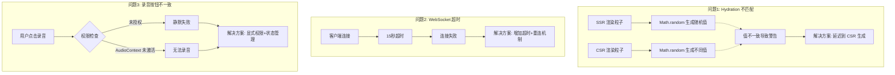
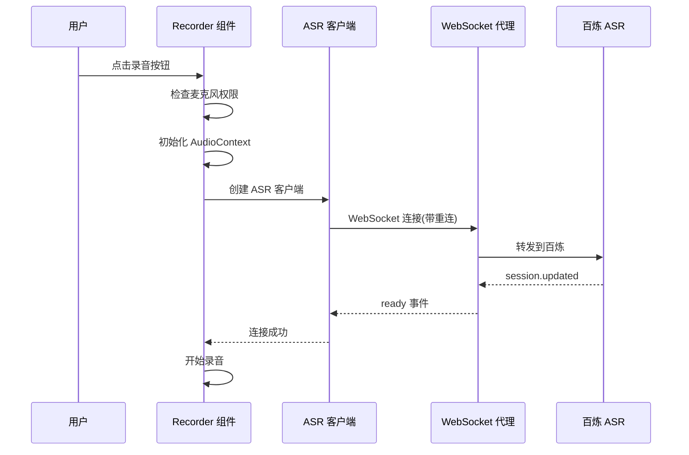

## 产品概述

修复 MeetMind 智能课堂学习助手在公网环境下的三个关键问题，确保应用在不同网络环境和设备上都能稳定运行。

## 核心问题

1. **Hydration 不匹配警告**：AppLoading 组件使用 `Math.random()` 生成粒子，SSR 与 CSR 渲染结果不一致导致控制台警告
2. **WebSocket 连接超时**：公网访问时 ASR 流式转录连接在 15 秒后超时失败
3. **录音按钮行为不一致**：不同设备/浏览器点击录音按钮后的响应不同，影响用户体验

## 技术栈

- 前端框架：Next.js 14 + React 18 + TypeScript
- 样式：Tailwind CSS
- 状态管理：Zustand
- 实时通信：WebSocket（自定义 server.js 代理）
- 语音识别：百炼 DashScope ASR（qwen3-asr-flash-realtime）

## 技术架构

### 问题分析与解决方案



### 数据流



## 实现细节

### 核心目录结构（仅修改文件）

```
project-root/
├── src/
│   ├── components/
│   │   ├── AppLoading.tsx        # 修复: 粒子延迟生成
│   │   └── Recorder.tsx          # 修复: 权限检查+AudioContext
│   └── lib/
│       └── services/
│           └── dashscope-asr-service.ts  # 修复: 超时+重连机制
└── server.js                      # 优化: 心跳检测+连接稳定性
```

### 关键代码结构

**问题1：Hydration 修复方案**

使用 `useState` + `useEffect` 确保粒子仅在客户端生成：

```typescript
// 修改前：useMemo 在 SSR/CSR 都执行
const particles = useMemo(() => generateParticles(), []);

// 修改后：使用 useState + useEffect 延迟到 CSR
const [particles, setParticles] = useState<Particle[]>([]);
useEffect(() => {
  setParticles(generateParticles());
}, []);
```

**问题2：WebSocket 超时与重连**

增加连接超时配置和自动重连机制：

```typescript
interface ASRConnectionOptions {
  connectionTimeout: number;  // 连接超时，默认 30s
  maxRetries: number;         // 最大重试次数，默认 3
  retryDelay: number;         // 重试间隔，默认 2s
}
```

**问题3：录音权限与 AudioContext**

在录音前显式检查权限并正确初始化 AudioContext：

```typescript
// 检查并请求麦克风权限
async function checkMicrophonePermission(): Promise<boolean> {
  try {
    const result = await navigator.permissions.query({ name: 'microphone' });
    return result.state === 'granted' || result.state === 'prompt';
  } catch {
    // 部分浏览器不支持 permissions API，尝试直接请求
    return true;
  }
}

// AudioContext 需要用户交互后才能初始化（部分浏览器要求）
function resumeAudioContext(ctx: AudioContext): Promise<void> {
  if (ctx.state === 'suspended') {
    return ctx.resume();
  }
  return Promise.resolve();
}
```

### 技术实现计划

**1. Hydration 修复**

- 问题：`useMemo` 在 SSR 和 CSR 都会执行，`Math.random()` 产生不同值
- 方案：使用 `useState([])` 初始化空数组，在 `useEffect` 中生成粒子
- 验证：检查控制台无 Hydration 警告

**2. WebSocket 连接优化**

- 问题：公网延迟高，15 秒超时不够
- 方案：
- 增加超时时间到 30 秒
- 添加连接重试机制（最多 3 次）
- 添加心跳检测保持连接
- 验证：公网环境下能稳定连接

**3. 录音按钮一致性**

- 问题：不同浏览器对麦克风权限和 AudioContext 处理不同
- 方案：
- 录音前显式检查权限状态
- AudioContext 创建后调用 `resume()` 确保激活
- 添加权限拒绝的明确错误提示
- 验证：Chrome/Safari/Firefox 等主流浏览器表现一致

### 安全考虑

- WebSocket 重连时不应暴露敏感信息
- 麦克风权限请求应有明确的用户提示