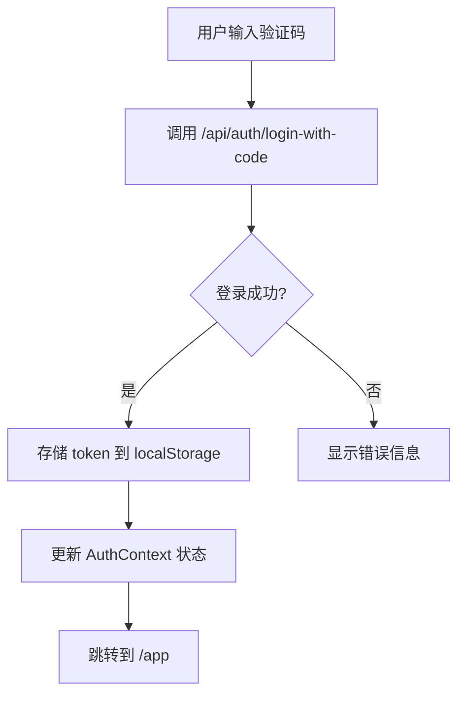

## 产品概述

修复 MeetMind 应用验证码登录后认证状态不同步的 Bug，并优化验证码登录的用户体验流程。

## 核心功能

1. **修复登录状态同步 Bug**：解决验证码登录成功后，右上角导航栏仍显示"登录"按钮而非用户头像的问题
2. **验证码自动登录**：当用户输入满 6 位验证码后，自动触发登录流程，减少用户点击操作

## 技术栈

- 前端框架：Next.js 14 + React + TypeScript
- 状态管理：React Context（AuthContext）
- 样式方案：Tailwind CSS

## 问题分析与解决方案

### Bug 原因分析

验证码登录 `handleCodeLogin` 函数存在两个问题：

1. **Token 存储 Key 错误**：使用了 `accessToken` 而非正确的 `meetmind_access_token`
2. **未更新 AuthContext 状态**：登录成功后直接跳转页面，未调用 AuthContext 中的方法更新全局认证状态

### 数据流分析



### 解决方案

#### 方案一：修复 Token 存储 Key（必须）

将 `handleCodeLogin` 中的 token 存储从 `localStorage.setItem('accessToken', ...)` 修改为使用 `useAuth` 提供的方法或正确的 key `meetmind_access_token`

#### 方案二：复用 AuthContext 登录逻辑（推荐）

在 `useAuth` hook 中新增 `loginWithCode` 方法，统一处理验证码登录逻辑，确保：

- 正确存储 token
- 更新全局认证状态
- 获取用户信息

### 流程优化方案

在验证码输入框的 `onChange` 事件中添加判断：当输入达到 6 位时，自动触发登录提交。

## 实现细节

### 修改文件

```
project-root/
├── src/
│   ├── lib/hooks/
│   │   └── useAuth.tsx           # 修改：新增 loginWithCode 方法
│   └── app/(auth)/login/
│       └── page.tsx              # 修改：使用 loginWithCode 并实现自动登录
```

### 关键代码结构

**新增 loginWithCode 方法（useAuth.tsx）**

此方法统一处理验证码登录流程，确保与密码登录共用相同的状态更新逻辑：

```typescript
interface LoginWithCodeRequest {
  target: string;
  code: string;
  type: 'email' | 'sms';
  rememberMe?: boolean;
}

const loginWithCode = useCallback(async (request: LoginWithCodeRequest): Promise<AuthResponse> => {
  const response = await fetch('/api/auth/login-with-code', {
    method: 'POST',
    headers: { 'Content-Type': 'application/json' },
    body: JSON.stringify(request),
    credentials: 'include',
  });
  
  const data: AuthResponse = await response.json();
  
  if (data.success && data.accessToken && data.user) {
    setStoredToken(data.accessToken);  // 使用正确的 key
    setState({
      user: data.user,
      isLoading: false,
      isAuthenticated: true,
      permissions: [],
      accessToken: data.accessToken,
    });
  }
  
  return data;
}, []);
```

**验证码自动登录逻辑（login/page.tsx）**

监听验证码变化，满 6 位时自动提交：

```typescript
const handleCodeChange = (value: string) => {
  const newCode = value.replace(/\D/g, '').slice(0, 6);
  setCode(newCode);
  
  // 满6位自动登录
  if (newCode.length === 6) {
    handleAutoLogin(newCode);
  }
};
```

### 技术实现要点

1. **状态一致性**：统一使用 AuthContext 管理登录状态，避免手动操作 localStorage
2. **防抖处理**：自动登录需添加防抖，避免重复提交
3. **错误处理**：自动登录失败时保留验证码输入，允许用户手动重试