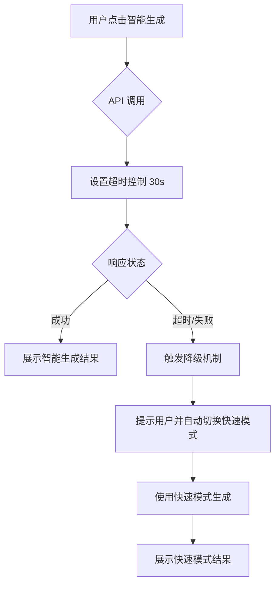

## 产品概述

MeetMind 是一款课堂录音智能分析应用，支持从录音中提取关键知识点。当前存在智能模式生成失败和时间戳匹配不够准确的问题需要修复。

## 核心功能修复

### 1. 智能模式生成失败修复

- 问题现象：点击智能生成后几秒回到原页面，无生成内容
- 根本原因：qwen3-max 模型 API 调用可能存在超时或错误，缺乏异常处理
- 修复目标：添加超时控制机制，实现降级到快速模式的容错策略

### 2. 时间戳匹配优化

- 问题现象：生成的精选片段时间戳与实际内容位置存在偏差
- 优化目标：提升时间戳定位的准确性，确保片段起止点与内容匹配

## 技术方案

### 问题诊断

根据控制台日志和用户反馈分析：

1. 智能模式使用 qwen3-max 模型，API 响应时间较长
2. 缺乏超时控制导致请求挂起后静默失败
3. 无错误提示和降级机制

### 修复架构



### 核心修复点

#### 1. 超时控制实现

```typescript
// API 调用超时控制
interface SmartModeOptions {
  timeout: number;  // 超时时间 ms
  retryCount: number;  // 重试次数
  fallbackToFast: boolean;  // 是否降级到快速模式
}

async function generateSmartMode(
  audioData: AudioData, 
  options: SmartModeOptions = { timeout: 30000, retryCount: 1, fallbackToFast: true }
): Promise<GenerationResult> {
  // 带超时的 API 调用
}
```

#### 2. 降级机制

- 检测到超时或 API 错误时，自动提示用户
- 提供"切换快速模式"选项或自动降级
- 保留用户选择，记录失败日志用于后续优化

#### 3. 时间戳匹配优化

```typescript
// 时间戳匹配算法优化
interface TimestampMatch {
  startTime: number;
  endTime: number;
  confidence: number;  // 匹配置信度
  adjustedOffset: number;  // 校正偏移量
}

function optimizeTimestamp(
  transcript: TranscriptSegment[],
  targetContent: string
): TimestampMatch {
  // 基于文本相似度的精确匹配
  // 考虑语音识别的边界误差
}
```

### 实现细节

#### 目录结构（仅修改部分）

```
src/
├── services/
│   └── aiService.ts      # 修改：添加超时控制和重试逻辑
├── hooks/
│   └── useGeneration.ts  # 修改：添加降级机制状态管理
├── utils/
│   └── timestampMatcher.ts  # 修改：优化时间戳匹配算法
└── components/
    └── GenerationPanel.tsx  # 修改：添加错误提示和降级 UI
```

#### 错误处理流程

1. 捕获 API 超时错误（AbortController + setTimeout）
2. 捕获网络错误（ERR_CONNECTION_REFUSED）
3. 显示友好错误提示
4. 提供降级选项或自动切换

### 技术要点

- 使用 AbortController 实现请求超时取消
- Promise.race 实现超时竞争
- 添加请求状态追踪（loading/error/success）
- 优化时间戳匹配使用滑动窗口算法提升准确性

## Agent Extensions

### SubAgent

- **code-explorer**
- 用途：探索项目代码结构，定位智能模式生成相关的服务层、API 调用逻辑和时间戳匹配算法的具体实现位置
- 预期结果：找到 aiService、生成逻辑 hooks、时间戳处理工具等关键文件的位置和现有实现方式