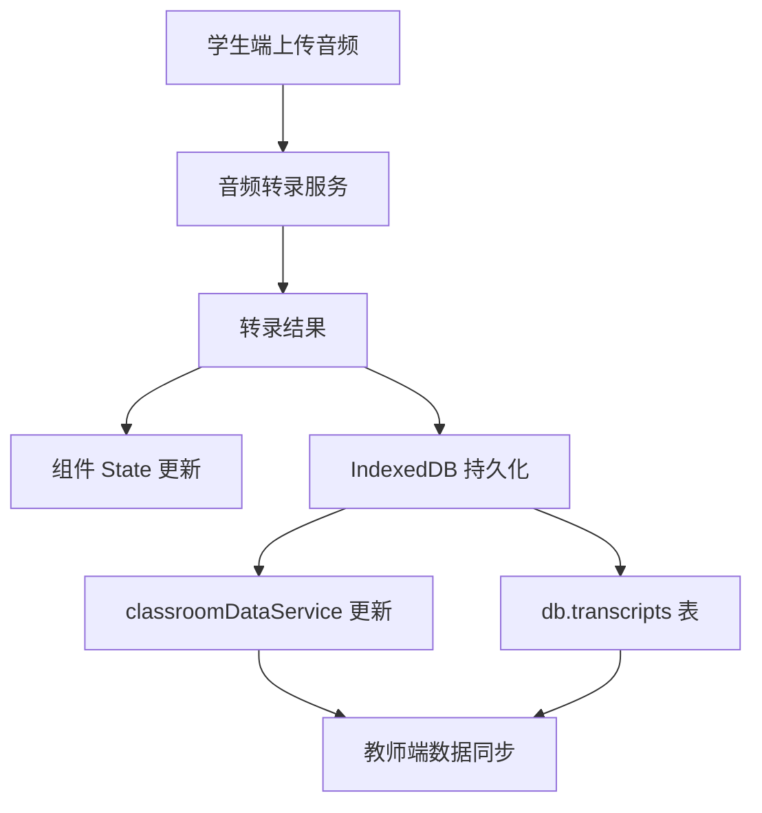

## Product Overview

修复学生端音频转录后数据无法同步到教师端的问题。当前学生端上传音频并完成转录后，转录内容仅保存在组件的 state 中，未持久化到 IndexedDB 共享存储，导致教师端无法获取真实的转录数据。

## Core Features

- 转录数据持久化：将转录内容写入 IndexedDB 的 db.transcripts 表
- 会话 ID 管理：生成并使用真实的 sessionId 替代默认的 'demo-session'
- 数据同步机制：更新 classroomDataService 的会话信息，确保教师端能正确读取
- 状态一致性：保证组件 state 与 IndexedDB 数据的同步

## 技术栈

- 前端框架：React + TypeScript（沿用现有项目技术栈）
- 数据存储：IndexedDB（Dexie.js）
- 状态管理：React Hooks

## 技术架构

### 系统架构



### 数据流

1. 学生端上传音频文件
2. 调用转录服务获取转录结果
3. 同时更新组件 state 和写入 IndexedDB
4. 更新 classroomDataService 会话信息
5. 教师端从 IndexedDB 读取最新数据

## 实现细节

### 修改文件结构

```
src/
├── components/
│   └── StudentView.tsx      # 修改：添加转录数据持久化逻辑
├── services/
│   └── classroomDataService.ts  # 修改：更新会话信息方法
└── db/
    └── index.ts             # 检查：确认 transcripts 表结构
```

### 关键代码结构

**转录数据写入逻辑**：在转录完成后，需要将数据同步写入 IndexedDB

```typescript
// 转录完成后的数据持久化
const saveTranscript = async (sessionId: string, transcriptData: TranscriptData) => {
  await db.transcripts.put({
    sessionId,
    content: transcriptData.content,
    segments: transcriptData.segments,
    updatedAt: new Date()
  });
  await classroomDataService.updateSession(sessionId, transcriptData);
};
```

**会话 ID 生成**：使用真实的会话 ID 替代默认值

```typescript
const generateSessionId = () => {
  return `session-${Date.now()}-${Math.random().toString(36).substr(2, 9)}`;
};
```

### 技术实现方案

1. **问题定位**：转录数据只存在于组件 state，未调用 db.transcripts.put()
2. **解决方案**：在转录回调中添加 IndexedDB 写入操作
3. **关键步骤**：

- 生成唯一 sessionId
- 转录完成后调用数据持久化方法
- 更新 classroomDataService 会话状态
- 验证教师端数据同步

## Agent Extensions

### SubAgent

- **code-explorer**
- Purpose：探索项目代码结构，定位转录相关的组件、服务和数据库操作代码
- Expected outcome：找到 StudentView 组件、classroomDataService 服务、IndexedDB 数据库定义等关键文件的位置和实现细节