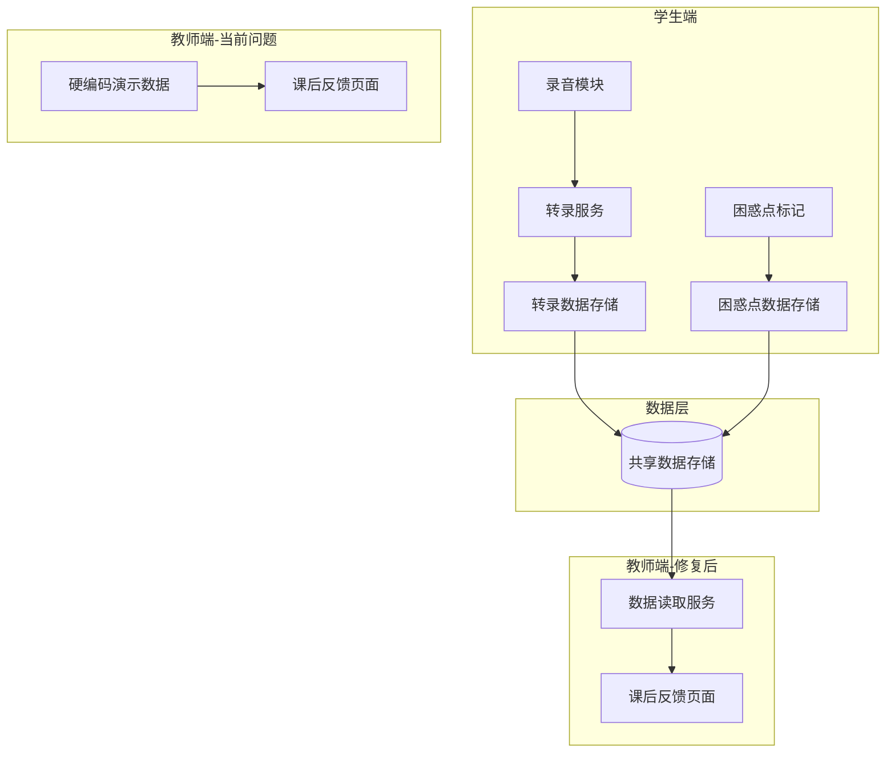
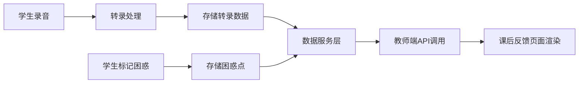

## 产品概述

修复MeetMind教育平台中教师端与学生端数据同步问题，确保教师端能够正确读取并显示学生端录制的真实转录内容和困惑点数据，实现两端数据完全一致。

## 核心功能

- 移除教师端硬编码的演示数据（二次函数相关内容）
- 建立教师端与学生端的数据读取通道
- 教师端实时获取学生端的课堂转录内容
- 教师端同步显示学生标记的困惑点数据
- 确保困惑热点TOP3显示真实学生数据而非模拟数据

## 技术分析

### 问题定位

根据用户反馈，存在以下数据不一致问题：

1. 教师端"课后反馈"页面显示硬编码的二次函数演示数据
2. 学生端显示真实转录内容（Australia's Moving Experience英文对话）
3. 两端数据源不统一，教师端未从共享数据源读取

### 系统架构分析



### 模块划分

#### 数据服务模块

- 职责：统一管理转录和困惑点数据的读写
- 关键接口：
- `getSessionTranscripts(sessionId)` - 获取课堂转录
- `getConfusionPoints(sessionId)` - 获取困惑点列表
- `getConfusionHotspots(sessionId)` - 获取困惑热点统计

#### 教师端页面模块

- 职责：展示课后反馈数据
- 需修改：移除硬编码数据，改为调用数据服务

### 数据流修复方案



## 实现细节

### 核心目录结构

针对现有项目的修改，仅展示需要修改的文件：

```
src/
├── services/
│   └── sessionDataService.ts    # 修改：统一数据读取服务
├── pages/
│   └── teacher/
│       └── FeedbackPage.tsx     # 修改：移除硬编码，接入真实数据
├── hooks/
│   └── useSessionData.ts        # 新增：课堂数据获取Hook
└── types/
    └── session.ts               # 修改：确保类型定义一致
```

### 关键代码结构

**转录数据接口**：定义课堂转录的数据结构

```typescript
interface TranscriptSegment {
  timestamp: string;      // 时间戳 如 "00:00"
  content: string;        // 转录文本内容
  speakerRole?: string;   // 说话者角色
}

interface SessionTranscript {
  sessionId: string;
  segments: TranscriptSegment[];
  totalDuration: string;
}
```

**困惑点数据接口**：定义学生困惑点的数据结构

```typescript
interface ConfusionPoint {
  id: string;
  timeRange: { start: string; end: string };
  description: string;
  studentCount: number;
  possibleReason?: string;
  status: 'pending' | 'resolved';
}
```

### 技术实现计划

1. **定位硬编码数据源**

- 搜索教师端代码中的硬编码数据
- 识别"二次函数"、"顶点坐标公式"等关键词位置

2. **建立数据读取通道**

- 确认学生端数据存储位置和格式
- 创建统一的数据服务接口
- 教师端调用该服务获取真实数据

3. **数据格式对齐**

- 确保转录数据格式在两端一致
- 困惑点数据结构统一

### 集成要点

- 教师端与学生端共用同一数据源
- 数据通过sessionId关联
- 实时性要求：教师端刷新后应显示最新数据

## 代理扩展

### SubAgent

- **code-explorer**
- 用途：全面搜索项目代码库，定位硬编码的演示数据位置，追踪学生端数据存储逻辑，分析现有数据流架构
- 预期结果：找到所有硬编码数据的文件位置，理清学生端数据存储机制，明确需要修改的文件清单