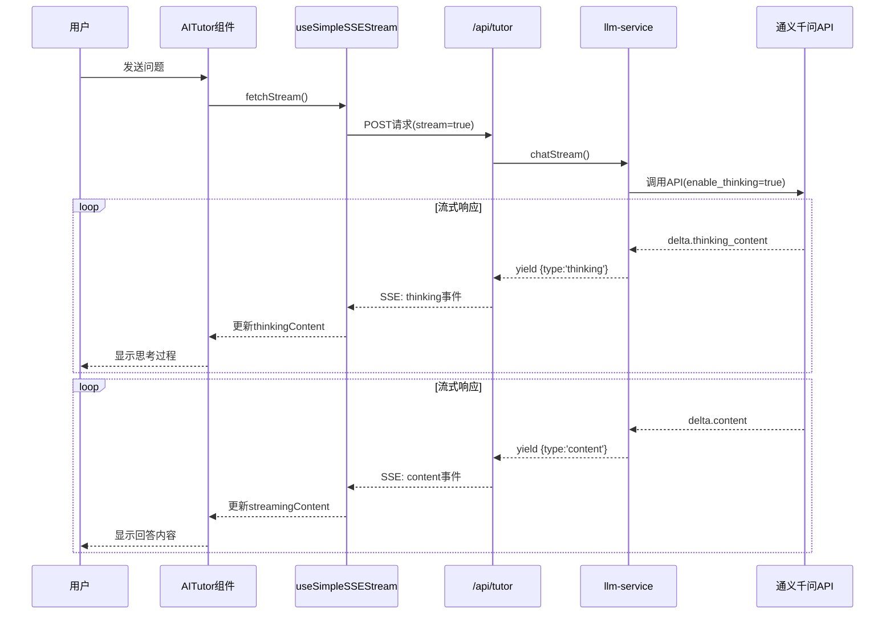

## 用户需求

用户反馈启用 qwen3-max-2026-01-23 模型思考模式后，思考过程没有输出显示给用户。需要在 AI 对话中展示模型的思考过程。

## 产品概述

为 MeetMind AI 助手添加思考过程展示功能，让用户能够看到 AI 在回答问题时的思考推理过程，提升用户对 AI 回答的信任度和理解。

## 核心功能

1. **LLM 服务层支持思考内容**：修改 LLMResponse 接口和 chatStream 函数，支持输出思考内容
2. **API 路由传递思考内容**：在 SSE 流式响应中新增 thinking 类型事件
3. **SSE Hook 支持思考内容**：扩展 useSimpleSSEStream 处理思考内容事件
4. **前端展示思考过程**：在 AITutor 组件中以可折叠区块展示思考过程

## Tech Stack

- 前端框架：Next.js + React + TypeScript
- 样式：Tailwind CSS
- 流式通信：Server-Sent Events (SSE)
- 后端 API：通义千问 qwen3-max-2026-01-23 思考模式

## 实现方案

### 整体数据流



### 关键技术决策

1. **流式输出区分思考和回答阶段**：通义千问思考模式会先输出 `delta.thinking_content`，再输出 `delta.content`。需要在 chatStream 中区分这两个阶段，使用不同的 yield 类型。

2. **SSE 事件新增 thinking 类型**：在现有 content/metadata/error 基础上新增 thinking 类型，专门用于传递思考内容。

3. **前端思考展示设计**：采用可折叠区块，默认展开显示思考过程，用户可以折叠隐藏。使用淡紫色背景区分思考和回答内容。

## 实现细节

### 1. LLM 服务层修改 (`llm-service.ts`)

**修改 chatStream 返回值类型**：

```typescript
// 流式输出的 chunk 类型
export interface StreamChunk {
  type: 'thinking' | 'content';
  content: string;
}

// chatStream 改为 yield StreamChunk
export async function* chatStream(...): AsyncGenerator<StreamChunk>
```

**处理通义千问思考模式的流式响应**：

- 解析 `delta.thinking_content` 字段，yield `{ type: 'thinking', content }`
- 解析 `delta.content` 字段，yield `{ type: 'content', content }`

### 2. API 路由修改 (`/api/tutor/route.ts`)

**扩展 SSE 事件格式**：

```typescript
// 思考内容
{ type: 'thinking', content: '思考过程...' }
// 回答内容
{ type: 'content', content: '回答内容...' }
```

### 3. SSE Hook 修改 (`useSSEStream.ts`)

**扩展 useSimpleSSEStream**：

- 新增 `thinkingContent` 状态
- 新增 `onThinking` 回调
- 处理 `type: 'thinking'` 事件

### 4. 前端组件修改 (`AITutor.tsx`)

**思考过程 UI 设计**：

- 使用可折叠的紫色背景区块
- 显示「AI 正在思考...」动画
- 思考完成后可折叠/展开
- 思考内容使用斜体和较小字号

## 目录结构

```
src/
├── lib/
│   ├── services/
│   │   └── llm-service.ts        # [MODIFY] 新增 StreamChunk 类型，修改 chatStream 函数支持输出思考内容
│   └── hooks/
│       └── useSSEStream.ts       # [MODIFY] 扩展 SSEEvent 类型，新增 thinkingContent 状态
├── app/
│   └── api/
│       └── tutor/
│           └── route.ts          # [MODIFY] 流式响应中新增 thinking 类型事件
└── components/
    └── AITutor.tsx               # [MODIFY] 新增思考过程展示 UI，使用可折叠区块
```

## 关键代码结构

```typescript
// StreamChunk 类型定义 (llm-service.ts)
export interface StreamChunk {
  type: 'thinking' | 'content';
  content: string;
}

// SSE 事件扩展 (useSSEStream.ts)
export interface SSEEvent {
  type: 'content' | 'metadata' | 'error' | 'thinking';
  content?: string;
  // ...
}

// useSimpleSSEStream 返回值扩展
return {
  fetchStream,
  stopStream,
  isStreaming,
  streamingContent,
  thinkingContent,  // 新增
  clearContent,
};
```