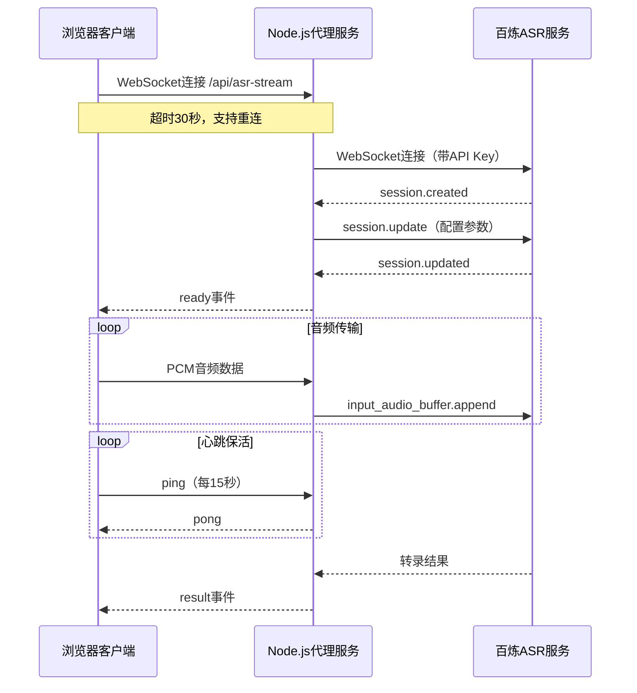

## 产品概述

修复 MeetMind 智能课堂学习助手的两个技术问题，确保应用在公网环境下稳定运行。

## 核心功能

1. **Hydration 不匹配修复**：解决 AppLoading 组件在服务端渲染（SSR）与客户端渲染（CSR）时粒子数据不一致导致的警告
2. **WebSocket 连接稳定性增强**：优化 ASR 语音识别服务的 WebSocket 连接机制，提升公网访问的稳定性和容错能力

## 技术栈

- 框架：Next.js（支持 SSR/CSR）
- 运行时：Node.js + 自定义 WebSocket 服务器
- 语音识别：百炼 DashScope ASR（实时流式）
- 样式：Tailwind CSS

## 技术架构

### 问题分析

#### 1. Hydration 不匹配问题

**文件**：`/src/components/AppLoading.tsx`

**原因**：第 41-51 行使用 `useMemo` 配合 `Math.random()` 生成粒子数据，但 `useMemo` 的初始计算在 SSR 和 CSR 时都会执行，导致：

- SSR 生成一组随机值
- CSR hydration 时生成另一组随机值
- React 检测到 DOM 不匹配，触发警告

**解决方案**：使用 `useState` + `useEffect` 延迟到客户端生成粒子数据，确保 SSR 时不渲染粒子。

#### 2. WebSocket 连接超时与稳定性问题

**文件**：

- `/src/lib/services/dashscope-asr-service.ts`（客户端）
- `/server.js`（服务端代理）

**原因**：

- 连接超时仅 15 秒（第 130-136 行），公网延迟大时不够
- 无自动重连机制，连接失败后无法恢复
- 无心跳保活机制，连接可能被中间网络设备断开

**解决方案**：

- 延长连接超时至 30 秒
- 实现指数退避重连机制（最多 3 次）
- 添加 WebSocket 心跳保活（客户端 ping、服务端 pong）

### 数据流



## 实现细节

### 核心目录结构（修改文件）

```
/mnt/meetmind/
├── src/
│   ├── components/
│   │   └── AppLoading.tsx      # 修改：延迟生成粒子数据
│   └── lib/services/
│       └── dashscope-asr-service.ts  # 修改：重连+心跳+超时优化
└── server.js                    # 修改：心跳响应+连接优化
```

### 关键代码结构

**AppLoading.tsx 修改**：使用 useState 延迟初始化粒子

```typescript
// 修改前：useMemo 在 SSR/CSR 都执行
const particles = useMemo<Particle[]>(() => {
  return Array.from({ length: 20 }, (_, i) => ({
    x: Math.random() * 100,
    // ...
  }));
}, []);

// 修改后：useState + useEffect 仅客户端执行
const [particles, setParticles] = useState<Particle[]>([]);
useEffect(() => {
  setParticles(Array.from({ length: 20 }, (_, i) => ({
    x: Math.random() * 100,
    // ...
  })));
}, []);
```

**DashScopeASRClient 重连机制**：

```typescript
interface ReconnectConfig {
  maxRetries: number;      // 最大重试次数：3
  baseDelay: number;       // 基础延迟：1000ms
  maxDelay: number;        // 最大延迟：10000ms
}

// 指数退避算法
function getRetryDelay(attempt: number): number {
  return Math.min(baseDelay * Math.pow(2, attempt), maxDelay);
}
```

**心跳保活机制**：

```typescript
// 客户端：每15秒发送ping
private heartbeatInterval: NodeJS.Timeout | null = null;
private startHeartbeat(): void {
  this.heartbeatInterval = setInterval(() => {
    if (this.ws?.readyState === WebSocket.OPEN) {
      this.ws.send(JSON.stringify({ type: 'ping' }));
    }
  }, 15000);
}

// 服务端：响应pong
if (msg.type === 'ping') {
  clientWs.send(JSON.stringify({ type: 'pong' }));
}
```

### 技术实现计划

#### 1. Hydration 修复

- **问题**：SSR/CSR 随机值不一致
- **方案**：`useState([])` 初始化空数组 + `useEffect` 客户端填充
- **步骤**：

1. 将 `useMemo` 改为 `useState` 初始化空数组
2. 添加 `useEffect` 在客户端生成粒子
3. 粒子为空时不渲染粒子 DOM

- **验证**：浏览器控制台无 Hydration 警告

#### 2. WebSocket 超时优化

- **问题**：15秒超时在公网不够
- **方案**：延长至 30 秒
- **步骤**：修改 `dashscope-asr-service.ts` 第 136 行超时值

#### 3. 重连机制

- **问题**：连接失败无法恢复
- **方案**：指数退避重连（1s/2s/4s，最多 3 次）
- **步骤**：

1. 添加重连配置和状态跟踪
2. 在 `onclose`/`onerror` 时触发重连
3. 重连成功后重置计数器

#### 4. 心跳保活

- **问题**：长连接被中间设备断开
- **方案**：客户端 ping + 服务端 pong（15秒间隔）
- **步骤**：

1. 客户端：连接成功后启动心跳定时器
2. 服务端：识别 ping 消息并回复 pong
3. 断开连接时清理定时器

## 技术考量

### 性能优化

- 粒子延迟渲染对用户无感知（首屏已有 loading 动画）
- 心跳间隔 15 秒平衡保活效果与网络开销

### 稳定性保障

- 重连上限防止无限循环
- 指数退避减少服务端压力
- 心跳超时检测可扩展（当前方案简化实现）