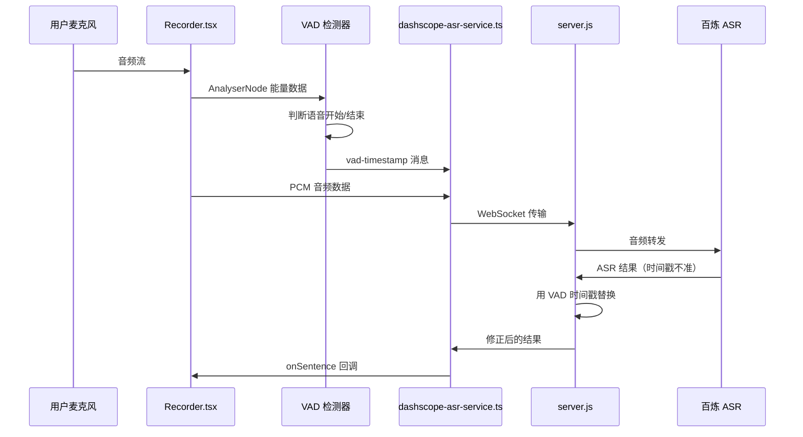
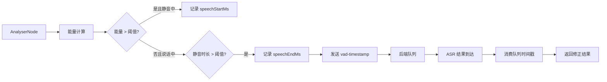

## 产品概述

实现前端能量 VAD（语音活动检测）功能，记录用户实际说话的开始/结束时间，替换百炼 ASR 不准确的时间戳，确保转录时间戳与断点标记、音频播放、时间轴等组件完全兼容。

## 核心功能

- **前端 VAD 能量检测**：复用 Recorder.tsx 中已有的 AnalyserNode，通过能量阈值判断语音开始和结束
- **VAD 时间戳记录**：在语音开始/结束时记录 elapsedMs（录音开始后的经过时间），确保与断点使用相同时间基准
- **WebSocket 消息传递**：前端将 VAD 时间戳通过 WebSocket 传递给后端
- **后端时间戳替换**：后端收到 ASR 结果时，使用前端 VAD 时间戳队列替换不准确的 ASR 时间戳
- **消费方兼容**：确保 TimelineView、WaveformPlayer、AITutor、AnchorDetailPanel 等组件正常工作

## 技术栈

- 前端框架：Next.js + React + TypeScript
- 音频处理：Web Audio API (AnalyserNode, ScriptProcessorNode)
- 通信协议：WebSocket (前端 dashscope-asr-service.ts <-> 后端 server.js <-> 百炼 ASR)

## 技术架构

### 系统架构



### 模块划分

- **VAD 检测模块**（新增）：基于能量阈值的语音活动检测，记录 startMs/endMs
- **WebSocket 通信模块**（修改）：dashscope-asr-service.ts 新增 vad-timestamp 消息发送
- **后端代理模块**（修改）：server.js 维护 VAD 时间戳队列，替换 ASR 结果时间戳

### 数据流



## 实现细节

### 核心目录结构

```
project-root/
├── src/
│   ├── components/
│   │   └── Recorder.tsx              # 修改：集成 VAD 检测逻辑
│   └── lib/
│       └── services/
│           └── dashscope-asr-service.ts  # 修改：新增 sendVADTimestamp 方法
├── server.js                          # 修改：维护 VAD 时间戳队列
```

### 关键代码结构

**VAD 状态接口**：定义 VAD 检测器的内部状态，包括能量阈值、静音判定时长、最小语音时长等参数，以及当前检测状态（是否在说话、静音开始时间等）。

```typescript
// VAD 状态（在 Recorder.tsx 中）
interface VADState {
  isSpeaking: boolean;          // 当前是否在说话
  speechStartMs: number | null; // 语音开始时间
  silenceStartMs: number | null; // 静音开始时间
}

// VAD 配置
const VAD_CONFIG = {
  energyThreshold: 0.08,        // 能量阈值（0-1）
  silenceDuration: 600,         // 静音判定时长（毫秒）
  minSpeechDuration: 200,       // 最小语音时长（毫秒）
};
```

**WebSocket 消息格式**：定义前端发送给后端的 VAD 时间戳消息结构，包含语音段的开始和结束时间（基于录音开始后的经过毫秒数）。

```typescript
// 新增 WebSocket 消息类型（前端 -> 后端）
interface VADTimestampMessage {
  type: 'vad-timestamp';
  startMs: number;  // 语音开始的 elapsedMs
  endMs: number;    // 语音结束的 elapsedMs
}
```

**后端时间戳队列**：服务端维护的 VAD 时间戳队列，用于存储前端发送的语音段时间信息，当 ASR 结果到达时按 FIFO 顺序消费，替换不准确的 ASR 时间戳。

```javascript
// 后端时间戳队列（在 server.js 中）
const vadTimestampQueue = [];

// 处理 VAD 时间戳消息
function handleVADTimestamp(msg) {
  vadTimestampQueue.push({
    startMs: msg.startMs,
    endMs: msg.endMs
  });
}

// ASR 结果到达时消费队列
function getVADTimestamp() {
  return vadTimestampQueue.shift();
}
```

### 技术实现方案

#### 1. VAD 能量检测

- **问题**：百炼 ASR 不返回准确的 beginTime/endTime
- **方案**：复用 Recorder.tsx 现有的 checkLevel 循环，在能量超过阈值时判定为语音开始，连续低于阈值达到静音时长时判定为语音结束
- **关键技术**：AnalyserNode.getByteFrequencyData() 获取频域能量数据
- **实现步骤**：

1. 在 checkLevel 循环中新增 VAD 状态管理
2. 计算平均能量并与阈值比较
3. 检测语音开始/结束边沿
4. 记录时间戳并发送到 ASR 客户端

#### 2. 时间戳传递

- **问题**：前端检测到的时间戳需要传递给后端
- **方案**：通过现有 WebSocket 连接发送 JSON 消息
- **实现步骤**：

1. dashscope-asr-service.ts 新增 sendVADTimestamp 方法
2. 前端检测到语音结束时调用该方法
3. 后端解析消息并入队

#### 3. 后端时间戳替换

- **问题**：ASR 结果到达时需要使用正确的时间戳
- **方案**：维护 FIFO 队列，每收到一个 ASR 结果消费一个时间戳
- **实现步骤**：

1. server.js 新增 vadTimestampQueue 数组
2. 收到 vad-timestamp 消息时入队
3. 收到 ASR completed 事件时，优先从队列取时间戳
4. 队列为空时使用当前 fallback 逻辑

### 集成验证

- TimelineView：VAD startMs/endMs 基于 elapsedMs，与 currentTime 同基准
- WaveformPlayer：seekTo(startMs) 可正确跳转到语音开始位置
- 断点标记：使用相同的 elapsedMs 时间基准，可正确对齐

## 技术考量

### 性能优化

- VAD 检测复用现有的 requestAnimationFrame 循环，无额外性能开销
- 时间戳消息体积小（约 50 字节），对 WebSocket 带宽影响可忽略

### 边界情况处理

- 快速连续说话：合并过短的静音间隙
- 队列不匹配：当队列为空时使用 fallback 时间戳
- 录音暂停/恢复：正确处理暂停期间的时间计算