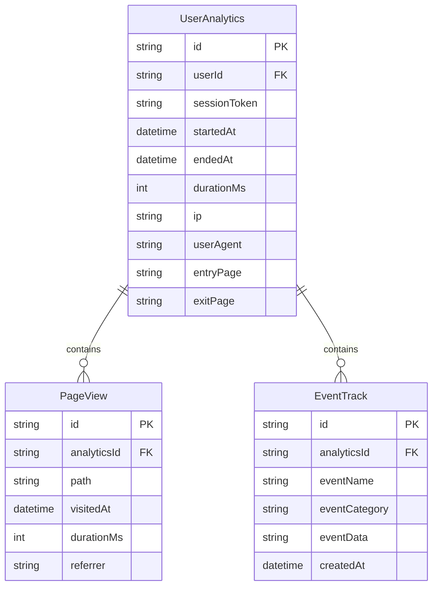
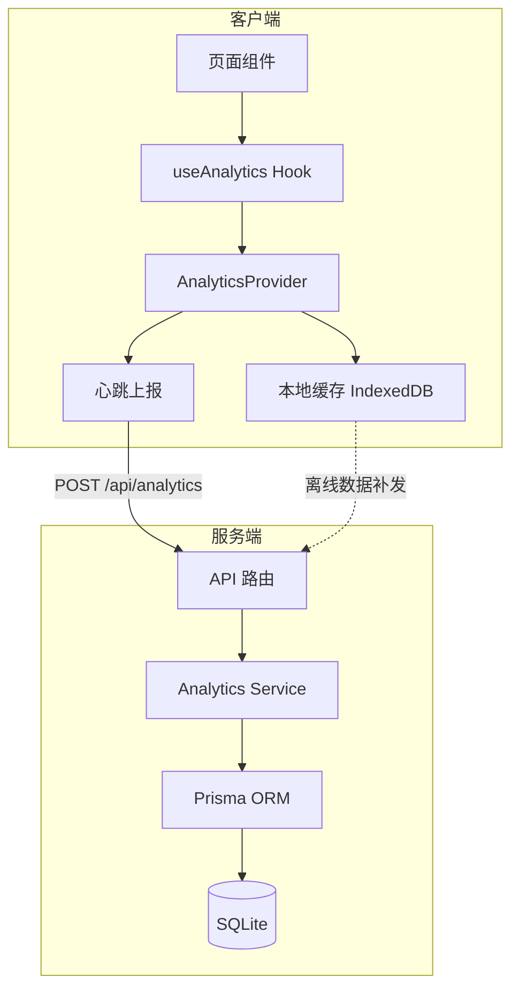
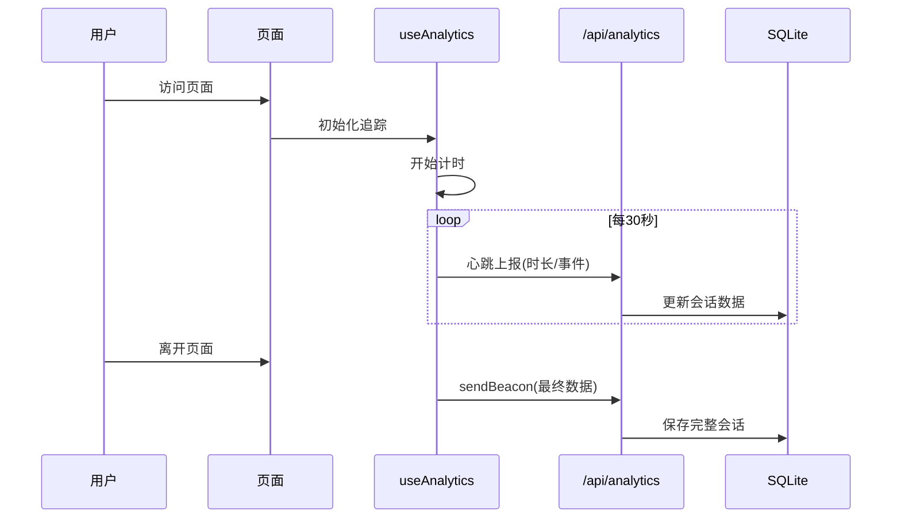

## 用户需求

为 MeetMind AI 学习助手的内测阶段设计一套轻量级、无感知的用户数据收集与体验分析系统。

## 产品概述

构建自建的数据收集基础设施，在不引入第三方依赖的前提下，实现用户行为和使用数据的无感采集，为产品优化提供数据支撑。

## 核心功能

1. **基础数据收集**

- 新用户注册量统计（日/周/月维度）
- 用户IP地址及地理位置记录
- 用户使用时长统计（会话级别）

2. **核心指标追踪**

- 页面访问量（PV/UV）
- 核心功能使用频次（录音、困惑标记、AI对话）
- 用户留存率计算基础数据

3. **数据存储与查询**

- 所有数据存储在自有SQLite数据库
- 提供管理员API查看统计数据
- 为后续分析看板预留扩展接口

## 技术栈

- **框架**: Next.js (现有项目)
- **数据库**: SQLite + Prisma ORM (现有)
- **前端追踪**: 自定义 Analytics Hook
- **后端记录**: API 中间件 + 服务层

## 实现方案

### 核心思路

采用「服务端 + 客户端」双层采集架构，服务端负责记录访问和会话数据，客户端负责追踪页面停留时长和交互事件，两者通过心跳机制协同工作。

### 关键技术决策

1. **无第三方依赖**：完全自建，数据存储在自有数据库，确保数据安全和隐私可控

2. **无感采集机制**：

- 服务端：在认证流程（登录/注册）中自动记录
- 客户端：使用 `visibilitychange` 和 `beforeunload` 事件追踪时长
- 心跳上报：每30秒静默上报，失败不影响用户体验

3. **性能优化**：

- 数据上报使用 `navigator.sendBeacon()` 保证离开页面时的可靠性
- 批量写入减少数据库压力
- 异步处理不阻塞主流程

### 数据模型设计



## 实现要点

### 1. 数据采集优先级

- P0: 新用户数量、活跃用户数、IP地址（登录/注册时记录）
- P1: 使用时长（页面可见性 + 心跳机制）
- P2: 核心功能使用次数（事件追踪）

### 2. IP 地址获取

复用现有模式（已在 `feedback/route.ts` 和 `rate-limit-service.ts` 中验证）：

```typescript
const ip = request.headers.get('x-forwarded-for')?.split(',')[0]?.trim() 
  || request.headers.get('x-real-ip') 
  || 'unknown';
```

### 3. 时长计算策略

- 使用 `Page Visibility API` 检测用户是否在当前页面
- 页面隐藏时暂停计时，显示时恢复
- 通过 `beforeunload` + `sendBeacon` 确保离开时上报

### 4. 性能与可靠性

- 心跳间隔：30秒（平衡精度与性能）
- 失败重试：最多1次，不阻塞用户操作
- 本地缓存：IndexedDB 暂存未上报数据，联网后补发

## 架构设计

### 系统架构



### 数据流设计



## 目录结构

```
src/
├── lib/
│   └── services/
│       └── analytics-service.ts  # [NEW] 数据分析服务层。实现用户分析数据的 CRUD 操作，包括会话创建、时长更新、事件记录，以及统计数据聚合查询（新用户数、DAU/MAU、时长分布）。
│
├── hooks/
│   └── useAnalytics.ts          # [NEW] 客户端分析 Hook。实现页面停留时长追踪、用户交互事件采集、心跳上报机制，使用 Page Visibility API 和 sendBeacon 确保数据可靠性。
│
├── components/
│   └── AnalyticsProvider.tsx    # [NEW] 分析上下文提供者。包装应用根组件，管理会话状态，提供 trackEvent 方法供子组件使用，处理离线数据缓存和重传。
│
├── app/
│   ├── layout.tsx               # [MODIFY] 根布局文件。集成 AnalyticsProvider 组件，在应用入口启用数据采集。
│   │
│   └── api/
│       └── analytics/
│           ├── route.ts         # [NEW] 分析数据接收 API。处理心跳上报和会话结束请求，记录 IP 地址，调用 analytics-service 存储数据。
│           │
│           └── stats/
│               └── route.ts     # [NEW] 统计数据查询 API。提供管理员查询接口，返回新用户数、活跃用户数、平均时长等聚合指标，需验证管理员权限。
│
prisma/
└── schema.prisma               # [MODIFY] 数据库模型定义。新增 UserAnalytics、PageView、EventTrack 三个模型，建立与 User 表的关联关系。
```

## 关键代码结构

### 数据模型定义 (Prisma)

```
// 用户分析会话
model UserAnalytics {
  id           String   @id @default(cuid())
  userId       String?  // 可选，支持匿名用户
  sessionToken String   @unique
  ip           String?
  userAgent    String?
  entryPage    String?
  exitPage     String?
  startedAt    DateTime @default(now())
  endedAt      DateTime?
  durationMs   Int      @default(0)
  
  pageViews    PageView[]
  events       EventTrack[]
  
  @@index([userId])
  @@index([startedAt])
  @@index([ip])
}

// 页面访问记录
model PageView {
  id          String   @id @default(cuid())
  analyticsId String
  path        String
  visitedAt   DateTime @default(now())
  durationMs  Int      @default(0)
  referrer    String?
  
  analytics   UserAnalytics @relation(fields: [analyticsId], references: [id], onDelete: Cascade)
  
  @@index([analyticsId])
  @@index([path])
}

// 事件追踪
model EventTrack {
  id          String   @id @default(cuid())
  analyticsId String
  eventName   String
  eventCategory String?
  eventData   String?  // JSON 格式存储额外数据
  createdAt   DateTime @default(now())
  
  analytics   UserAnalytics @relation(fields: [analyticsId], references: [id], onDelete: Cascade)
  
  @@index([analyticsId])
  @@index([eventName])
}
```

### 客户端 Hook 接口

```typescript
interface UseAnalyticsReturn {
  // 追踪自定义事件
  trackEvent: (name: string, category?: string, data?: Record<string, unknown>) => void;
  // 追踪页面访问
  trackPageView: (path: string) => void;
  // 当前会话 ID
  sessionId: string | null;
}

// 预定义的核心事件
type CoreEvent = 
  | 'recording_start'      // 开始录音
  | 'recording_end'        // 结束录音
  | 'anchor_mark'          // 标记困惑点
  | 'anchor_resolve'       // 解决困惑点
  | 'tutor_chat_start'     // 开始 AI 对话
  | 'tutor_chat_complete'; // 完成 AI 对话
```