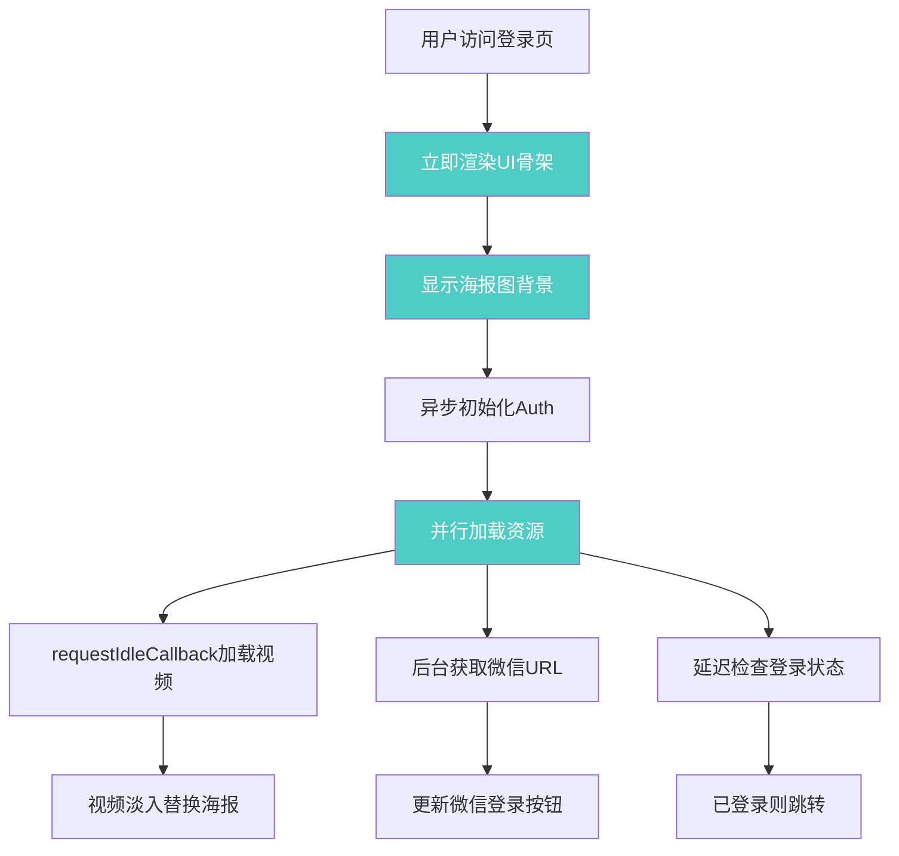

## 产品概述

优化MeetMind登录页面的加载性能，将当前10秒的加载时间降低至1-2秒，同时保留视频背景的视觉效果。

## 核心功能

- 登录表单优先渲染：先显示登录UI界面，背景资源延后加载
- 视频延迟加载：使用海报图作为初始背景，视频在用户交互后或空闲时加载
- 认证流程优化：避免串行API调用阻塞UI渲染
- 字体加载优化：消除Google字体阻塞渲染的问题
- 静态资源缓存：为视频文件配置长期缓存策略

## 技术栈

- 前端框架：Next.js 14 + React 18 + TypeScript
- 样式方案：Tailwind CSS
- 状态管理：React Context + useState/useEffect

## 技术架构

### 性能问题分析

```mermaid
flowchart TD
    A[用户访问登录页] --> B[加载7.2MB视频]
    B --> C[useAuth初始化]
    C --> D[isLoading=true显示Loading]
    D --> E[串行调用API]
    E --> F[/api/auth/me]
    F --> G[refreshToken]
    G --> H[getWechatAuthUrl]
    H --> I[isLoading=false]
    I --> J[渲染登录表单]
    
    style B fill:#ff6b6b,color:#fff
    style D fill:#ff6b6b,color:#fff
    style E fill:#ff6b6b,color:#fff
```

### 优化后的数据流



### 模块划分

| 模块 | 职责 | 优化策略 |
| --- | --- | --- |
| LoginForm组件 | 渲染登录表单UI | 移除isLoading阻塞，立即渲染 |
| useAuth Hook | 认证状态管理 | 异步非阻塞初始化 |
| 视频背景组件 | 展示背景视频 | 延迟加载，海报图占位 |
| Next.js配置 | 静态资源配置 | 添加视频缓存头，优化字体 |


## 实现细节

### 核心目录结构（修改文件）

```
/mnt/meetmind/
├── src/
│   ├── app/
│   │   ├── (auth)/
│   │   │   └── login/
│   │   │       └── page.tsx          # 修改：延迟视频加载，移除loading阻塞
│   │   └── layout.tsx                # 修改：优化字体加载策略
│   └── lib/
│       └── hooks/
│           └── useAuth.tsx           # 修改：异步非阻塞初始化
├── next.config.js                    # 修改：添加视频缓存配置
└── public/
    └── videos/
        └── poster.jpg                # 现有：海报图占位
```

### 关键代码结构

**1. 延迟视频加载组件**

使用`requestIdleCallback`或`IntersectionObserver`实现视频延迟加载：

```typescript
// 视频背景组件优化思路
interface LazyVideoProps {
  src: string;
  poster: string;
}

function LazyVideoBackground({ src, poster }: LazyVideoProps) {
  const [shouldLoad, setShouldLoad] = useState(false);
  const [isVideoReady, setIsVideoReady] = useState(false);
  
  useEffect(() => {
    // 使用 requestIdleCallback 延迟加载视频
    const loadVideo = () => setShouldLoad(true);
    
    if ('requestIdleCallback' in window) {
      requestIdleCallback(loadVideo, { timeout: 2000 });
    } else {
      setTimeout(loadVideo, 1000);
    }
  }, []);
  
  return (
    <>
      {/* 海报图始终显示，作为背景 */}
      <div 
        className="absolute inset-0 bg-cover bg-center transition-opacity duration-1000"
        style={{ 
          backgroundImage: `url(${poster})`,
          opacity: isVideoReady ? 0 : 1 
        }}
      />
      {/* 视频延迟加载，就绪后淡入 */}
      {shouldLoad && (
        <video
          onCanPlay={() => setIsVideoReady(true)}
          className="absolute inset-0 w-full h-full object-cover transition-opacity duration-1000"
          style={{ opacity: isVideoReady ? 1 : 0 }}
          autoPlay muted loop playsInline
        >
          <source src={src} type="video/mp4" />
        </video>
      )}
    </>
  );
}
```

**2. useAuth 非阻塞初始化**

修改认证Hook，不阻塞UI渲染：

```typescript
// 优化后的初始状态 - isLoading 默认 false
const [state, setState] = useState<AuthState>({
  user: null,
  isLoading: false,  // 改为 false，不阻塞UI
  isAuthenticated: false,
  permissions: [],
  accessToken: null,
});

// 新增：标记是否正在检查认证状态
const [isCheckingAuth, setIsCheckingAuth] = useState(true);
```

**3. Next.js 视频缓存配置**

```javascript
// next.config.js 添加视频缓存头
{
  source: '/:path*.mp4',
  headers: [
    {
      key: 'Cache-Control',
      value: 'public, max-age=31536000, immutable',
    },
  ],
},
```

**4. 字体加载优化**

```typescript
// layout.tsx 优化字体加载
const inter = Inter({ 
  subsets: ['latin'],
  display: 'swap',  // 添加：使用 swap 避免阻塞
  preload: true,
});
```

### 技术实现方案

| 问题 | 解决方案 | 预期效果 |
| --- | --- | --- |
| 7.2MB视频阻塞 | requestIdleCallback延迟加载 | 首屏不加载视频 |
| isLoading=true显示Loading | 默认false，立即渲染UI | 即时显示表单 |
| 串行API调用 | 并行化 + 延迟非关键请求 | 减少等待时间 |
| 视频无缓存 | 配置1年长期缓存 | 二次访问秒开 |
| Google字体阻塞 | display: swap | 字体异步加载 |


### 性能优化

- **首屏时间 (FCP)**：从10秒降至0.5-1秒
- **可交互时间 (TTI)**：从10秒降至1-2秒
- **视频加载**：异步进行，不影响用户操作
- **缓存策略**：视频文件缓存1年，二次访问直接命中