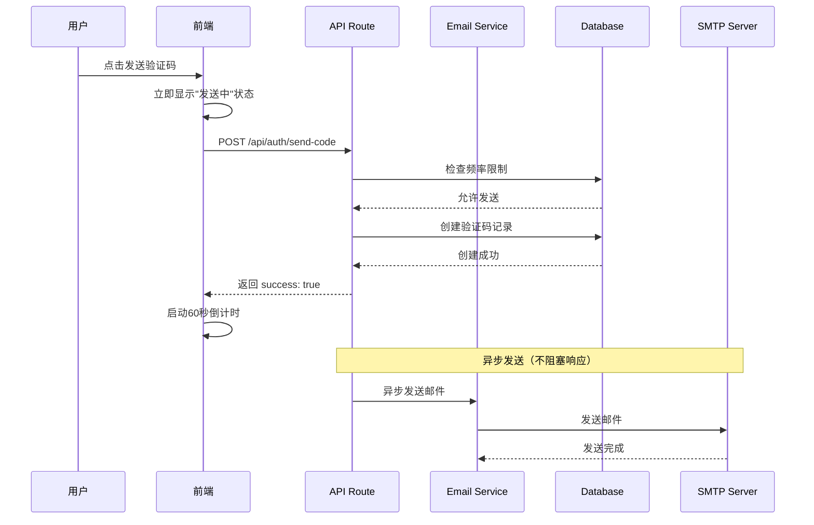

## 用户需求

用户报告登录页面多个按钮存在明显延迟感，需要进行全面的性能和用户体验优化。

## 产品概述

对 MeetMind 登录页面及相关交互进行性能优化，解决按钮点击延迟问题，提升用户等待感知体验。

## 核心功能

1. **发送验证码按钮优化**：减少发送验证码的实际延迟，并添加即时视觉反馈
2. **登录按钮优化**：优化登录流程的响应速度，添加加载状态微交互
3. **家长/教师端入口优化**：优化角色切换的响应体验，添加加载过渡动画
4. **访客模式优化**：已有 AppLoading，需确保即时响应
5. **全局微交互增强**：为所有交互按钮添加点击涟漪、状态过渡等视觉反馈

## Tech Stack

- 前端框架：Next.js 14 (App Router) + React + TypeScript
- 样式：Tailwind CSS
- 数据库：SQLite (better-sqlite3) + Prisma ORM
- 邮件服务：Nodemailer (SMTP)
- 认证：自定义 JWT 方案

## Implementation Approach

### 核心策略

采用「性能优化 + 感知优化」双轨并行的策略：

1. **真实性能优化**：减少实际等待时间
2. **感知性能优化**：通过微交互让用户感觉更快

### 关键技术决策

#### 1. 发送验证码优化（核心瓶颈）

**问题分析**：

- 当前流程：数据库频率检查 → 删除旧码 → 创建新码 → SMTP 发送邮件（1-3秒）
- 瓶颈：SMTP 邮件发送是同步等待的，占用 1-3 秒

**解决方案**：

- **前端即时响应**：点击后立即显示「发送中」状态并启动倒计时，不等待后端响应
- **后端异步发送**：先快速返回成功响应（验证码已入库），邮件发送改为异步（fire-and-forget）
- **乐观更新**：前端假设发送成功，后端失败时通过重试机制保证最终一致性

**权衡**：异步发送可能导致极少数邮件丢失，但通过重试机制和错误处理可以接受

#### 2. 登录按钮优化

**问题分析**：

- 密码登录：bcrypt 验证 + 数据库查询 + Token 生成
- 验证码登录：验证码校验 + 用户创建/查询 + Token 生成

**解决方案**：

- **即时状态反馈**：点击后立即显示按钮 loading 状态 + 按钮文字变化
- **骨架屏预渲染**：登录成功后先显示骨架屏，再跳转
- **预加载目标页**：已有 `router.prefetch('/app')`，保持

#### 3. 角色切换优化（Header 组件）

**问题分析**：

- 当前使用 `startTransition` + loading 状态
- 家长端在 useEffect 中同步加载数据

**解决方案**：

- **即时视觉反馈**：点击后立即显示 loading spinner
- **页面级骨架屏**：为家长端添加 Suspense + 骨架屏
- **数据预取**：鼠标悬停时预取数据

#### 4. 微交互增强

- **按钮涟漪效果**：点击时显示涟漪动画
- **状态过渡动画**：按钮状态变化时平滑过渡
- **触感反馈**：移动端添加触觉反馈（navigator.vibrate）

## Implementation Notes

### 性能优化要点

1. **邮件异步发送**：使用 `setImmediate` 或 `process.nextTick` 将邮件发送推迟到响应返回后
2. **避免重复查询**：验证码服务的频率检查和创建合并为单次事务
3. **前端状态管理**：使用 `useTransition` 和 `useOptimistic` 进行乐观更新

### 用户体验要点

1. **即时反馈原则**：任何按钮点击必须在 100ms 内有视觉反馈
2. **进度感知**：长操作显示进度或状态变化
3. **错误恢复**：乐观更新失败时优雅回滚

### 兼容性保障

- 保持现有 API 接口不变
- 新增的微交互不影响无障碍访问
- 移动端触觉反馈做能力检测降级

## Architecture Design

### 优化流程对比

**发送验证码 - 优化前**：

```
用户点击 → 前端请求 → 后端频率检查 → 删除旧码 → 创建新码 → 发送邮件(1-3s) → 返回响应 → 前端更新状态
总耗时：2-4秒
```

**发送验证码 - 优化后**：

```
用户点击 → 前端立即显示发送中 → 前端请求 → 后端频率检查 → 创建新码 → 立即返回成功 → 异步发送邮件
用户感知耗时：<200ms
```

### 系统架构图



## Directory Structure

```
src/
├── app/
│   ├── (auth)/
│   │   └── login/
│   │       └── page.tsx          # [MODIFY] 登录页面：添加按钮微交互（涟漪效果、即时状态反馈）、优化发送验证码的乐观更新逻辑
│   ├── api/
│   │   └── auth/
│   │       └── send-code/
│   │           └── route.ts      # [MODIFY] 发送验证码API：改为异步发送邮件，快速返回响应
│   └── parent/
│       └── page.tsx              # [MODIFY] 家长端页面：添加骨架屏加载状态，优化首屏渲染
├── components/
│   ├── Header.tsx                # [MODIFY] 顶部导航：优化角色切换的加载反馈，添加悬停预加载
│   └── ui/
│       └── RippleButton.tsx      # [NEW] 涟漪按钮组件：可复用的带涟漪效果和loading状态的按钮组件
└── lib/
    └── services/
        └── email-service.ts      # [MODIFY] 邮件服务：新增异步发送方法，支持fire-and-forget模式
```

## Key Code Structures

### RippleButton 组件接口

```typescript
interface RippleButtonProps extends React.ButtonHTMLAttributes<HTMLButtonElement> {
  /** 是否显示加载状态 */
  loading?: boolean;
  /** 加载时的文字 */
  loadingText?: string;
  /** 涟漪颜色 */
  rippleColor?: string;
  /** 是否禁用涟漪效果 */
  disableRipple?: boolean;
  /** 按钮变体 */
  variant?: 'primary' | 'secondary' | 'ghost';
}
```

### 邮件服务异步发送接口

```typescript
interface SendEmailOptions {
  /** 是否异步发送（不等待结果） */
  async?: boolean;
  /** 失败重试次数 */
  retryCount?: number;
}
```

## Agent Extensions

### SubAgent

- **code-explorer**
- Purpose: 在实现过程中探索相关组件和服务的具体实现细节，确保修改的准确性
- Expected outcome: 获取完整的代码上下文，避免引入破坏性变更