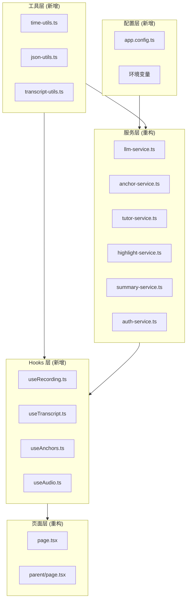
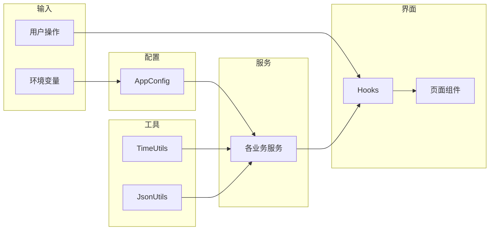

## 产品概述

MeetMind 是一款课堂学习辅助应用，支持学生、家长、教师三个角色，核心功能包括课堂录音转录、AI困惑点标记、精选片段提取、结构化摘要生成、个人笔记管理。当前代码库存在大量冗余逻辑、硬编码数据和架构不合理之处，需要全面重构以提升可维护性和扩展性。

## 核心问题清单

### 1. 重复代码问题

- `formatTimestamp(ms)` 函数在 4 处重复定义（highlight-service、summary-service、tutor-service、parent-service）
- `formatTranscriptWithTimestamps` 函数在 2 处重复（highlight-service、summary-service）
- `parseJsonResponse<T>` 泛型函数在 2 处重复定义
- `getContextAroundTimestamp` 在 tutor-service 和 api/tutor/route.ts 中重复
- `Anchor` 类型在 3 处分别定义（anchor-service、classroom-data-service、db.ts、types/index.ts）

### 2. 硬编码数据问题

- 管理员账户 `admin/admin123` 硬编码于 auth-service.ts
- JWT 密钥硬编码为 `'meetmind-jwt-secret-change-in-production'`
- 模型列表（AVAILABLE_MODELS）硬编码于 llm-service.ts
- 各服务中模型名称和配置分散硬编码
- 困惑点估时固定 7 分钟、ASR 分块时长固定 180 秒
- 页面 Header 中 lessonTitle/courseName 硬编码

### 3. 架构问题

- page.tsx 文件超过 1600 行，需拆分为独立 hooks 和组件
- anchor-service 与 classroom-data-service 职责重叠
- auth-service 使用内存存储，不适用于生产环境
- tutor-service 与 api/tutor/route.ts 逻辑分散
- 缺少统一的配置管理模块

## 技术栈

- 框架：Next.js 14 + React 18 + TypeScript
- 样式：Tailwind CSS
- 状态管理：Zustand
- 本地存储：Dexie.js (IndexedDB)
- UI 组件：Radix UI
- AI 服务：通义千问、Gemini、OpenAI

## 重构架构设计

### 系统架构



### 模块划分

#### 1. 配置管理模块 (新增)

- **文件**：`src/lib/config/app.config.ts`
- **职责**：集中管理所有配置常量
- **内容**：模型配置、时间常量、默认值、功能开关

#### 2. 工具函数模块 (新增)

- **文件**：`src/lib/utils/`
- **职责**：提供通用工具函数
- **子模块**：
- `time-utils.ts`：时间格式化、解析、范围计算
- `json-utils.ts`：JSON 解析、响应处理
- `transcript-utils.ts`：转录文本处理、上下文提取

#### 3. 类型定义模块 (整合)

- **文件**：`src/types/index.ts`
- **职责**：统一所有类型定义
- **改动**：删除 anchor-service、classroom-data-service、db.ts 中的重复定义

#### 4. 页面 Hooks 模块 (新增)

- **文件**：`src/hooks/`
- **职责**：拆分 page.tsx 中的业务逻辑
- **子模块**：
- `useRecording.ts`：录音控制逻辑
- `useTranscript.ts`：转录数据管理
- `useAnchors.ts`：困惑点标记管理
- `useAudio.ts`：音频播放控制

### 数据流



## 实现详情

### 核心目录结构变更

```
src/
├── lib/
│   ├── config/
│   │   └── app.config.ts        # 新增：统一配置
│   ├── utils/
│   │   ├── time-utils.ts        # 新增：时间工具
│   │   ├── json-utils.ts        # 新增：JSON工具
│   │   └── transcript-utils.ts  # 新增：转录工具
│   └── services/
│       ├── highlight-service.ts # 修改：移除重复函数
│       ├── summary-service.ts   # 修改：移除重复函数
│       ├── tutor-service.ts     # 修改：移除重复函数
│       ├── parent-service.ts    # 修改：移除重复函数
│       ├── auth-service.ts      # 修改：移除硬编码
│       └── llm-service.ts       # 修改：配置外置
├── hooks/
│   ├── useRecording.ts          # 新增：录音Hook
│   ├── useTranscript.ts         # 新增：转录Hook
│   ├── useAnchors.ts            # 新增：锚点Hook
│   └── useAudio.ts              # 新增：音频Hook
├── types/
│   └── index.ts                 # 修改：整合类型定义
└── app/
    └── page.tsx                 # 修改：拆分逻辑到hooks
```

### 关键代码结构

**统一配置接口**：集中管理所有可配置项，支持环境变量覆盖，提供类型安全的配置访问。

```typescript
// src/lib/config/app.config.ts
export const AppConfig = {
  // LLM 配置
  llm: {
    defaultModel: process.env.DEFAULT_LLM_MODEL || 'qwen3-max',
    models: [] as ModelConfig[],  // 从环境或配置文件加载
  },
  // 认证配置
  auth: {
    jwtSecret: process.env.JWT_SECRET || '',
    jwtExpiresIn: 7200,
    adminCredentials: {
      username: process.env.ADMIN_USERNAME || '',
      password: process.env.ADMIN_PASSWORD || '',
    },
  },
  // 时间配置
  timing: {
    confusionEstimateMinutes: 7,
    asrChunkDurationSec: 180,
    highlightChunkDurationMs: 5 * 60 * 1000,
  },
};
```

**时间工具函数**：统一时间格式化逻辑，消除 4 处重复定义，提供毫秒转时间戳、时间戳解析、范围格式化等功能。

```typescript
// src/lib/utils/time-utils.ts
export function formatTimestamp(ms: number): string {
  const totalSeconds = Math.floor(ms / 1000);
  const minutes = Math.floor(totalSeconds / 60);
  const seconds = totalSeconds % 60;
  return `${minutes.toString().padStart(2, '0')}:${seconds.toString().padStart(2, '0')}`;
}

export function parseTimestamp(timestamp: string): number { /* ... */ }
export function formatTimeRange(startMs: number, endMs: number): string { /* ... */ }
export function getContextAroundTimestamp(
  segments: TranscriptSegment[],
  timestamp: number,
  beforeMs: number,
  afterMs: number
): TranscriptSegment[] { /* ... */ }
```

**JSON 工具函数**：统一 JSON 解析逻辑，处理 markdown 代码块、提取 JSON 数组/对象，提供类型安全的泛型解析。

```typescript
// src/lib/utils/json-utils.ts
export function parseJsonResponse<T>(content: string): T | null {
  // 统一的 JSON 解析逻辑
  // 1. 直接解析
  // 2. 移除 markdown 代码块
  // 3. 正则提取 JSON
}
```

### 技术实施方案

#### 1. 消除重复代码

- 将 `formatTimestamp`、`formatTranscriptWithTimestamps`、`parseJsonResponse`、`getContextAroundTimestamp` 提取到工具模块
- 各服务文件改为 import 使用

#### 2. 配置外置

- 创建 `app.config.ts` 统一管理配置
- 敏感配置（JWT密钥、管理员密码）必须从环境变量读取
- 移除所有硬编码的默认密码

#### 3. 类型统一

- 以 `src/types/index.ts` 为唯一类型定义源
- 删除 `anchor-service.ts`、`classroom-data-service.ts`、`db.ts` 中的重复类型
- 各文件改为 import from '@/types'

#### 4. 页面拆分

- 将 page.tsx 中的录音、转录、锚点、音频逻辑分别提取为 hooks
- 主页面只负责组装和渲染
- 目标：page.tsx 降至 500 行以内

### 安全考量

- JWT 密钥必须通过环境变量配置，移除硬编码默认值
- 管理员账户凭据通过环境变量配置
- 开发环境可提供演示账户，生产环境强制要求配置

## Agent Extensions

### SubAgent

- **code-explorer**
- Purpose：在重构过程中搜索代码库，查找所有使用重复函数和类型的位置，确保全面覆盖修改点
- Expected outcome：生成完整的依赖关系图和修改点清单，避免遗漏任何引用位置