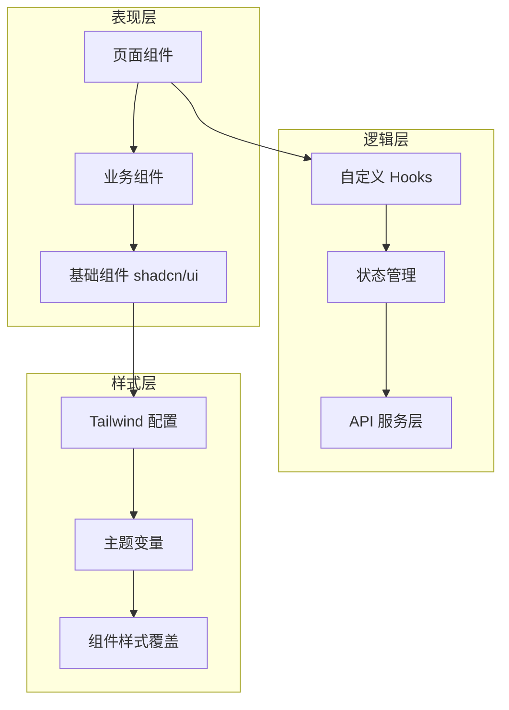
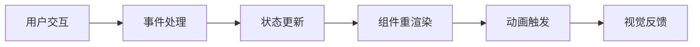

## 产品概述

MeetMind 是一款面向 K12 全年龄段学生（6-18岁）的智能学习助手应用。本次任务是对其前端视觉系统进行全面重构，采用"墨韵书院"设计风格，融合中国传统书院文化美学与现代交互设计，打造移动端优先的极致学习体验。

## 核心功能

- **首页仪表盘**：展示学习进度、今日任务、推荐内容，采用书卷式卡片布局
- **智能对话界面**：AI 学习助手交互界面，融入水墨动效与毛笔书写风格
- **学习资源库**：课程、笔记、资料的分类展示，采用古籍卷轴式导航
- **个人中心**：学习数据统计、成就系统、设置管理，融入印章徽章设计
- **笔记系统**：支持手写、语音、文字多模态输入，宣纸质感背景

## 视觉效果

- 整体风格：现代极简与中国传统书院美学融合，避免廉价 AI 风格
- 色彩基调：水墨黑、宣纸白、朱砂红、青瓷蓝为主色调
- 动效设计：水墨晕染过渡、毛笔书写动画、卷轴展开效果
- 移动适配：触控友好、手势交互流畅、响应式布局完美适配各尺寸屏幕

## 技术栈

- **前端框架**：React 18 + TypeScript
- **样式方案**：Tailwind CSS 4.x
- **组件库**：shadcn/ui（深度定制主题）
- **构建工具**：Vite
- **状态管理**：React Context + Hooks
- **动画库**：Framer Motion

## 技术架构

### 系统架构



### 模块划分

- **主题系统模块**：shadcn/ui 主题深度定制，包含"墨韵书院"设计令牌
- **基础组件模块**：Button、Card、Input、Dialog 等基础组件的风格化封装
- **业务组件模块**：学习卡片、进度环、成就徽章等业务专属组件
- **页面模块**：首页、对话、资源库、个人中心、笔记五大核心页面
- **动效模块**：水墨过渡、书写动画、卷轴展开等特色动效

### 数据流



## 实现细节

### 核心目录结构

```
src/
├── components/
│   ├── ui/                    # shadcn/ui 基础组件（定制版）
│   │   ├── button.tsx
│   │   ├── card.tsx
│   │   ├── input.tsx
│   │   └── dialog.tsx
│   ├── business/              # 业务组件
│   │   ├── LearningCard.tsx
│   │   ├── ProgressRing.tsx
│   │   ├── AchievementBadge.tsx
│   │   └── InkTransition.tsx
│   └── layout/                # 布局组件
│       ├── MobileNav.tsx
│       ├── PageContainer.tsx
│       └── ScrollArea.tsx
├── pages/
│   ├── Home.tsx               # 首页仪表盘
│   ├── Chat.tsx               # 智能对话
│   ├── Resources.tsx          # 资源库
│   ├── Profile.tsx            # 个人中心
│   └── Notes.tsx              # 笔记系统
├── styles/
│   ├── globals.css            # 全局样式
│   └── ink-effects.css        # 水墨特效
├── lib/
│   ├── utils.ts               # 工具函数
│   └── animations.ts          # 动画配置
└── hooks/
    ├── useTheme.ts            # 主题管理
    └── useAnimation.ts        # 动画控制
```

### 关键代码结构

**主题配置接口**：定义"墨韵书院"设计系统的核心变量

```typescript
interface MoyunTheme {
  colors: {
    ink: string;           // 水墨黑
    paper: string;         // 宣纸白
    vermilion: string;     // 朱砂红
    celadon: string;       // 青瓷蓝
  };
  fonts: {
    heading: string;       // 标题字体
    body: string;          // 正文字体
  };
  effects: {
    inkSpread: string;     // 水墨晕染
    brushStroke: string;   // 毛笔笔触
  };
}
```

**动画配置**：Framer Motion 水墨过渡动效

```typescript
const inkTransition = {
  initial: { opacity: 0, filter: 'blur(10px)' },
  animate: { opacity: 1, filter: 'blur(0px)' },
  transition: { duration: 0.6, ease: 'easeOut' }
};
```

### 技术实现要点

1. **shadcn/ui 深度定制**：通过 CSS 变量覆盖实现"墨韵书院"主题
2. **移动端优先**：所有组件以移动端为基准设计，向上适配平板和桌面
3. **性能优化**：组件懒加载、图片优化、动画 GPU 加速
4. **无障碍设计**：符合 WCAG 2.1 AA 标准，支持屏幕阅读器

## 设计理念

"墨韵书院"设计风格融合中国传统书院文化精髓与现代数字产品设计理念，为 K12 学生打造沉浸式学习环境。设计追求"形简意深"，以水墨为魂、宣纸为底、朱砂点睛，营造宁静专注的学习氛围。

## 设计风格

- **主题**：新中式书院风，现代极简与传统美学融合
- **氛围**：宁静、专注、雅致、温润
- **质感**：宣纸纹理、水墨晕染、印章浮雕

## 页面设计

### 首页仪表盘

- **顶部导航**：简洁品牌标识，水墨风格图标，搜索入口
- **学习进度区**：圆形进度环采用水墨渐变，数据以书法数字呈现
- **今日任务卡片**：卷轴式卡片布局，任务项以毛笔勾选标记
- **推荐内容区**：瀑布流卡片，悬停时水墨晕染动效
- **底部导航**：五个核心入口，选中态以朱砂印章标记

### 智能对话界面

- **对话气泡**：用户消息为宣纸质感，AI 回复为淡墨背景
- **输入区域**：毛笔图标，输入时有书写动画提示
- **快捷操作**：常用功能以印章按钮呈现
- **历史记录**：侧滑抽屉，书签式分类导航

### 学习资源库

- **分类导航**：横向滚动标签，选中态下划线为毛笔笔触
- **资源卡片**：古籍封面风格，分类以印章角标区分
- **搜索筛选**：下拉菜单采用卷轴展开动效
- **空状态**：水墨山水插画，引导文案

### 个人中心

- **头像区域**：圆形头像外围印章边框
- **数据统计**：学习时长、完成任务数以书法数字展示
- **成就徽章**：印章风格徽章墙，解锁动画为印章盖下效果
- **设置列表**：简洁分组，图标采用线性水墨风格

### 笔记系统

- **笔记列表**：宣纸卡片，时间戳以竖排小字呈现
- **编辑器**：宣纸背景纹理，工具栏为毛笔、印章等图标
- **标签系统**：印章式标签，可自定义颜色
- **导出分享**：生成精美卷轴式分享图

## 交互设计

- **页面切换**：水墨晕染过渡动效
- **按钮反馈**：按下时轻微下沉，释放时墨点扩散
- **列表加载**：卷轴徐徐展开效果
- **手势支持**：左右滑动切换、下拉刷新、长按操作

## 响应式策略

- **移动端优先**：320px-428px 为基准设计
- **平板适配**：768px 以上双栏布局
- **桌面适配**：1024px 以上三栏布局，侧边导航

## Agent Extensions

### Skill

- **frontend-design**
- 用途：创建高质量、独特的前端界面设计，避免 AI slop 风格
- 预期成果：生成"墨韵书院"风格的精美组件代码和页面布局

- **ui-ux-pro-max**
- 用途：提供专业 UI/UX 设计智能支持，包括配色方案、字体搭配、动效设计
- 预期成果：输出完整的设计系统规范和组件样式指南

- **web-artifacts-builder**
- 用途：构建复杂的多组件 React 应用，集成 shadcn/ui 组件库
- 预期成果：生成可运行的完整页面组件和交互逻辑

- **webapp-testing**
- 用途：使用 Playwright 测试前端功能，验证移动端交互体验
- 预期成果：确保所有页面在移动端正常运行，交互流畅

### SubAgent

- **code-explorer**
- 用途：探索现有项目代码结构，理解当前实现方式
- 预期成果：获取项目现有组件和样式的完整信息，确保重构方案与现有代码兼容