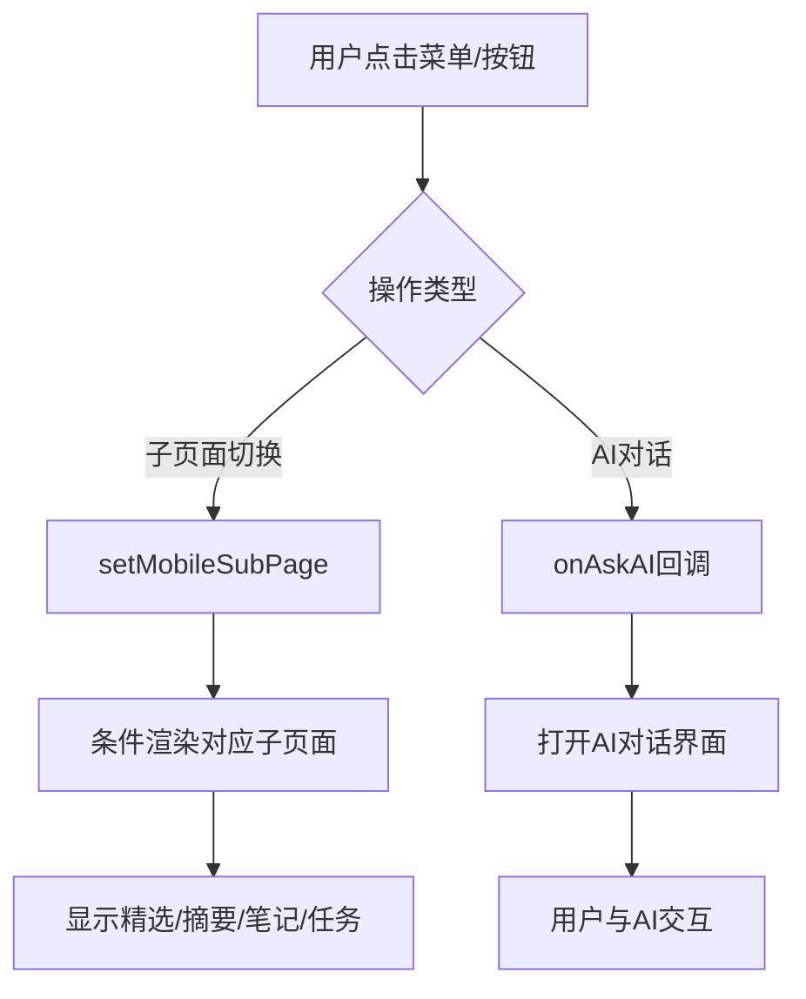

## 产品概述

修复MeetMind移动端的多个交互功能问题，使移动端用户能够正常使用子页面切换和AI对话功能，达到与桌面端一致的用户体验。

## 核心功能

- 移动端子页面渲染：根据mobileSubPage状态正确渲染对应的子页面内容（精选/摘要/笔记/任务）
- AI对话功能：实现移动端onAskAI回调的完整逻辑，触发AI对话界面
- 菜单导航联动：确保移动端菜单点击后能正确显示对应内容区域
- Tab面板适配：将桌面端的Tab面板功能适配到移动端界面

## 技术方案

### 问题分析与解决策略

#### 问题1：mobileSubPage状态未渲染对应页面

- 现状：状态值被正确设置，但缺少条件渲染逻辑
- 方案：在移动端主容器中添加基于mobileSubPage的条件渲染分支

#### 问题2：onAskAI回调是空函数

- 现状：移动端仅关闭弹窗，未触发AI对话
- 方案：复用桌面端AI对话逻辑，在移动端回调中正确调用

#### 问题3：菜单导航后无内容显示

- 现状：状态更新但视图未响应
- 方案：确保状态变更触发正确的组件重渲染

### 数据流设计



### 实现细节

#### 核心修改文件

```
src/
├── components/
│   └── MeetingDetail/
│       ├── index.tsx          # 修改：添加移动端子页面渲染逻辑
│       ├── MobileSubPages.tsx # 新增：移动端子页面组件
│       └── hooks/
│           └── useMobileNav.ts # 修改：完善onAskAI回调
```

#### 关键代码结构

**移动端子页面渲染逻辑**

```typescript
// 条件渲染映射
const renderMobileSubPage = () => {
  switch (mobileSubPage) {
    case 'highlights':
      return <HighlightsPanel />;
    case 'summary':
      return <SummaryPanel />;
    case 'notes':
      return <NotesPanel />;
    case 'tasks':
      return <TasksPanel />;
    default:
      return <DefaultView />;
  }
};
```

**onAskAI回调完善**

```typescript
const onAskAI = (text: string) => {
  // 关闭当前弹窗
  closeModal();
  // 设置AI对话内容
  setAIQuery(text);
  // 切换到AI对话子页面
  setMobileSubPage('ai-chat');
  // 或打开AI对话模态框
  openAIChatModal();
};
```

### 技术考量

- 复用现有桌面端组件逻辑，保持代码一致性
- 确保移动端响应式布局正确适配各子页面
- 状态管理需与现有架构保持一致

## 代码探索

### SubAgent

- **code-explorer**
- 目的：深入分析现有代码结构，定位mobileSubPage状态定义、使用位置，以及桌面端Tab面板的实现方式
- 预期结果：获取完整的状态流转路径和组件依赖关系，为修复提供准确的代码上下文