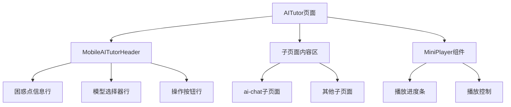

## 产品概述

优化移动端AI助教页面的用户体验，解决当前布局混乱、功能缺失的问题。主要包括添加播放进度条、重构头部布局、简化模型选择器、统一子页面播放器等改进。

## 核心功能

- **MiniPlayer播放进度条**：在AI对话页面添加MiniPlayer组件，用户点击AI返回的时间戳时能看到播放进度
- **头部垂直布局重构**：将困惑点信息、模型选择器、操作按钮改为垂直堆叠布局，避免横向挤压
- **模型选择器简化**：精简模型选择器宽度，移除"联网搜索"选项和token数量显示
- **统一播放器组件**：为AI助教所有子页面统一添加MiniPlayer组件

## 技术方案

### 系统架构



### 模块划分

- **MobileAITutorHeader模块**：重构后的移动端头部组件，采用垂直布局
- **SimplifiedModelSelector模块**：简化版模型选择器，移除冗余信息
- **MiniPlayer集成模块**：在所有子页面统一挂载播放器组件

### 数据流

用户点击时间戳 → 触发播放事件 → MiniPlayer接收播放状态 → 显示进度条和控制UI

## 实现细节

### 核心目录结构

```
src/
├── components/
│   └── ai-tutor/
│       ├── MobileAITutorHeader.tsx  # 修改：重构为垂直布局
│       └── ModelSelector.tsx         # 修改：简化选择器
├── pages/
│   └── AITutor.tsx                   # 修改：统一添加MiniPlayer
```

### 关键代码结构

**MobileAITutorHeader重构**：将原有水平布局改为垂直堆叠，每个功能区独占一行

```typescript
// 重构后的头部布局结构
interface MobileHeaderLayout {
  row1: ConfusionPointInfo;    // 困惑点信息
  row2: ModelSelectorSimple;   // 简化模型选择器
  row3: ActionButtons;         // 操作按钮组
}
```

**ModelSelector简化**：移除联网搜索复选框和token显示

```typescript
// 简化后的模型选择器Props
interface SimplifiedModelSelectorProps {
  selectedModel: string;
  onModelChange: (model: string) => void;
  // 移除: showWebSearch, tokenCount
}
```

### 技术实现计划

1. **MiniPlayer集成**

- 问题：AI对话子页面缺少MiniPlayer
- 方案：在AITutor组件中将MiniPlayer提升到所有子页面外层
- 验证：点击时间戳后进度条正常显示

2. **头部布局重构**

- 问题：水平布局在移动端挤压
- 方案：使用flex-col垂直布局，各元素独占一行
- 验证：视觉上无挤压，信息清晰可读

3. **模型选择器简化**

- 问题：选择器过宽，信息冗余
- 方案：移除联网搜索和token显示，精简UI
- 验证：选择器宽度适中，核心功能保留

## 代理扩展

### SubAgent

- **code-explorer**
- 用途：探索AITutor相关组件代码结构，定位MiniPlayer、Header、ModelSelector的实现位置
- 预期结果：获取完整的组件依赖关系和当前实现细节