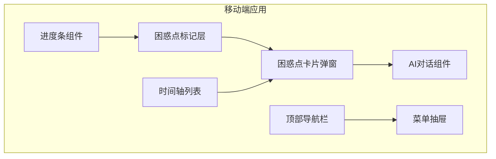
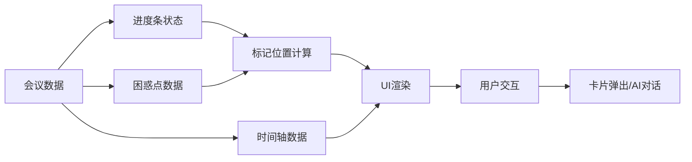

## 产品概述

MeetMind 移动端重构为播客式极简界面，以时间轴为核心交互，提供沉浸式的会议回顾体验。界面参考得到/喜马拉雅的设计风格，将会议内容以音频播客形式呈现，用户可通过进度条快速定位，困惑点以悬浮标记形式直观展示，点击即可深入了解并与AI对话。

## 核心功能

1. **播客式进度条**：顶部显示会议音频进度条，支持拖动定位，困惑点以悬浮标记形式显示在进度条上方
2. **可滚动时间轴列表**：主内容区域展示会议发言的时间轴，按时间顺序排列，支持平滑滚动浏览
3. **困惑点悬浮标记**：在进度条对应位置显示困惑点图标，视觉上醒目但不干扰主体验
4. **困惑点详情卡片**：点击困惑点标记弹出详情卡片，展示困惑内容并提供"问AI"入口
5. **AI对话能力**：在卡片内可直接向AI提问，获取困惑点相关解答
6. **精简菜单**：右上角菜单收纳精选、摘要、笔记、任务等低频功能，保持主界面极简

## 技术栈

- 前端框架：React + TypeScript（沿用现有项目技术栈）
- 样式方案：Tailwind CSS
- 状态管理：React Hooks
- 动画效果：CSS Transitions + Framer Motion

## 技术架构

### 系统架构



### 模块划分

- **播放控制模块**：进度条、播放/暂停、时间显示
- **困惑点标记模块**：标记渲染、点击交互、位置计算
- **时间轴模块**：发言列表、自动滚动、时间同步
- **卡片弹窗模块**：困惑详情、AI问答入口
- **菜单模块**：低频功能入口（精选、摘要、笔记、任务）

### 数据流



## 实现细节

### 核心目录结构

```
src/
├── components/
│   └── mobile/
│       ├── PodcastPlayer/
│       │   ├── index.tsx           # 播客播放器主组件
│       │   ├── ProgressBar.tsx     # 进度条组件
│       │   └── ConfusionMarker.tsx # 困惑点标记组件
│       ├── Timeline/
│       │   ├── index.tsx           # 时间轴列表组件
│       │   └── TimelineItem.tsx    # 时间轴条目组件
│       ├── ConfusionCard/
│       │   ├── index.tsx           # 困惑点卡片弹窗
│       │   └── AIAssistant.tsx     # AI问答组件
│       ├── MobileHeader.tsx        # 移动端顶部导航
│       └── MobileMenu.tsx          # 菜单抽屉组件
└── pages/
    └── mobile/
        └── MeetingDetail.tsx       # 会议详情页（重构）
```

### 关键代码结构

**困惑点标记接口**：定义困惑点在进度条上的位置和状态

```typescript
interface ConfusionMarker {
  id: string;
  timestamp: number;      // 对应时间点（秒）
  position: number;       // 进度条位置百分比
  content: string;        // 困惑内容摘要
  resolved: boolean;      // 是否已解决
}
```

**时间轴条目接口**：定义时间轴列表中的发言条目

```typescript
interface TimelineEntry {
  id: string;
  speaker: string;
  content: string;
  startTime: number;
  endTime: number;
  hasConfusion: boolean;  // 是否包含困惑点
}
```

### 技术实现要点

1. **进度条困惑点标记**

- 根据困惑点时间戳计算在进度条上的百分比位置
- 使用绝对定位在进度条上方渲染标记图标
- 点击标记触发卡片弹窗

2. **时间轴与进度条同步**

- 播放进度变化时自动滚动时间轴到对应位置
- 点击时间轴条目跳转到对应播放位置

3. **卡片弹窗交互**

- 使用底部弹出的模态卡片展示困惑详情
- 卡片内嵌AI对话输入框，支持追问

## 设计风格

采用播客应用风格的极简设计，参考得到/喜马拉雅的时间轴体验。深色主题营造沉浸式氛围，配合柔和的渐变和微妙的阴影效果，打造专业且舒适的会议回顾体验。

## 页面设计

### 会议详情页（核心页面重构）

**顶部导航栏**

- 左侧返回按钮，中间显示会议标题（单行截断）
- 右侧菜单图标，点击展开抽屉菜单
- 背景采用深色渐变，与内容区自然过渡

**播客播放器区域**

- 会议封面/图标居中展示，下方显示会议时长
- 进度条横跨屏幕宽度，高度适中便于拖动
- 困惑点标记以亮色圆点悬浮在进度条上方，带微光效果
- 进度条下方显示当前时间/总时长，播放/暂停按钮居中

**时间轴列表区域**

- 占据屏幕主体，支持平滑滚动
- 每条发言显示头像、发言人、时间标签、内容摘要
- 当前播放位置的条目高亮显示
- 包含困惑点的条目右侧显示小标记

**困惑点卡片弹窗**

- 从底部滑入的圆角卡片，覆盖约60%屏幕高度
- 顶部显示困惑内容，中间为相关上下文
- 底部固定AI问答输入框，支持一键提问

**菜单抽屉**

- 从右侧滑入，半透明背景遮罩
- 列表展示：精选内容、会议摘要、我的笔记、待办任务
- 每项配有图标和简短描述

## 子智能体

- **code-explorer**
- 用途：探索现有项目结构，了解当前移动端组件架构和数据流
- 预期结果：明确现有组件位置、接口定义、状态管理方式，为重构提供基础