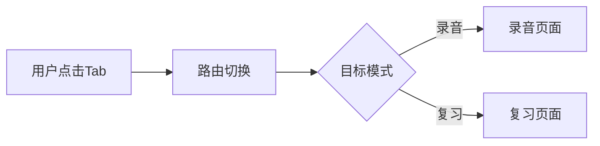

## 产品概述

修复MeetMind移动端录音页面缺少顶部导航栏的问题，为录音模式添加与复习模式一致的得到风格顶部导航栏，实现录音和复习两种模式之间的无缝切换。

## 核心功能

- 顶部导航栏：包含Logo、Tab切换按钮（录音/复习）、菜单按钮
- Tab切换：支持在录音模式和复习模式之间点击切换
- 视觉一致性：保持与现有复习模式顶部导航栏相同的设计风格
- 当前状态高亮：Tab切换时显示当前所在模式的激活状态

## 技术方案

### 现有项目分析

这是对现有项目的修复任务，需要在移动端录音页面添加已存在于复习模式的顶部导航组件。

### 修改范围

基于现有代码结构，主要修改录音模式的移动端布局文件，复用现有的顶部导航组件。

### 数据流



## 实现细节

### 核心目录结构

针对现有项目修改，仅展示需要修改的文件：

```
src/
├── components/
│   └── MobileHeader.tsx    # 复用：移动端顶部导航组件
└── pages/
    └── record/
        └── index.tsx       # 修改：录音页面添加顶部导航
```

### 关键代码结构

**顶部导航组件接口**：复用现有MobileHeader组件，传入当前激活的Tab状态

```typescript
interface MobileHeaderProps {
  activeTab: 'record' | 'review';
  onTabChange: (tab: 'record' | 'review') => void;
}
```

### 技术实现计划

1. 调研现有复习模式的MobileHeader组件实现
2. 在录音页面引入并配置MobileHeader组件
3. 确保Tab切换路由正确跳转
4. 测试移动端布局适配

## Agent Extensions

### SubAgent

- **code-explorer**
- 用途：探索现有项目结构，查找复习模式顶部导航组件的实现位置和代码结构
- 预期结果：定位MobileHeader组件文件路径，了解其props接口和使用方式