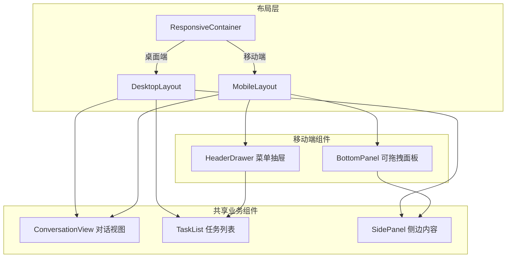
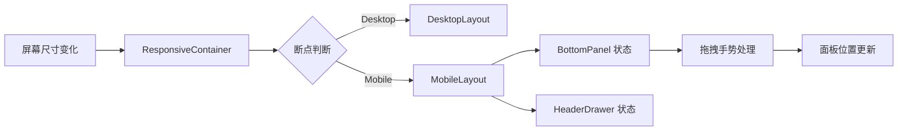

## 产品概述

为 MeetMind 主页面实现移动端响应式布局，采用"共享组件 + 响应式布局容器"模式，确保业务组件复用，只需维护一套代码。桌面端保持现有三栏布局，移动端自动适配为可拖拽底部面板 + 对话主体的设计。

## 核心功能

- **响应式布局系统**：桌面端三栏布局，移动端自适应单栏 + 底部面板
- **可拖拽底部面板**：移动端将侧边栏内容整合至可上下拖拽的底部面板中
- **Header 菜单抽屉**：移动端将"今晚任务"等功能项移至 Header 的汉堡菜单抽屉
- **业务组件复用**：所有业务组件（对话、任务列表等）在桌面端和移动端共享使用
- **断点自动切换**：根据屏幕宽度自动切换桌面/移动端布局模式

## 技术栈

- 前端框架：React + TypeScript（复用现有项目技术栈）
- 样式方案：Tailwind CSS 响应式工具类
- 状态管理：复用现有状态管理方案
- 手势交互：实现可拖拽底部面板的触摸手势支持

## 技术架构

### 系统架构



### 模块划分

- **ResponsiveContainer 模块**
- 职责：检测屏幕尺寸，切换桌面/移动端布局
- 技术：CSS 媒体查询 + React Context
- 暴露接口：`useResponsive()` Hook

- **MobileLayout 模块**
- 职责：移动端布局容器，整合底部面板和菜单抽屉
- 技术：Tailwind CSS + 触摸手势
- 依赖：ResponsiveContainer、BottomPanel、HeaderDrawer

- **BottomPanel 模块**
- 职责：可拖拽底部面板，承载侧边栏内容
- 技术：Touch Events + CSS Transform
- 暴露接口：展开/收起/拖拽状态控制

- **HeaderDrawer 模块**
- 职责：移动端 Header 菜单抽屉，包含"今晚任务"等功能
- 技术：CSS 动画 + 状态管理

### 数据流



## 实现细节

### 核心目录结构

```
src/
├── components/
│   ├── layout/
│   │   ├── ResponsiveContainer.tsx  # 新增：响应式容器
│   │   ├── MobileLayout.tsx         # 新增：移动端布局
│   │   └── DesktopLayout.tsx        # 新增/重构：桌面端布局
│   ├── mobile/
│   │   ├── BottomPanel.tsx          # 新增：可拖拽底部面板
│   │   ├── HeaderDrawer.tsx         # 新增：Header 菜单抽屉
│   │   └── useDragGesture.ts        # 新增：拖拽手势 Hook
│   └── shared/                       # 现有业务组件（复用）
├── hooks/
│   └── useResponsive.ts             # 新增：响应式 Hook
└── styles/
    └── responsive.css               # 新增：响应式样式变量
```

### 关键代码结构

**响应式 Hook 接口**：提供统一的响应式状态检测，供组件判断当前设备类型。

```typescript
interface ResponsiveState {
  isMobile: boolean;
  isTablet: boolean;
  isDesktop: boolean;
  breakpoint: 'mobile' | 'tablet' | 'desktop';
}

function useResponsive(): ResponsiveState;
```

**可拖拽底部面板接口**：定义底部面板的属性和状态控制。

```typescript
interface BottomPanelProps {
  children: React.ReactNode;
  defaultHeight?: number;
  minHeight?: number;
  maxHeight?: number;
  onHeightChange?: (height: number) => void;
}

type PanelState = 'collapsed' | 'partial' | 'expanded';
```

**拖拽手势 Hook**：处理触摸拖拽交互逻辑。

```typescript
interface DragGestureOptions {
  onDragStart?: () => void;
  onDragMove?: (deltaY: number) => void;
  onDragEnd?: (velocity: number) => void;
}

function useDragGesture(ref: RefObject<HTMLElement>, options: DragGestureOptions): void;
```

### 技术实现方案

**1. 响应式断点策略**

- 移动端断点：< 768px
- 平板断点：768px - 1024px
- 桌面端断点：> 1024px
- 使用 Tailwind CSS 的 `sm:`, `md:`, `lg:` 前缀实现

**2. 底部面板拖拽实现**

- 使用 Touch Events 监听手势
- CSS Transform 实现平滑动画
- 支持三档位置：收起(15%)、半展开(50%)、全展开(85%)
- 手势速度检测实现惯性滑动

**3. 组件复用策略**

- 业务组件不感知布局模式
- 布局容器负责组件排列
- 通过 Props 传递必要的样式覆盖

## 技术考量

### 性能优化

- 使用 `will-change: transform` 优化拖拽动画
- 防抖处理窗口 resize 事件
- 懒加载非首屏内容

### 兼容性

- 支持 iOS Safari 和 Android Chrome
- 处理移动端安全区域（Safe Area）
- 适配不同屏幕比例

## 设计风格

采用现代简洁风格，保持与现有 MeetMind 桌面端设计语言一致。移动端布局以内容优先，通过可拖拽底部面板和菜单抽屉实现功能整合。

## 页面设计

### 移动端主页面

- **Header 区域**：保留 Logo 和核心操作，新增汉堡菜单按钮，点击展开抽屉菜单
- **对话主体区域**：全宽展示对话内容，与桌面端复用相同的对话组件
- **可拖拽底部面板**：顶部拖拽手柄，承载侧边栏内容，支持三档高度切换

### Header 菜单抽屉

- 从右侧滑入的抽屉面板
- 包含"今晚任务"快捷入口
- 用户设置和其他功能入口
- 半透明遮罩层，点击关闭

### 底部面板

- 圆角顶部设计，中央拖拽指示条
- 收起状态：仅显示拖拽指示条和简要信息
- 展开状态：完整展示侧边栏内容
- 流畅的拖拽动画和惯性滑动效果

## Agent Extensions

### SubAgent

- **code-explorer**
- 用途：探索现有项目结构，分析当前布局组件和业务组件的实现方式
- 预期结果：了解现有组件结构、样式方案和状态管理模式，确保新增响应式功能与现有代码无缝集成