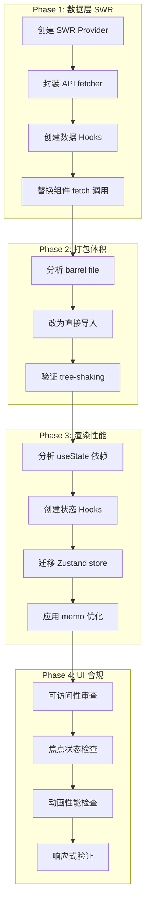
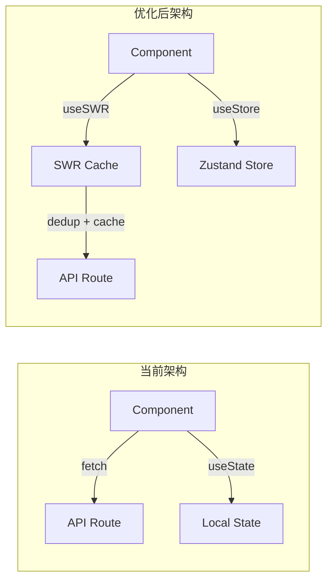

## 产品概述

对 MeetMind 课堂 AI 家教项目进行企业级性能优化，通过 4 个阶段的渐进式优化，建立可扩展的性能基础并形成规范沉淀。

## 核心功能

- **Phase 1 数据层优化**：使用 SWR 统一管理 API 请求，实现请求去重、自动缓存、自动重试和乐观更新
- **Phase 2 打包体积优化**：解决 barrel file 问题，优化组件导入方式，减少首屏加载体积
- **Phase 3 渲染性能优化**：重构 page.tsx 中 30+ useState，抽取状态到自定义 Hook 或 Zustand store，减少不必要重渲染
- **Phase 4 UI 合规性审查**：审查可访问性、焦点状态、动画、响应式布局等 UI 规范

## 技术栈

- **框架**: Next.js 14.2.0 (App Router) + React 18.2.0
- **状态管理**: Zustand 4.5.0（现有）+ SWR 2.2.0（待启用）
- **样式**: Tailwind CSS 3.4.0
- **组件库**: shadcn/ui (Radix UI)
- **数据库**: Prisma + better-sqlite3
- **类型检查**: TypeScript 5.3.0

## 技术架构

### 系统架构



### 模块划分

**Phase 1 - SWR 数据层模块**

- `src/lib/swr/`: SWR 配置和全局 Provider
- `src/lib/swr/fetcher.ts`: 统一 fetch 封装，处理错误和认证
- `src/hooks/data/`: SWR 数据 Hooks（useTopics, useSummary, useTutor 等）

**Phase 2 - 打包优化模块**

- `src/components/mobile/`: 改造 barrel file，支持直接导入
- `src/app/page.tsx`: 更新导入语句

**Phase 3 - 状态管理模块**

- `src/stores/`: Zustand stores 扩展
- `src/hooks/`: 抽取的状态 Hooks

**Phase 4 - UI 合规模块**

- 各组件的可访问性增强

### 数据流



## 实现详情

### 核心目录结构

仅展示新增和修改的文件：

```
src/
├── lib/
│   └── swr/
│       ├── provider.tsx      # 新增: SWR 全局配置
│       ├── fetcher.ts        # 新增: 统一 fetcher
│       └── index.ts          # 新增: 导出
├── hooks/
│   └── data/
│       ├── useTopics.ts      # 新增: 精选片段数据 Hook
│       ├── useSummary.ts     # 新增: 摘要数据 Hook
│       ├── useTutor.ts       # 新增: AI 家教数据 Hook
│       └── index.ts          # 新增: 导出
├── stores/
│   └── page-store.ts         # 新增: 页面状态 Zustand store
├── components/
│   └── mobile/
│       └── index.ts          # 修改: 优化导出方式
└── app/
    ├── layout.tsx            # 修改: 添加 SWR Provider
    └── page.tsx              # 修改: 使用 SWR Hooks + 状态重构
```

### 关键代码结构

**SWR Provider 配置**：全局 SWR 配置，统一管理缓存策略、重试逻辑和错误处理

```typescript
// src/lib/swr/provider.tsx
interface SWRProviderProps {
  children: React.ReactNode;
}

const swrConfig: SWRConfiguration = {
  fetcher: authFetcher,
  revalidateOnFocus: false,
  dedupingInterval: 5000,
  errorRetryCount: 3,
};
```

**统一 Fetcher**：封装认证头、错误处理和响应解析

```typescript
// src/lib/swr/fetcher.ts
async function authFetcher<T>(url: string, options?: FetcherOptions): Promise<T>
```

**SWR 数据 Hook**：封装 API 调用，提供类型安全的数据访问

```typescript
// src/hooks/data/useTopics.ts
interface UseTopicsOptions {
  sessionId: string;
  segments: TranscriptSegment[];
  mode?: TopicGenerationMode;
}

function useTopics(options: UseTopicsOptions): {
  topics: HighlightTopic[];
  isLoading: boolean;
  error: Error | null;
  generate: () => Promise<void>;
}
```

**页面状态 Store**：将 page.tsx 的 30+ useState 迁移到 Zustand

```typescript
// src/stores/page-store.ts
interface PageState {
  viewMode: ViewMode;
  reviewTab: ReviewTab;
  selectedAnchor: Anchor | null;
  // ... 其他状态
  actions: {
    setViewMode: (mode: ViewMode) => void;
    setReviewTab: (tab: ReviewTab) => void;
    // ... 其他 actions
  };
}
```

### 技术实施方案

**Phase 1: SWR 数据层**

1. 问题陈述：page.tsx 和 AITutor.tsx 中存在多处独立 fetch 调用，无请求去重和缓存
2. 解决方案：使用 SWR 统一管理所有 API 请求
3. 关键技术：SWR 2.2.0、useSWRMutation、条件请求
4. 实施步骤：

- 创建 SWR Provider 和配置
- 封装带认证的 fetcher
- 创建 useTopics、useSummary、useTutor 等 Hooks
- 替换组件中的 fetch 调用

5. 验证方式：检查 DevTools Network 面板确认请求去重生效

**Phase 2: 打包体积优化**

1. 问题陈述：`mobile/index.ts` 导出 20+ 组件，page.tsx 从中导入导致无法 tree-shaking
2. 解决方案：改为直接导入具体组件文件
3. 关键技术：ES 模块直接导入、Next.js bundle 分析
4. 实施步骤：

- 修改 page.tsx 导入语句为直接路径
- 保留 barrel file 但标记 sideEffects: false
- 验证打包体积变化

5. 验证方式：对比优化前后 bundle 体积

**Phase 3: 渲染性能优化**

1. 问题陈述：page.tsx 有 33 个 useState，可能导致级联重渲染
2. 解决方案：按职责拆分状态到 Zustand store 和自定义 Hooks
3. 关键技术：Zustand selector、React.memo、useMemo
4. 实施步骤：

- 分析状态依赖关系
- 创建 pageStore 管理 UI 状态
- 创建 reviewStore 管理复习模式状态
- 应用 selector 精确订阅

5. 验证方式：React DevTools Profiler 检查重渲染次数

**Phase 4: UI 合规性审查**

1. 问题陈述：需确保 UI 符合可访问性和设计规范
2. 解决方案：使用 Web Design Guidelines 审查并修复
3. 关键技术：ARIA 属性、焦点管理、prefers-reduced-motion
4. 实施步骤：

- 审查按钮和交互元素的焦点状态
- 检查动画是否尊重 prefers-reduced-motion
- 验证语义化标签和 ARIA 属性
- 检查响应式断点一致性

5. 验证方式：使用 [skill:web-design-guidelines] 进行自动化审查

### 集成点

- **SWR 与 Zustand 协作**：SWR 管理服务端数据，Zustand 管理客户端 UI 状态
- **认证集成**：SWR fetcher 从 useAuth Hook 获取 accessToken
- **错误边界**：SWR 错误通过全局 onError 统一处理

## 技术考量

### 性能优化

- SWR dedupingInterval 设为 5 秒，避免重复请求
- Zustand selector 精确订阅，避免无关状态导致的重渲染
- 直接导入替代 barrel file，确保 tree-shaking 生效

### 向后兼容

- barrel file 保留，现有导入方式仍可使用
- 渐进式迁移，不影响现有功能

## Agent Extensions

### Skill

- **vercel-react-best-practices**
- 用途：指导 React/Next.js 性能优化，确保 SWR 使用、状态管理、代码分割等符合 Vercel 最佳实践
- 预期成果：生成符合企业级标准的性能优化代码

- **web-design-guidelines**
- 用途：Phase 4 UI 合规性审查，检查可访问性、焦点状态、动画、响应式布局
- 预期成果：生成 UI 合规性报告和修复建议

### SubAgent

- **code-explorer**
- 用途：Phase 3 状态分析时，探索 page.tsx 的 useState 依赖关系和组件结构
- 预期成果：完整的状态依赖图谱，指导 Zustand store 设计