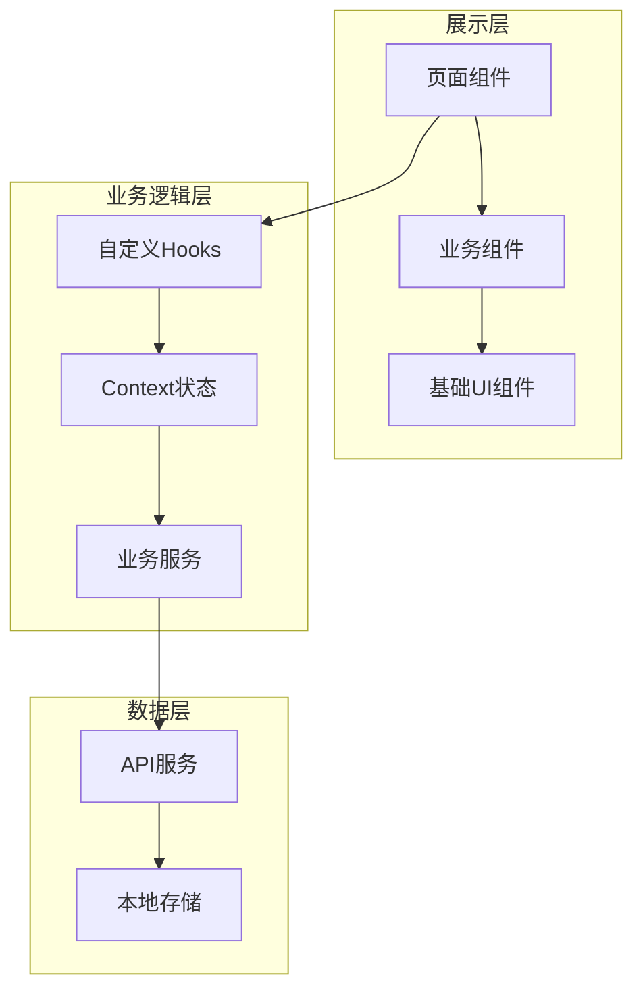
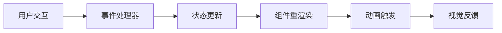

## 产品概述

MeetMind 智能助教系统是一款面向学习者的 AI 辅助工具，集成课堂录音转录、AI 家教对话、时间轴回放和学习进度追踪等核心功能。本次重构将参考 ChatGPT、Notion、Duolingo、Linear、Otter.ai 等爆款产品的设计模式，使用 shadcn/ui 组件库进行大厂级前端 UI 重设计，实现高级视觉效果和流畅微交互。

## 核心功能

### 录音转录模块（参考 Otter.ai）

- 中央悬浮录音按钮，带实时脉冲动画
- 录音时显示动态声波可视化
- 实时转录文本流式显示
- 说话人识别标签区分不同发言者
- 时间戳标记支持快速跳转

### AI 家教对话模块（参考 ChatGPT）

- 极简对话布局，消息气泡左右分布
- AI 回复流式打字机效果
- 底部悬浮输入框，支持快捷操作
- 侧边栏历史对话记录，支持搜索和分类

### 时间轴回放模块（参考 Notion + Linear）

- 块级内容结构展示课堂要点
- 困惑点标记系统，带状态标签（已解决/待解决）
- 时间轴可视化，支持拖拽跳转
- 健康度指示器显示学习掌握程度

### 学习进度追踪模块（参考 Duolingo）

- 游戏化进度条显示学习完成度
- XP 经验值系统激励持续学习
- 成就徽章墙展示学习里程碑
- 连续学习天数统计和提醒

### 整体布局与导航

- 响应式侧边栏导航，支持折叠
- 深色/浅色主题切换
- 面包屑导航和树状结构
- 全局搜索和快捷键支持

## 技术栈

- 前端框架：React 18 + TypeScript
- 样式方案：Tailwind CSS
- 组件库：shadcn/ui
- 状态管理：React Context + Hooks
- 动画库：Framer Motion
- 图标库：Lucide Icons

## 技术架构

### 系统架构

采用组件化分层架构，将 UI 组件、业务逻辑、数据层清晰分离，确保代码可维护性和复用性。



### 模块划分

**UI 组件模块**

- 基础组件：Button、Card、Dialog、Input 等 shadcn/ui 组件
- 业务组件：RecorderButton、ChatBubble、TimelineBlock、ProgressRing
- 布局组件：Sidebar、Header、MainContent

**录音转录模块**

- 录音控制器组件
- 声波可视化组件
- 转录文本流组件
- 说话人标签组件

**AI 对话模块**

- 消息列表组件
- 流式文本渲染器
- 输入框组件
- 历史记录侧边栏

**时间轴模块**

- 时间轴轨道组件
- 内容块组件
- 困惑点标记组件
- 状态标签组件

**进度追踪模块**

- 进度环组件
- 经验值条组件
- 徽章卡片组件
- 连续天数组件

### 数据流



## 实现细节

### 核心目录结构

```
src/
├── components/
│   ├── ui/                    # shadcn/ui 基础组件
│   ├── recorder/              # 录音模块组件
│   │   ├── RecorderButton.tsx
│   │   ├── WaveformVisualizer.tsx
│   │   └── TranscriptStream.tsx
│   ├── chat/                  # AI对话模块组件
│   │   ├── ChatContainer.tsx
│   │   ├── MessageBubble.tsx
│   │   └── ChatInput.tsx
│   ├── timeline/              # 时间轴模块组件
│   │   ├── TimelineTrack.tsx
│   │   ├── ContentBlock.tsx
│   │   └── ConfusionMarker.tsx
│   ├── progress/              # 进度追踪模块组件
│   │   ├── ProgressRing.tsx
│   │   ├── XPBar.tsx
│   │   └── BadgeCard.tsx
│   └── layout/                # 布局组件
│       ├── Sidebar.tsx
│       ├── Header.tsx
│       └── ThemeToggle.tsx
├── hooks/                     # 自定义Hooks
│   ├── useRecorder.ts
│   ├── useChat.ts
│   └── useProgress.ts
├── contexts/                  # 全局状态
│   └── ThemeContext.tsx
├── lib/                       # 工具函数
│   └── utils.ts
└── styles/                    # 全局样式
    └── globals.css
```

### 关键代码结构

**消息数据结构**

```typescript
interface ChatMessage {
  id: string;
  role: 'user' | 'assistant';
  content: string;
  timestamp: Date;
  isStreaming?: boolean;
}
```

**时间轴块结构**

```typescript
interface TimelineBlock {
  id: string;
  timestamp: number;
  type: 'transcript' | 'confusion' | 'highlight';
  content: string;
  status?: 'resolved' | 'pending';
}
```

**进度数据结构**

```typescript
interface LearningProgress {
  totalXP: number;
  currentStreak: number;
  badges: Badge[];
  completionRate: number;
}
```

### 技术实现要点

**流式打字机效果**

- 使用 requestAnimationFrame 实现平滑字符渲染
- 支持 Markdown 实时解析
- 光标闪烁动画

**声波可视化**

- Canvas 绘制实时音频波形
- Web Audio API 获取音频数据
- 60fps 流畅动画

**微交互动画**

- Framer Motion 实现组件进入/退出动画
- 按钮悬停缩放和颜色过渡
- 页面切换平滑过渡

### 性能优化

- React.memo 优化消息列表渲染
- 虚拟滚动处理长对话历史
- 图片和资源懒加载
- CSS 动画优先于 JS 动画

## 设计风格

融合多款爆款产品的设计精髓，打造专业、现代、富有活力的智能助教界面：

- **整体基调**：采用 Notion 式的简洁高级感，大量留白，块级内容结构
- **交互体验**：借鉴 ChatGPT 的流畅对话体验和 Linear 的极速微交互
- **视觉活力**：融入 Duolingo 的游戏化元素，使用渐变色和成就系统激励学习
- **功能专业**：参考 Otter.ai 的录音转录界面，清晰的时间戳和说话人标识

## 页面设计

### 主布局

- 左侧可折叠导航栏，采用树状结构，支持深色/浅色主题
- 顶部轻量级 Header，包含搜索、主题切换、用户头像
- 主内容区采用卡片式布局，圆角边框，柔和阴影

### 录音转录页面

- 顶部区域：课程标题、录音时长、状态指示
- 中央核心：大型圆形录音按钮，录音时显示脉冲动画和声波可视化
- 下方区域：实时转录文本流，带时间戳和说话人标签
- 右侧面板：摘要区域和关键词提取

### AI 家教对话页面

- 左侧：历史对话列表，支持搜索和分类筛选
- 中央：对话主区域，消息气泡左右分布，AI 回复带流式打字效果
- 底部：悬浮输入框，支持语音输入和快捷指令
- 右侧：上下文面板，显示相关课程内容

### 时间轴回放页面

- 顶部：播放控制条，支持倍速和跳转
- 左侧：时间轴轨道，可视化显示课程进度和标记点
- 中央：内容块区域，Notion 式块级结构
- 右侧：困惑点列表，带状态标签（已解决/待解决）

### 学习进度页面

- 顶部：今日学习概览，XP 获取、连续天数
- 中央：进度环和统计卡片，Duolingo 式游戏化展示
- 下方：成就徽章墙，网格布局展示已获得和待解锁徽章
- 底部：学习日历热力图

## 微交互设计

- 按钮悬停：轻微放大 + 颜色加深 + 阴影增强
- 卡片悬停：边框高亮 + 微微上浮
- 录音按钮：点击时脉冲扩散动画
- 消息发送：气泡弹入动画
- 进度更新：数字滚动 + 进度条填充动画
- 徽章解锁：闪光 + 弹跳动画

## Agent Extensions

### Skill

- **frontend-design**
- 用途：创建高质量、独特的前端界面设计，避免通用 AI 美学
- 预期结果：生成符合大厂级标准的精美 UI 组件和页面布局

- **ui-ux-pro-max**
- 用途：提供专业的 UI/UX 设计智能，包括配色方案、字体搭配、组件样式
- 预期结果：确保设计符合现代设计趋势，实现 glassmorphism、微交互等高级效果

- **web-artifacts-builder**
- 用途：使用 React + Tailwind CSS + shadcn/ui 构建复杂的多组件前端界面
- 预期结果：生成可运行的完整前端代码，包含状态管理和组件交互

### SubAgent

- **code-explorer**
- 用途：探索现有项目代码结构，了解当前实现方式
- 预期结果：获取项目现有组件、样式和架构信息，确保重构方案与现有代码兼容