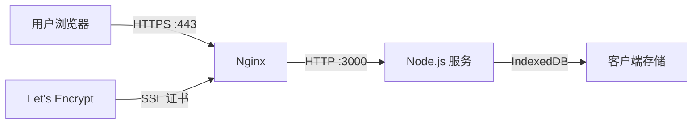

## 产品概述

将 MeetMind 会议助手项目部署到公网环境，通过 meetmind.online 域名提供服务，实现 HTTPS 安全访问。

## 核心功能

- 配置 Nginx 反向代理，将域名请求转发到 Node.js 服务
- 使用 Let's Encrypt 获取免费 SSL 证书，启用 HTTPS 加密
- 通过 screen 会话后台运行 Node.js 服务，确保服务持久化
- 域名解析配置，将 meetmind.online 指向服务器 IP

## 技术栈

- Web 服务器: Nginx (反向代理)
- SSL 证书: Let's Encrypt + Certbot
- 进程管理: screen
- 运行时: Node.js
- 域名: meetmind.online

## 技术架构

### 系统架构



### 模块划分

- **Nginx 模块**: 负责接收外部 HTTPS 请求，SSL 终止，反向代理到后端服务
- **Node.js 服务模块**: MeetMind 应用主服务，运行在本地端口
- **SSL 证书模块**: Certbot 自动获取和续期 Let's Encrypt 证书

### 数据流

用户请求 → DNS 解析到服务器 IP → Nginx 443 端口接收 → SSL 解密 → 反向代理到 Node.js 3000 端口 → 返回响应

## 实施细节

### 核心配置文件结构

```
/etc/nginx/
├── sites-available/
│   └── meetmind.online    # Nginx 站点配置
└── sites-enabled/
    └── meetmind.online    # 软链接

/mnt/meetmind/
├── .env                   # 环境变量配置
└── ...                    # 项目文件
```

### 关键配置

**Nginx 反向代理配置**: 处理 HTTPS 请求并转发到 Node.js 服务

```
server {
    listen 443 ssl;
    server_name meetmind.online www.meetmind.online;
    
    ssl_certificate /etc/letsencrypt/live/meetmind.online/fullchain.pem;
    ssl_certificate_key /etc/letsencrypt/live/meetmind.online/privkey.pem;
    
    location / {
        proxy_pass http://127.0.0.1:3000;
        proxy_http_version 1.1;
        proxy_set_header Upgrade $http_upgrade;
        proxy_set_header Connection 'upgrade';
        proxy_set_header Host $host;
        proxy_cache_bypass $http_upgrade;
    }
}
```

### 技术实施计划

1. **DNS 配置**: 在域名服务商处添加 A 记录指向服务器 IP
2. **Nginx 安装配置**: 安装 Nginx 并配置反向代理
3. **SSL 证书获取**: 使用 Certbot 获取 Let's Encrypt 证书
4. **服务启动**: 使用 screen 后台运行 Node.js 服务
5. **验证测试**: 访问 https://meetmind.online 验证部署

## Agent Extensions

### SubAgent

- **code-explorer**
- 用途: 探索 MeetMind 项目结构，确认入口文件、端口配置和启动命令
- 预期结果: 获取项目的 package.json 启动脚本和服务端口信息