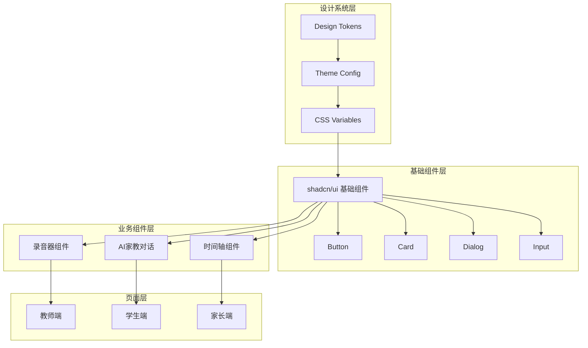
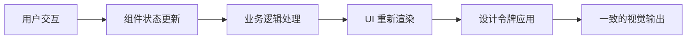

## 产品概述

MeetMind 是一款"家校同频"智能助教系统，核心定位是通过课堂录音、AI家教对话和三端协同（教师端、家长端、学生端）来提升教学效率和家校沟通体验。本次重构目标是将现有前端升级为大厂级产品体验，对标 Duolingo/Notion/Linear 的设计水准。

## 核心功能

- **录音器组件**：课堂录音的核心交互入口，支持开始/暂停/停止录音，实时波形展示，录音时长显示
- **AI家教对话**：智能对话界面，支持流式消息展示、上下文记忆、快捷提问建议
- **时间轴组件**：课堂内容时间线展示，支持关键节点标记、快速跳转、内容摘要预览
- **三端协同界面**：教师端、家长端、学生端的差异化视图与统一设计语言
- **统一设计系统**：基于 shadcn/ui 的设计令牌体系，确保全局风格一致性

## 技术栈

- 前端框架：Next.js 14 + TypeScript
- 样式方案：Tailwind CSS
- 组件库：shadcn/ui（正规初始化）
- 状态管理：React Context + Hooks
- 动画库：Framer Motion（微交互增强）

## 技术架构

### 系统架构

采用分层架构模式，确保组件复用性和设计一致性：



### 模块划分

| 模块名称 | 主要职责 | 关键技术 | 依赖关系 |
| --- | --- | --- | --- |
| 设计令牌模块 | 统一管理颜色、字体、间距、圆角等设计变量 | CSS Variables + Tailwind Config | 无 |
| shadcn/ui 基础层 | 提供经过定制的基础 UI 组件 | shadcn/ui + Radix UI | 设计令牌模块 |
| 录音器模块 | 课堂录音交互与状态管理 | Web Audio API + React Hooks | shadcn/ui 基础层 |
| AI对话模块 | 智能对话界面与消息流处理 | Streaming API + React State | shadcn/ui 基础层 |
| 时间轴模块 | 课堂内容时间线展示与交互 | Custom Hooks + Animations | shadcn/ui 基础层 |


### 数据流



## 实现细节

### 核心目录结构

基于现有 Next.js 14 项目，新增和修改的文件结构：

```
meetmind/
├── components/
│   └── ui/                    # shadcn/ui 组件目录（正规初始化）
│       ├── button.tsx         # 重构：统一按钮组件
│       ├── card.tsx           # 重构：统一卡片组件
│       ├── dialog.tsx         # 新增：对话框组件
│       ├── input.tsx          # 重构：统一输入组件
│       └── ...
├── components/
│   ├── recorder/              # 录音器业务组件
│   │   ├── RecorderPanel.tsx  # 重构：录音面板
│   │   └── WaveformDisplay.tsx # 重构：波形展示
│   ├── ai-tutor/              # AI家教业务组件
│   │   ├── ChatInterface.tsx  # 重构：对话界面
│   │   └── MessageBubble.tsx  # 重构：消息气泡
│   └── timeline/              # 时间轴业务组件
│       ├── TimelineView.tsx   # 重构：时间轴视图
│       └── TimelineNode.tsx   # 重构：时间节点
├── lib/
│   └── utils.ts               # shadcn/ui 工具函数（cn 函数）
├── styles/
│   └── globals.css            # 更新：CSS 变量定义
├── tailwind.config.ts         # 更新：设计令牌配置
└── components.json            # 新增：shadcn/ui 配置文件
```

### 关键代码结构

**设计令牌接口**：定义统一的设计变量类型，确保全局样式一致性。

```typescript
// 设计令牌类型定义
interface DesignTokens {
  colors: {
    primary: string;
    secondary: string;
    accent: string;
    background: string;
    foreground: string;
    muted: string;
    border: string;
  };
  radius: {
    sm: string;
    md: string;
    lg: string;
  };
  spacing: Record<string, string>;
}
```

**组件变体配置**：使用 class-variance-authority 管理组件变体，保持 API 一致性。

```typescript
// 按钮组件变体示例
const buttonVariants = cva(
  "inline-flex items-center justify-center rounded-md text-sm font-medium transition-colors",
  {
    variants: {
      variant: {
        default: "bg-primary text-primary-foreground hover:bg-primary/90",
        secondary: "bg-secondary text-secondary-foreground hover:bg-secondary/80",
        ghost: "hover:bg-accent hover:text-accent-foreground",
      },
      size: {
        default: "h-10 px-4 py-2",
        sm: "h-9 rounded-md px-3",
        lg: "h-11 rounded-md px-8",
      },
    },
  }
);
```

### 技术实施计划

**1. shadcn/ui 正规初始化**

- 问题：现有项目有手写仿 shadcn 组件但未正规初始化
- 方案：执行 `npx shadcn-ui@latest init` 完成标准化配置
- 关键步骤：配置 components.json、更新 tailwind.config.ts、添加 CSS 变量
- 验证：确保 `npx shadcn-ui@latest add button` 可正常工作

**2. 设计令牌体系建立**

- 问题：需要统一的设计语言对标大厂产品
- 方案：基于 shadcn/ui 的 CSS 变量体系扩展自定义令牌
- 关键步骤：定义色彩、字体、间距、圆角、阴影等变量
- 验证：所有组件使用统一变量，无硬编码样式值

**3. 核心组件重构**

- 问题：现有组件风格不一致
- 方案：基于 shadcn/ui 基础组件逐步重构业务组件
- 关键步骤：录音器 → AI对话 → 时间轴，按优先级重构
- 验证：组件 API 统一、视觉风格一致、交互体验流畅

## 技术考量

### 性能优化

- 组件按需加载，避免打包体积过大
- 使用 React.memo 优化频繁更新的组件（如波形展示）
- CSS 变量运行时切换主题，无需重新加载

### 可维护性

- 遵循 shadcn/ui 的组件组织规范
- 业务组件与基础组件分离
- 设计令牌集中管理，便于全局调整

## 设计风格

采用现代极简主义设计风格，融合 Notion 的清爽留白、Linear 的精致细节和 Duolingo 的友好亲和感。整体追求"专业而不冰冷，活泼而不幼稚"的教育科技产品调性。

## 设计原则

- **一致性**：所有组件遵循统一的设计令牌，确保视觉语言统一
- **层次感**：通过阴影、圆角、间距建立清晰的视觉层次
- **微交互**：精心设计的 hover、active、focus 状态，提升交互质感
- **可访问性**：确保足够的色彩对比度和键盘可访问性

## 页面规划

### 1. 录音器面板

- **顶部状态栏**：录音状态指示、时长显示、音量电平
- **中央波形区**：实时音频波形可视化，采用渐变色彩增强视觉吸引力
- **底部控制区**：开始/暂停/停止按钮组，采用圆形按钮设计，主操作突出显示
- **快捷操作栏**：标记重点、添加笔记等辅助功能

### 2. AI家教对话界面

- **顶部导航**：对话主题、上下文信息、设置入口
- **消息流区域**：用户消息右对齐、AI回复左对齐，支持 Markdown 渲染
- **快捷建议区**：智能推荐的常见问题标签，一键快速提问
- **输入区域**：多行输入框、发送按钮、附件上传

### 3. 时间轴视图

- **时间轴主体**：垂直时间线，节点标记关键时刻
- **节点卡片**：展示时间点、内容摘要、相关标签
- **筛选控制**：按类型、时间范围筛选内容
- **详情面板**：点击节点展开完整内容

### 4. 三端导航框架

- **侧边导航**：主功能入口，支持折叠/展开
- **顶部栏**：用户信息、通知、全局搜索
- **内容区域**：响应式布局，适配不同屏幕尺寸

## Agent Extensions

### Skill

- **frontend-design**
- 用途：创建高质量的前端界面设计，确保组件达到大厂级视觉标准
- 预期成果：生成符合 Duolingo/Notion/Linear 设计水准的组件代码

- **ui-ux-pro-max**
- 用途：提供专业的 UI/UX 设计指导，包括配色方案、字体搭配、动效设计
- 预期成果：建立完整的设计令牌体系和组件变体规范

- **web-artifacts-builder**
- 用途：构建复杂的多组件 React 界面，使用 shadcn/ui 组件库
- 预期成果：生成可直接使用的录音器、AI对话、时间轴等核心组件

### SubAgent

- **code-explorer**
- 用途：探索现有项目结构，分析已有组件代码和样式定义
- 预期成果：完整了解当前项目架构，为重构提供准确的代码基础