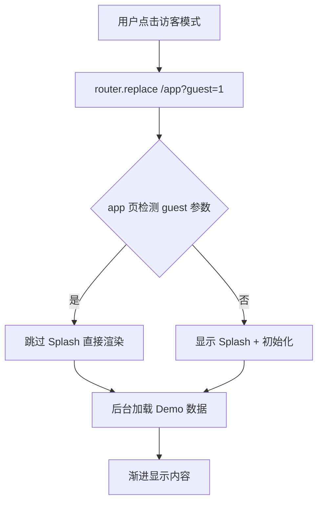

## 用户需求

MeetMind 应用存在严重的用户体验问题，需要全面优化加载性能和交互体验：

## 核心问题

1. **访客模式双击问题**：点击"访客模式体验"后经历多重加载（login页 AppLoading → /app 初始化 → Splash），需要等待后再点击才能进入
2. **加载动画过长**：进入后加载页面动画不变，用户有明显等待感
3. **教师端/家长端延迟高**：数据串行加载导致进入延迟
4. **整体用户体验不流畅**：缺乏微交互反馈，等待感明显

## 产品概览

MeetMind 是一个课堂学习辅助应用，包含学生端（录音、复习）、教师端、家长端三个角色入口，核心痛点是各端口进入延迟过高。

## 核心功能优化范围

- 访客模式一键进入，消除双击问题
- 加载动画更动态，提供进度反馈
- 数据预加载与并行化
- 微交互提升操作即时反馈感
- 骨架屏与渐进式渲染

## 技术栈

- **框架**: Next.js 14 (App Router) + React 18
- **语言**: TypeScript
- **样式**: Tailwind CSS
- **数据**: IndexedDB (Dexie) + SWR
- **状态**: React Hooks + Context

## 实现方案

### 核心策略

采用 **"即时反馈 + 后台加载 + 渐进渲染"** 三层优化策略：

1. 所有点击操作立即给予视觉反馈，消除等待感
2. 数据加载并行化，关键路径优先
3. 使用骨架屏和渐进式内容显示

### 关键技术决策

1. **访客模式优化 - 消除双重加载**

- 问题根因：login 页显示 AppLoading 后跳转 /app，/app 又显示自己的 Splash
- 方案：使用 `router.replace` + URL 参数 `?guest=1` 标识访客，app 页检测到此参数时跳过 Splash 直接进入
- 权衡：这样做会让访客和登录用户有不同的首次加载体验，但访客模式本就是快速体验，合理

2. **加载动画优化 - 动态进度 + 阶段文案**

- 问题根因：进度条更新频率低，文案固定，动画单调
- 方案：增加进度更新频率（每 200ms），根据进度阶段显示不同文案，添加脉冲动画
- 时间复杂度：O(1)，无性能影响

3. **数据加载并行化 - Promise.all 改造**

- 问题根因：家长端 `getTodayLearningStatus` 串行调用 demo 数据
- 方案：使用 Promise.allSettled 并行请求，失败自动降级
- 性能收益：加载时间从 2T 降至 T（假设单次请求时间为 T）

4. **微交互优化 - 涟漪效果 + 触觉反馈**

- 复用已有的 RippleButton 组件
- 关键交互点添加过渡动画（scale、opacity）

## 实现要点

### 性能相关

- **避免重复渲染**：访客模式参数只在首次挂载时检测一次，使用 useRef 标记
- **合理使用 prefetch**：login 页已实现 router.prefetch('/app')，确保访客点击时页面已预加载
- **进度更新节流**：进度更新使用 requestAnimationFrame 批量处理，避免频繁 re-render

### 日志与监控

- 复用现有 console.log 模式，关键路径添加性能标记
- 错误场景使用 try-catch 并提供用户友好提示

### 向后兼容

- URL 参数 `?guest=1` 仅作为提示，不存在时按正常流程处理
- 所有优化保持现有 API 和组件接口不变

## 架构设计



## 目录结构

```
src/
├── app/
│   ├── (auth)/login/page.tsx         # [MODIFY] 访客模式优化：使用 replace + guest 参数
│   └── (main)/app/page.tsx           # [MODIFY] 检测 guest 参数跳过 Splash，优化初始化流程
├── app/parent/page.tsx               # [MODIFY] 数据加载并行化，添加骨架屏
├── components/
│   ├── AppLoading.tsx                # [MODIFY] 动态进度动画，阶段文案，脉冲效果
│   └── ui/
│       └── loading-overlay.tsx       # [NEW] 轻量级加载遮罩组件，用于页面切换
├── lib/
│   └── services/
│       └── parent-service.ts         # [MODIFY] 并行加载优化
└── hooks/
    └── usePageTransition.ts          # [NEW] 页面切换过渡 Hook
```

## 关键代码结构

```typescript
// 访客模式跳转优化 - login/page.tsx
const handleGuestMode = () => {
  setIsGuestLoading(true);
  // 使用 replace 避免返回到 loading 状态，添加 guest 参数
  router.replace('/app?guest=1');
};

// app 页检测 - app/page.tsx
const searchParams = useSearchParams();
const isGuestFastEntry = searchParams.get('guest') === '1';
// 访客快速入口跳过 Splash
const [showSplash, setShowSplash] = useState(!isGuestFastEntry);
```

## Agent Extensions

### Skill

- **vercel-react-best-practices**
- 用途: 应用 Vercel 官方的 React/Next.js 性能优化最佳实践
- 预期结果: 确保优化方案符合 React 18 并发特性和 Next.js App Router 最佳实践

- **frontend-design**
- 用途: 设计微交互和加载动画效果
- 预期结果: 提供流畅的视觉反馈体验，消除等待感

### SubAgent

- **code-explorer**
- 用途: 深入探索相关服务层代码，确保并行化改造不破坏现有逻辑
- 预期结果: 完整识别所有需要修改的依赖调用链