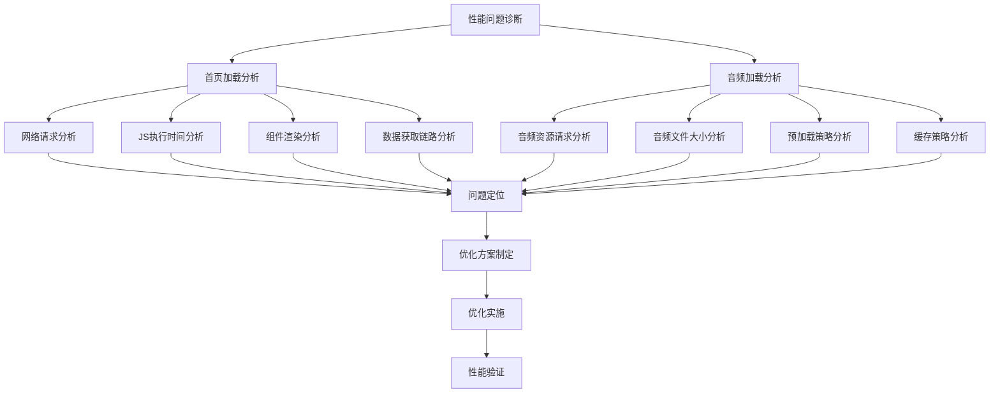

## 产品概述

MeetMind 应用存在两个核心性能问题需要深入分析和优化：首页加载时显示"加载中..."等待时间过长，以及复习模式下"加载音频..."速度过慢。之前已进行过代码分割优化但问题仍然存在，需要从根本上诊断和解决这些性能瓶颈。

## 核心功能

- **首页加载性能分析**：诊断首页初始化过程中的性能瓶颈，包括数据获取、组件渲染、资源加载等环节
- **音频加载优化**：分析复习页面音频资源加载链路，识别网络请求、音频解码、缓存策略等方面的问题
- **性能监控与度量**：建立性能基准指标，量化优化前后的加载时间差异
- **优化方案实施**：针对诊断出的问题实施具体的优化措施，如懒加载、预加载、缓存策略等

## 技术栈

- 基于现有项目技术栈进行分析和优化
- 性能分析工具：Chrome DevTools Performance、Network、Lighthouse
- 代码分析：React Profiler、Bundle Analyzer

## 技术架构

### 性能问题诊断流程



### 模块划分

- **诊断模块**：负责收集和分析性能数据，定位具体瓶颈
- **首页优化模块**：针对首页加载问题的具体优化实现
- **音频优化模块**：针对音频加载问题的具体优化实现
- **监控模块**：建立性能指标监控，验证优化效果

### 数据流分析重点

1. **首页加载链路**：应用启动 → 路由初始化 → 数据请求 → 组件渲染 → 首屏展示
2. **音频加载链路**：页面进入 → 音频URL获取 → 音频资源请求 → 音频解码 → 播放就绪

## 实施细节

### 核心目录结构（待分析）

```
project-root/
├── src/
│   ├── pages/
│   │   ├── Home/           # 首页相关组件
│   │   └── Review/         # 复习页面相关组件
│   ├── components/         # 公共组件
│   ├── services/           # API服务层
│   ├── hooks/              # 自定义hooks
│   └── utils/              # 工具函数
```

### 关键分析点

**首页性能分析**：

- 初始数据获取时序和并发策略
- 组件树深度和渲染开销
- 第三方依赖加载影响
- 状态管理初始化开销

**音频加载分析**：

- 音频文件大小和格式
- CDN/服务器响应时间
- 是否存在预加载机制
- 浏览器音频缓存策略

### 技术实施方案

1. **问题诊断**：深入代码审查，定位具体性能瓶颈
2. **数据获取优化**：优化API请求策略，减少阻塞式加载
3. **音频预加载**：实现智能预加载和渐进式加载
4. **缓存策略**：建立有效的数据和资源缓存机制
5. **渲染优化**：减少不必要的重渲染，优化关键渲染路径

### 性能指标目标

- 首页首屏加载时间：< 2秒
- 音频加载就绪时间：< 1秒
- 用户可交互时间（TTI）：显著降低

## Agent Extensions

### SubAgent

- **code-explorer**
- 用途：深入探索MeetMind项目代码库，分析首页和复习页面的实现逻辑、数据获取流程、组件结构和音频加载机制
- 预期结果：全面了解现有代码架构，定位具体的性能瓶颈代码位置和原因