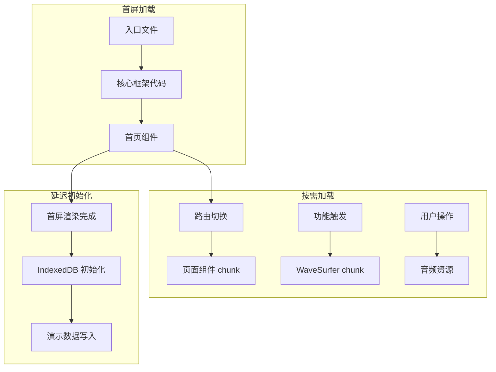
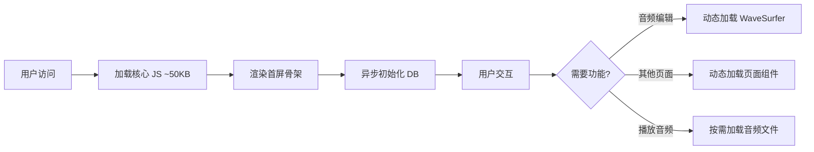

## 产品概述

针对 MeetMind 系统加载缓慢问题进行全链路性能优化，通过代码分割、懒加载、初始化流程优化等技术手段，显著提升应用首屏加载速度和整体运行性能。

## 核心功能

- **代码分割优化**：将 5.8MB 的主 chunk 拆分为多个按需加载的小模块，降低首屏 JS 体积
- **组件懒加载**：对页面级组件和大型功能组件实施动态导入，减少初始加载负担
- **初始化流程优化**：将 IndexedDB 操作和演示数据写入改为异步延迟执行，避免阻塞首屏渲染
- **WaveSurfer 懒加载**：仅在需要音频波形展示时动态加载 WaveSurfer 库
- **音频资源按需加载**：取消 review 模式下音频文件的自动加载，改为用户触发时加载

## 技术栈

- 框架：Next.js + TypeScript
- 构建优化：Next.js 内置代码分割 + dynamic import
- 状态管理：现有方案保持不变
- 数据持久化：IndexedDB（Dexie.js）

## 技术架构

### 系统架构



### 模块划分

- **路由层代码分割**：按页面路由拆分 chunk，实现页面级懒加载
- **组件懒加载模块**：对 WaveSurfer、大型编辑器等组件实施动态导入
- **初始化优化模块**：重构 IndexedDB 初始化逻辑，实现异步非阻塞加载
- **资源加载模块**：优化音频等大型资源的加载策略

### 数据流



## 实现细节

### 核心目录结构

```
src/
├── app/
│   ├── page.tsx              # 修改：优化首页加载
│   ├── meeting/
│   │   └── [id]/
│   │       └── page.tsx      # 修改：动态导入组件
│   └── review/
│       └── page.tsx          # 修改：取消音频自动加载
├── components/
│   ├── AudioWaveform.tsx     # 修改：WaveSurfer 懒加载封装
│   └── LazyComponents.tsx    # 新增：懒加载组件导出
├── lib/
│   ├── db/
│   │   └── init.ts           # 修改：异步初始化逻辑
│   └── utils/
│       └── lazyLoad.ts       # 新增：懒加载工具函数
└── hooks/
    └── useDelayedInit.ts     # 新增：延迟初始化 Hook
```

### 关键代码结构

**懒加载组件封装**：使用 Next.js dynamic 实现组件级代码分割，支持加载状态展示和错误边界处理。

```typescript
// 动态导入配置
import dynamic from 'next/dynamic';

const AudioWaveform = dynamic(
  () => import('@/components/AudioWaveform'),
  { 
    loading: () => <WaveformSkeleton />,
    ssr: false 
  }
);
```

**延迟初始化 Hook**：在首屏渲染完成后执行非关键初始化任务，避免阻塞用户交互。

```typescript
// 延迟初始化 Hook
function useDelayedInit(callback: () => Promise<void>, delay: number = 1000) {
  useEffect(() => {
    const timer = setTimeout(() => {
      requestIdleCallback(() => callback());
    }, delay);
    return () => clearTimeout(timer);
  }, []);
}
```

**IndexedDB 异步初始化**：将数据库初始化和演示数据写入改为后台任务，不阻塞首屏渲染。

```typescript
// 异步数据库初始化
export async function initDatabaseAsync() {
  if (typeof window === 'undefined') return;
  
  await new Promise(resolve => requestIdleCallback(resolve));
  await db.open();
  
  // 演示数据延迟写入
  if (shouldLoadDemoData()) {
    queueMicrotask(() => loadDemoData());
  }
}
```

### 技术实现方案

#### 1. 代码分割策略

- **问题**：主 chunk 5.8MB，所有组件同步导入
- **方案**：使用 Next.js dynamic import 按路由和功能模块拆分
- **技术**：next/dynamic、React.lazy、Suspense
- **步骤**：

1. 识别大型依赖和页面组件
2. 配置动态导入和 loading 状态
3. 设置预加载策略优化用户体验

- **验证**：构建后检查 chunk 大小分布

#### 2. WaveSurfer 懒加载

- **问题**：WaveSurfer 库较大且同步加载
- **方案**：仅在音频编辑功能激活时动态加载
- **技术**：dynamic import + ssr: false
- **步骤**：

1. 封装 WaveSurfer 组件为独立模块
2. 使用 dynamic 动态导入
3. 添加加载骨架屏

#### 3. 初始化流程优化

- **问题**：IndexedDB 操作阻塞首屏
- **方案**：使用 requestIdleCallback 延迟执行
- **技术**：requestIdleCallback、queueMicrotask
- **步骤**：

1. 重构初始化代码为异步函数
2. 在首屏渲染后调度执行
3. 添加初始化状态管理

#### 4. 音频资源按需加载

- **问题**：2.9MB 音频在 review 模式自动加载
- **方案**：改为用户点击播放时加载
- **技术**：条件加载、预加载提示
- **步骤**：

1. 移除自动加载逻辑
2. 添加播放触发加载机制
3. 优化加载状态展示

### 性能考量

- **目标指标**：首屏 JS 降至 100KB 以下，LCP < 2s
- **监控方案**：使用 Next.js 内置性能分析和 Lighthouse 检测
- **渐进增强**：确保基础功能在资源加载完成前可用

## Agent Extensions

### SubAgent

- **code-explorer**
- 目的：全面分析现有代码库中的组件导入方式、初始化逻辑和资源加载模式
- 预期结果：识别所有需要优化的同步导入点、IndexedDB 初始化位置和音频加载逻辑