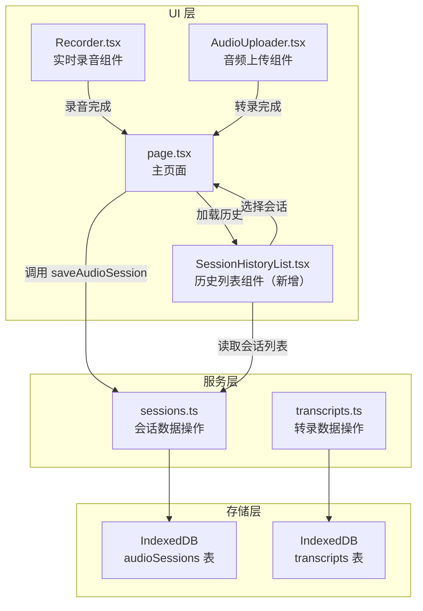
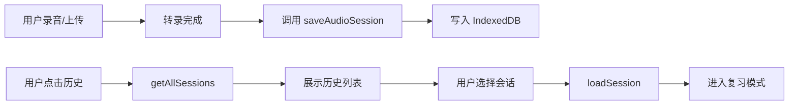

## 产品概述

完善录音历史记录功能，实现录音会话的持久化存储和历史列表展示。用户完成实时录音或上传音频转录后，系统自动保存会话到本地 IndexedDB 数据库，并提供"会话历史列表"入口，用户可从历史列表中选择任意会话进入复习模式查看。

## 核心功能

### 1. 录音会话自动保存

- 实时流式录音完成后，自动调用 `saveAudioSession()` 将音频 Blob、sessionId、时长等信息保存到 IndexedDB
- 上传音频文件转录完成后，同样自动保存会话到历史记录

### 2. 会话历史列表组件

- 新增 `SessionHistoryList` 组件，展示所有历史录音会话
- 列表显示会话标题（主题/日期）、创建时间、时长、状态等信息
- 支持按时间倒序排列，最新会话在前
- 提供删除单条历史记录功能

### 3. 从历史进入复习模式

- 点击历史列表中的会话项，加载对应的音频、转录数据和困惑点
- 自动切换到复习模式（viewMode='review'）
- 复用现有的 AI 家教、精选片段、摘要等功能

### 4. 入口与导航

- 在录音页面和复习页面添加"历史记录"入口按钮
- 移动端通过侧边菜单访问历史记录
- 桌面端在顶部或侧边栏添加入口

## 技术栈

- 前端框架：Next.js + React + TypeScript（现有项目技术栈）
- 数据存储：IndexedDB（Dexie.js）
- 样式方案：Tailwind CSS
- 状态管理：React Hooks

## 技术架构

### 系统架构



### 模块划分

#### 会话存储模块（sessions.ts）- 已存在需扩展

- 职责：音频会话的 CRUD 操作
- 新增函数：
- `getAllSessions()`: 获取所有历史会话
- `getSessionById(sessionId)`: 根据 ID 获取单个会话
- `deleteSession(sessionId)`: 删除指定会话及关联数据
- 依赖：Dexie.js

#### 会话历史 UI 模块（SessionHistoryList.tsx）- 新增

- 职责：展示历史会话列表、提供交互
- 技术：React 组件
- 依赖：sessions.ts

#### 主页面模块（page.tsx）- 修改

- 职责：协调录音、上传、历史的状态切换
- 修改点：
- 录音停止回调中调用 `saveAudioSession()`
- 上传完成回调中调用 `saveAudioSession()`
- 新增历史列表展示逻辑和入口

### 数据流



## 实现细节

### 核心目录结构

```
src/
├── lib/db/
│   └── sessions.ts           # 修改：新增 getAllSessions, getSessionById, deleteSession
├── components/
│   └── SessionHistoryList.tsx # 新增：会话历史列表组件
└── app/
    └── page.tsx              # 修改：集成保存逻辑和历史入口
```

### 关键代码结构

**扩展 AudioSession 操作（sessions.ts）**

```typescript
// 获取所有会话列表（按创建时间倒序）
export async function getAllSessions(): Promise<AudioSession[]> {
  return db.audioSessions
    .orderBy('createdAt')
    .reverse()
    .toArray();
}

// 根据 sessionId 获取单个会话
export async function getSessionById(sessionId: string): Promise<AudioSession | undefined> {
  return db.audioSessions
    .where('sessionId')
    .equals(sessionId)
    .first();
}

// 删除会话及其关联数据
export async function deleteSession(sessionId: string): Promise<void> {
  await db.transcripts.where('sessionId').equals(sessionId).delete();
  await db.anchors.where('sessionId').equals(sessionId).delete();
  await db.audioSessions.where('sessionId').equals(sessionId).delete();
}
```

**SessionHistoryList 组件接口**

```typescript
interface SessionHistoryListProps {
  onSessionSelect: (session: AudioSession) => void;
  onClose?: () => void;
}
```

### 技术实现计划

#### 1. 扩展 sessions.ts

- 新增 `getAllSessions()` 函数获取历史列表
- 新增 `getSessionById()` 函数加载单个会话
- 新增 `deleteSession()` 函数删除会话及关联数据
- 确保函数从 index.ts 正确导出

#### 2. 创建 SessionHistoryList 组件

- 使用 `useEffect` 加载历史数据
- 列表项展示：标题、时间、时长、状态标签
- 支持点击选择、删除操作
- 空状态提示
- 移动端和桌面端自适应布局

#### 3. 修改 page.tsx 集成保存逻辑

- 在 `handleRecordingStop` 中调用 `saveAudioSession()`
- 在 `AudioUploader.onTranscriptReady` 回调中调用 `saveAudioSession()`
- 新增 `handleLoadSession()` 函数加载历史会话
- 新增历史列表展示状态和入口

#### 4. 添加历史入口

- 桌面端：在 ActionSidebar 添加历史记录图标
- 移动端：在 DedaoMenu 添加历史记录菜单项
- 录音页面：添加"查看历史"按钮

### 集成点

- 录音完成：`onRecordingStop` 回调 -> 调用 `saveAudioSession(blob, sessionId, { duration })`
- 上传完成：`onTranscriptReady` 回调 -> 调用 `saveAudioSession(blob, sessionId, { duration })`
- 历史加载：读取 `AudioSession.blob` 创建音频 URL，读取 `transcripts` 表获取转录数据

## Agent Extensions

### SubAgent

- **code-explorer**
- 用途：在实现过程中搜索现有组件的实现模式和样式规范
- 预期结果：找到可复用的列表组件样式、交互模式