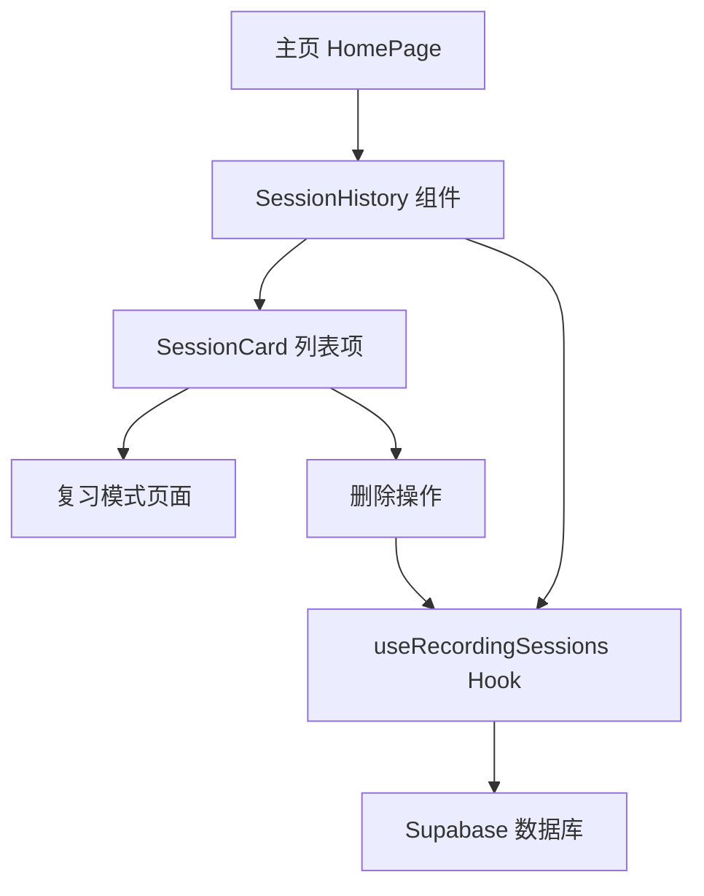

## 产品概述

在 MeetMind 主页添加「课程记录」功能模块，让用户可以浏览历史录音会话列表，支持点击进入复习模式查看完整内容，并提供删除操作。同时优化数据层 hooks 支持按 userId 过滤会话数据。

## 核心功能

- 历史会话列表展示：在主页显示用户的历史录音会话，包含会话标题、时间、时长等关键信息
- 复习模式入口：点击历史会话卡片可进入复习模式，查看该会话的完整转录内容和笔记
- 会话删除：支持删除不需要的历史会话记录，带确认提示防止误删
- 用户数据过滤：hooks 层支持按 userId 过滤，确保用户只能看到自己的会话记录
- 交互体验优化：复用已有的 ActionSidebar 交互模式，保持界面风格一致性

## 技术栈

- 前端框架：React + TypeScript（沿用项目现有技术栈）
- 样式方案：Tailwind CSS（沿用项目现有方案）
- 状态管理：React Hooks + Context（沿用项目现有模式）
- 数据层：现有的 useRecordingSessions hooks

## 技术架构

### 系统架构

基于现有项目架构进行功能扩展，不引入新的架构模式。



### 模块划分

- **SessionHistory 组件**：历史会话列表容器组件，负责数据获取和列表渲染
- **SessionCard 组件**：单个会话卡片组件，展示会话信息和操作按钮
- **useRecordingSessions Hook 扩展**：增加 userId 过滤参数和删除方法

### 数据流

用户进入主页 → useRecordingSessions 获取会话列表 → 渲染 SessionHistory → 用户点击卡片 → 跳转复习模式 / 用户点击删除 → 确认后调用删除方法 → 刷新列表

## 实现细节

### 核心目录结构

```
src/
├── components/
│   ├── SessionHistory/
│   │   ├── index.tsx          # 新增：历史会话列表组件
│   │   └── SessionCard.tsx    # 新增：会话卡片组件
├── hooks/
│   └── useRecordingSessions.ts # 修改：增加 userId 过滤和删除方法
└── pages/
    └── HomePage.tsx            # 修改：集成 SessionHistory 组件
```

### 关键代码结构

**Hook 接口扩展**：为 useRecordingSessions 增加 userId 过滤参数和 deleteSession 方法。

```typescript
interface UseRecordingSessionsOptions {
  userId?: string;
  limit?: number;
}

interface UseRecordingSessionsReturn {
  sessions: RecordingSession[];
  loading: boolean;
  error: Error | null;
  deleteSession: (sessionId: string) => Promise<void>;
  refetch: () => void;
}
```

**SessionCard Props**：定义会话卡片组件的属性接口。

```typescript
interface SessionCardProps {
  session: RecordingSession;
  onReview: (sessionId: string) => void;
  onDelete: (sessionId: string) => void;
}
```

### 技术实现要点

1. **列表虚拟化**：如果会话数量较多，考虑使用虚拟滚动优化性能
2. **删除确认**：使用 Modal 或 Popconfirm 组件实现删除二次确认
3. **加载状态**：显示骨架屏或 loading 动画提升用户体验
4. **空状态处理**：当没有历史会话时显示友好的空状态提示

## Agent Extensions

### SubAgent

- **code-explorer**
- 用途：探索项目现有代码结构，了解 useRecordingSessions hook 的实现细节、ActionSidebar 的交互模式、以及主页组件的布局方式
- 预期结果：获取现有代码的设计模式和实现细节，确保新功能与项目风格保持一致