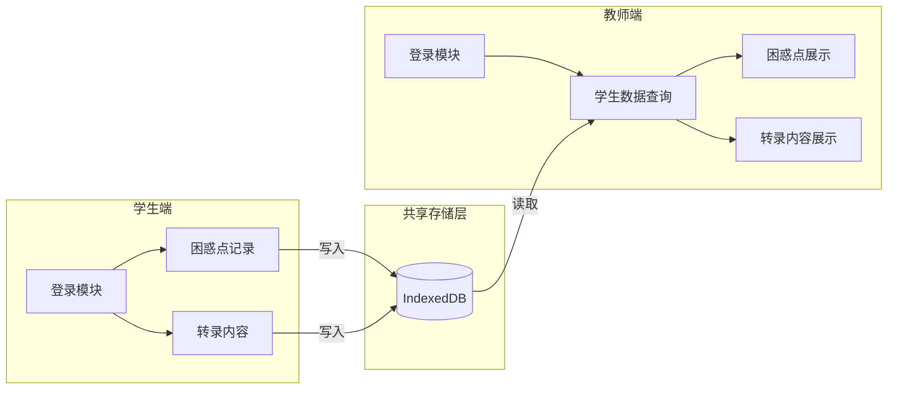
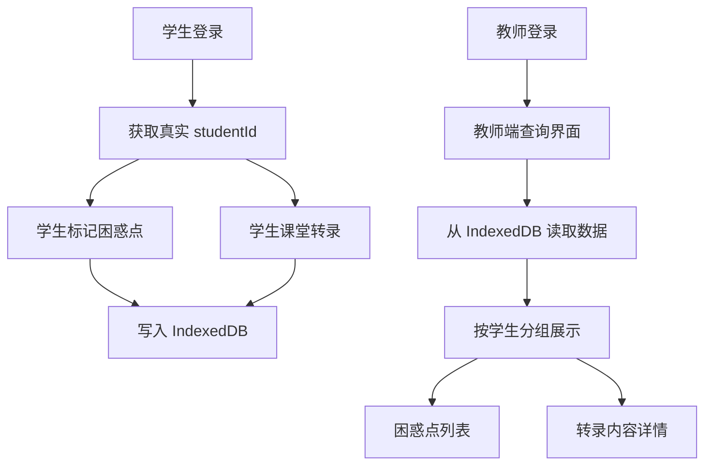

## Product Overview

打通学生端和教师端的数据流，实现一个完整可用的 Demo。学生端记录的困惑点数据和课堂转录内容能够被教师端实时读取和展示，整个数据链路基于真实的用户登录系统，使用真实的 studentId 进行数据关联。

## Core Features

- 统一数据存储层：建立学生端和教师端共享的 IndexedDB 数据存储，支持困惑点和转录内容的持久化
- 学生数据写入：学生端登录后，将困惑点标记和课堂转录内容写入共享存储，关联真实 studentId
- 教师数据读取：教师端能够查询和读取指定学生或全部学生的困惑点数据和转录内容
- 用户身份打通：与现有登录系统集成，确保学生端和教师端使用真实的用户身份信息
- 数据实时同步：教师端能够实时刷新获取最新的学生数据

## Tech Stack

- 前端框架：React + TypeScript（沿用现有项目技术栈）
- 数据存储：IndexedDB（浏览器本地存储，支持同一浏览器多标签页共享）
- 状态管理：React Hooks + Context（沿用现有模式）

## Tech Architecture

### System Architecture

采用共享存储层架构，学生端和教师端通过统一的 IndexedDB 数据库进行数据交换。



### Module Division

- **共享数据服务模块**：封装 IndexedDB 操作，提供统一的数据读写接口
- **学生端数据模块**：负责困惑点和转录内容的写入，关联 studentId
- **教师端数据模块**：负责查询和展示学生数据
- **用户身份模块**：对接现有登录系统，获取真实用户 ID

### Data Flow



## Implementation Details

### Core Directory Structure

基于现有项目结构，新增和修改以下文件：

```
src/
├── services/
│   └── sharedDataService.ts    # 新增：共享数据服务，封装 IndexedDB 操作
├── hooks/
│   └── useSharedData.ts        # 新增：共享数据 Hook
├── types/
│   └── sharedData.ts           # 新增：共享数据类型定义
├── pages/
│   ├── student/
│   │   └── [现有页面]          # 修改：集成数据写入逻辑
│   └── teacher/
│       └── [现有页面]          # 修改：集成数据读取逻辑
```

### Key Code Structures

**共享数据类型定义**：定义困惑点和转录内容的数据结构，确保学生端写入和教师端读取的数据格式一致。

```typescript
interface ConfusionPoint {
  id: string;
  studentId: string;
  studentName: string;
  timestamp: number;
  content: string;
  context: string;
  sessionId: string;
}

interface TranscriptRecord {
  id: string;
  studentId: string;
  studentName: string;
  sessionId: string;
  content: string;
  createdAt: number;
}
```

**共享数据服务接口**：提供统一的数据操作方法，支持学生端写入和教师端读取。

```typescript
class SharedDataService {
  async saveConfusionPoint(point: ConfusionPoint): Promise<void> { }
  async saveTranscript(record: TranscriptRecord): Promise<void> { }
  async getConfusionPointsByStudent(studentId: string): Promise<ConfusionPoint[]> { }
  async getAllConfusionPoints(): Promise<ConfusionPoint[]> { }
  async getTranscriptsByStudent(studentId: string): Promise<TranscriptRecord[]> { }
}
```

### Integration Points

- 与现有用户登录系统集成，获取真实的 studentId 和用户信息
- 学生端现有的困惑点标记功能需要调用共享数据服务写入数据
- 教师端现有的数据展示组件需要从共享数据服务读取数据

## Agent Extensions

### SubAgent

- **code-explorer**
- Purpose：探索现有项目结构，了解学生端和教师端的代码组织、现有登录系统实现、数据存储方式
- Expected outcome：获取现有代码结构信息，确定需要修改的文件和集成点