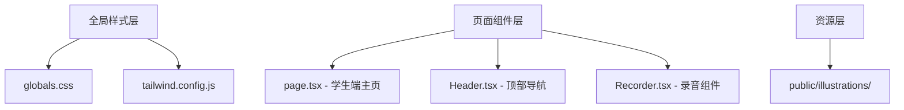

## 产品概述

将 MeetMind 学生端界面改造为教育平台风格，使用奶油色背景、手绘插画元素和卡片式布局，营造温馨友好的学习氛围。

## 核心功能

- 全局背景改造：将现有紫色渐变/白色背景替换为奶油色/米白色背景（#FFF9F5 或 cream 色系）
- 插画装饰元素：在关键页面区域添加 unDraw/Storyset 免费手绘风格插画作为视觉焦点
- 卡片式布局优化：统一使用大圆角（16-24px）卡片，配合柔和阴影效果
- 多彩色点缀：使用项目已配置的 sunflower（黄）、lavender（紫）、mint（绿）、coral（橙）作为功能区分色
- 大面积留白设计：减少信息密度，提升阅读舒适度
- 移动端/桌面端双布局适配：保持录音模式和复习模式的双端体验一致性

## 技术栈

- 前端框架：Next.js + React + TypeScript（现有技术栈）
- 样式方案：Tailwind CSS（已配置 cream、lavender、mint、coral 等色系）
- 插画资源：unDraw（https://undraw.co）或 Storyset（https://storyset.com）免费 SVG 插画

## 技术架构

### 系统架构

本次改造为 UI 风格层面的修改，不涉及架构变更，主要修改以下文件的样式和视觉元素：



### 模块划分

- **全局样式模块**：修改 CSS 变量、body 背景、卡片基础样式
- **页面布局模块**：调整 page.tsx 中录音/复习两种模式的背景和容器样式
- **组件样式模块**：更新 Header、Recorder 等组件的配色
- **插画资源模块**：新增 SVG 插画文件并在关键位置引用

### 数据流

无数据流变更，仅 UI 样式层修改。

## 实现细节

### 核心目录结构

```
src/
├── app/
│   ├── page.tsx          # 修改：背景色、卡片样式、插画位置
│   └── globals.css       # 修改：全局背景、卡片样式、奶油色变量
├── components/
│   ├── Header.tsx        # 修改：导航栏配色
│   └── Recorder.tsx      # 修改：录音区域样式
public/
└── illustrations/        # 新增：SVG 插画资源目录
    ├── learning.svg
    ├── studying.svg
    └── education.svg
```

### 关键代码结构

**奶油色背景 CSS 变量**：扩展现有 cream 色系，定义教育风格专用背景色

```css
:root {
  --edu-bg-primary: #FFF9F5;    /* 主背景-暖奶油 */
  --edu-bg-card: #FFFFFF;        /* 卡片背景-纯白 */
  --edu-bg-soft: #FFFBF0;        /* 次级背景-浅奶油 */
}
```

**卡片样式优化**：增大圆角，使用更柔和的阴影

```css
.card-edu {
  @apply bg-white rounded-2xl border border-cream-200;
  box-shadow: 0 4px 12px rgba(255, 213, 128, 0.08);
}
```

### 技术实现方案

1. **背景色替换**

- 问题：当前 body 使用紫色渐变背景
- 方案：改为奶油色单色背景或微妙暖色渐变
- 技术：修改 globals.css 中 body 样式
- 步骤：定义新 CSS 变量 → 更新 body background → 测试移动端/桌面端

2. **插画集成**

- 问题：页面缺乏教育氛围视觉元素
- 方案：从 unDraw/Storyset 下载免费 SVG，添加到关键区域
- 技术：Next.js Image 组件或内联 SVG
- 步骤：下载插画 → 放入 public/illustrations → 在 page.tsx 中引用

3. **卡片样式统一**

- 问题：现有卡片圆角较小，阴影偏硬
- 方案：统一使用 rounded-2xl/rounded-3xl，调整阴影透明度
- 技术：更新 Tailwind 工具类和 globals.css 中的 .card 样式

## 设计风格

采用现代教育平台风格，温馨友好的奶油色调为主基调，搭配手绘风格插画营造轻松学习氛围。大面积留白设计降低视觉压力，圆角卡片和柔和阴影提升亲和力。

## 页面规划

### 录音模式页面

- **顶部导航栏**：奶油白背景，Logo 保持渐变色，其余元素使用深灰文字
- **主内容区**：奶油色背景，中央放置录音卡片，卡片右上角可添加小型学习插画装饰
- **录音卡片**：纯白背景 + 大圆角（20px）+ 柔和阴影，录音按钮保持紫色渐变突出
- **困惑点列表**：白色卡片，使用 coral 色标记未解决项，mint 色标记已解决项

### 复习模式页面

- **左侧面板**：浅奶油色背景，标签页使用 lavender 高亮当前选中
- **右侧 AI 对话区**：白色背景，顶部波形播放器区域使用浅灰背景区分
- **空状态插画**：当无数据时展示教育主题插画（如学习场景、阅读场景）

### 移动端布局

- **顶部栏**：白色背景 + 底部细边框
- **内容区**：整体奶油色背景
- **卡片组件**：保持与桌面端一致的圆角和阴影风格

## 插画使用规范

- 位置：录音页空状态、复习页引导区、加载状态
- 尺寸：桌面端 200-300px 宽，移动端 150-200px 宽
- 颜色：选择与项目配色协调的插画或自定义颜色