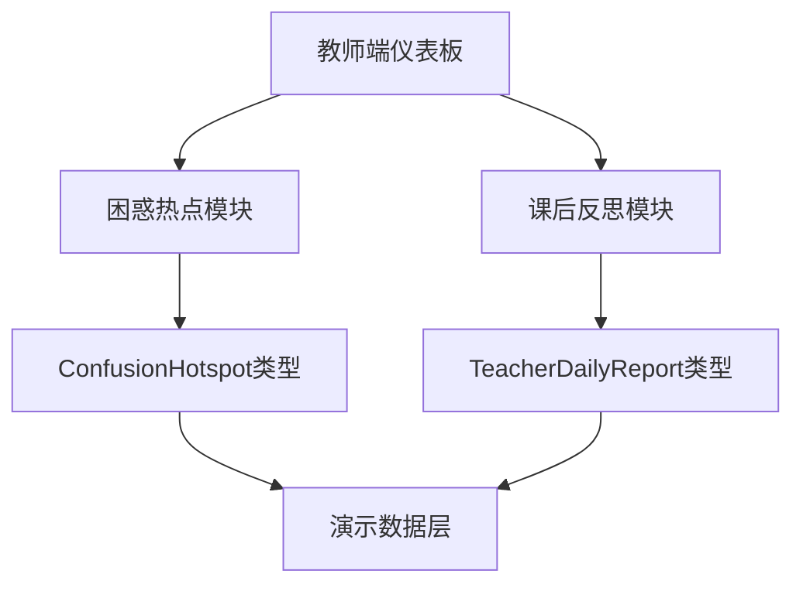

## 产品概述

教师端仪表板是MeetMind智能课堂助手的核心功能模块，为教师提供课堂困惑热点分析和课后反思生成服务。界面采用独立设计风格，专注于教学数据可视化和智能辅助功能。

## 核心功能

- **困惑热点TOP3展示**：以可视化卡片形式展示学生最集中的三个困惑点，包含困惑内容、出现频次、相关时间戳等信息，帮助教师快速定位教学难点
- **一键生成课后反思**：基于课堂数据智能生成教学反思报告，包含教学亮点、改进建议、学生参与度分析等内容，支持一键导出

## 技术栈

- 前端框架：React + TypeScript
- 样式方案：Tailwind CSS
- 组件库：shadcn/ui
- 构建工具：Vite

## 技术架构

### 系统架构



### 模块划分

- **困惑热点展示模块**：负责TOP3困惑点的可视化展示，包含排名徽章、内容卡片、频次统计
- **课后反思生成模块**：负责反思报告的生成、展示和导出功能
- **共享UI组件**：按钮、卡片、徽章等可复用组件

### 数据流

用户访问仪表板 → 加载演示数据 → 渲染困惑热点TOP3 → 点击生成反思 → 展示反思报告

## 实现细节

### 核心目录结构

```
src/
├── components/
│   └── teacher/
│       ├── TeacherDashboard.tsx      # 教师端主仪表板
│       ├── ConfusionHotspotCard.tsx  # 困惑热点卡片组件
│       └── ReflectionGenerator.tsx   # 课后反思生成组件
├── types/
│   └── index.ts                      # 复用现有类型定义
└── data/
    └── mockData.ts                   # 复用现有演示数据
```

### 关键代码结构

**复用现有类型定义**：直接使用项目中已定义的ConfusionHotspot和TeacherDailyReport类型，保持数据结构一致性。

```typescript
// 复用现有类型
interface ConfusionHotspot {
  id: string;
  content: string;
  frequency: number;
  timestamp: string;
}

interface TeacherDailyReport {
  highlights: string[];
  improvements: string[];
  studentEngagement: number;
}
```

## 设计风格

采用专业教育科技风格，以深蓝色为主色调，传达专业、可信赖的教学辅助工具形象。界面简洁大气，突出数据可视化效果，让教师能够快速获取关键信息。

## 页面设计

### 教师仪表板主页

- **顶部导航栏**：品牌Logo、页面标题"教学分析中心"、用户头像
- **困惑热点区域**：三张并排卡片展示TOP3困惑点，每张卡片包含排名徽章（金/银/铜色）、困惑内容摘要、出现频次柱状指示器、时间标签
- **课后反思区域**：大型操作卡片，包含"一键生成课后反思"按钮，点击后展开显示生成的反思报告内容
- **反思报告展示**：分区展示教学亮点、改进建议、学生参与度环形图

### 交互设计

- 困惑卡片悬停时轻微上浮并显示阴影
- 生成按钮点击后显示加载动画
- 反思报告以平滑动画展开显示

## Agent Extensions

### Skill

- **frontend-design**
- 用途：设计独立的教师端UI界面，打造专业、高品质的视觉效果
- 预期成果：生成具有现代感、专业度高的教师仪表板界面设计

- **web-artifacts-builder**
- 用途：构建复杂的多组件React应用，实现困惑热点和反思生成的交互功能
- 预期成果：完整可运行的教师端仪表板应用，包含状态管理和组件交互

### SubAgent

- **code-explorer**
- 用途：探索现有代码库，定位ConfusionHotspot、TeacherDailyReport类型定义和演示数据
- 预期成果：准确获取现有类型定义和数据结构，确保代码复用