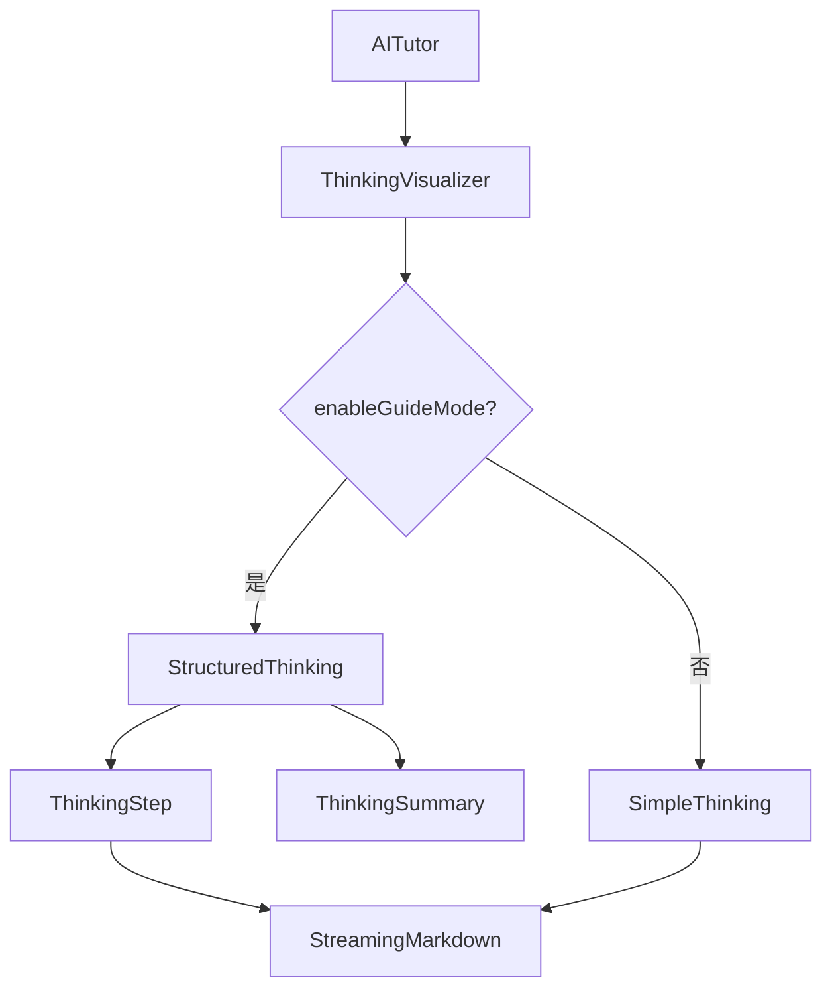

## 用户需求

为 MeetMind 教育产品实现"学霸思维引导模式"功能，在 AI 思考过程展示中融入教育学、心理学和学习方法论，让学生不仅看到 AI 的思考，还能学习清北学霸的思维方法。

## 产品概述

在现有的 AI 思考过程展示基础上，新增"思维引导"开关。开启后，大模型会动态生成结构化的学霸思维指导，包含分步骤分析、学霸笔记（思维技巧提示）和思维方法总结，帮助学生建立正确的思考习惯。

## 核心功能

1. **思维引导模式开关**

- 新增开关，与"联网搜索"并排显示
- 默认关闭，保持原有简洁体验
- 开启后展示结构化学霸思维

2. **学霸思维可视化展示**

- 分步骤节点展示思考过程
- 每步附带"学霸笔记"思维技巧提示
- 最后总结本次用到的思维方法
- 支持 Markdown 渲染和时间戳点击

3. **大模型动态生成**

- 通过 Prompt 引导大模型输出结构化内容
- 思维指导因题而异，灵活多样
- 无需预定义固定标签

4. **双场景支持**

- 全局对话模式
- 困惑点分析模式

## 技术栈

- 前端框架：Next.js + React + TypeScript
- 样式方案：Tailwind CSS
- Markdown 渲染：复用现有 StreamingMarkdown 组件
- 流式处理：SSE (Server-Sent Events)

## 实现方案

### 整体策略

采用"后端 Prompt 注入 + 前端智能解析"的方案。当用户开启"思维引导"模式时，后端在系统提示词中追加格式要求，引导大模型输出结构化的学霸思维内容；前端解析特定格式，美化展示为步骤卡片。

### 关键技术决策

1. **Prompt 注入方式**：在后端 `/api/tutor/route.ts` 中，根据 `enable_thinking_guide` 参数，在现有系统提示词后追加"学霸思维格式要求"，不影响原有回答逻辑

2. **前端解析策略**：使用正则匹配解析 `【思维步骤：xxx】`、`学霸笔记：` 和 `本次用到的思维方法：` 等格式，降级兼容未格式化内容

3. **组件复用**：复用现有 `StreamingMarkdown` 组件渲染步骤内容，支持时间戳点击跳转

4. **状态管理**：复用 `enableWeb` 的模式，新增 `enableThinkingGuide` 状态

### 数据流设计


## 实现要点

### 后端 Prompt 设计

学霸思维格式要求（追加到系统提示词）：

```
【思维引导模式】
请在思考时按以下格式组织思路，示范高效的思维方法：

【思维步骤：理解问题】
（分析学生的问题，找出核心疑问点）

学霸笔记：这里用到的思维技巧说明

【思维步骤：关联知识】
（回忆相关知识点，建立连接）

学霸笔记：这里用到的思维技巧说明

【思维步骤：组织回答】
（整合信息，形成清晰的解释）

学霸笔记：这里用到的思维技巧说明

本次用到的思维方法：方法1 - 方法2 - 方法3
```

### 前端解析逻辑

1. 使用正则匹配 `【思维步骤：(.+?)】` 提取步骤标题
2. 匹配 `学霸笔记：(.+?)(?=【|本次|$)` 提取学习建议
3. 匹配 `本次用到的思维方法：(.+)` 提取方法总结
4. 未匹配到格式时，降级为原始文本展示

### 性能考量

- ThinkingVisualizer 使用 React.memo 优化
- 解析逻辑使用 useMemo 缓存结果
- 正则匹配在内容变化时才执行

### 兼容性

- 保持现有 SSE 格式不变
- 保持紫色主题色调
- 移动端适配（isMobile 属性）
- 关闭模式时完全降级为原有展示

## 架构设计

### 组件结构



### 接口设计

ThinkingVisualizer 组件属性：

```typescript
interface ThinkingVisualizerProps {
  content: string;              // 思考内容
  isThinking: boolean;          // 是否正在思考
  isCollapsed: boolean;         // 是否折叠
  onToggleCollapse: () => void; // 折叠切换
  enableGuideMode: boolean;     // 学霸思维模式
  onTimestampClick?: (ms: number) => void;
  startTime?: number;           // 用于计算耗时
  isMobile?: boolean;
}
```

解析后的结构化数据：

```typescript
interface ParsedThinking {
  steps: Array<{
    title: string;      // 步骤标题
    content: string;    // 步骤内容
    tip?: string;       // 学霸笔记
  }>;
  summary?: string;     // 思维方法总结
  raw: string;          // 原始内容（降级用）
}
```

## 目录结构

```
src/
├── components/
│   └── ThinkingVisualizer.tsx  # [NEW] 思考过程可视化组件。实现可折叠面板、学霸思维解析、步骤卡片展示、耗时统计。支持 enableGuideMode 切换普通/学霸模式。
├── components/
│   └── AITutor.tsx              # [MODIFY] 新增 enableThinkingGuide 状态和开关 UI。用 ThinkingVisualizer 替换两处内联思考展示代码（全局模式 1035-1085 行、困惑点模式 1489-1539 行）。API 调用时传递 enable_thinking_guide 参数。
├── app/api/tutor/
│   └── route.ts                 # [MODIFY] 新增 enable_thinking_guide 参数。定义 THINKING_GUIDE_PROMPT 学霸思维格式要求。在流式模式下条件追加到系统提示词。
└── types/
    └── dify.ts                  # [MODIFY] ExtendedTutorRequest 接口新增 enable_thinking_guide 字段。
```

## 关键代码结构

### ThinkingVisualizer 组件接口

```typescript
interface ThinkingVisualizerProps {
  /** 思考内容 */
  content: string;
  /** 是否正在思考 */
  isThinking: boolean;
  /** 是否折叠 */
  isCollapsed: boolean;
  /** 折叠切换回调 */
  onToggleCollapse: () => void;
  /** 学霸思维引导模式 */
  enableGuideMode: boolean;
  /** 时间戳点击回调 */
  onTimestampClick?: (timestampMs: number) => void;
  /** 思考开始时间（用于计算耗时） */
  startTime?: number;
  /** 移动端模式 */
  isMobile?: boolean;
}
```

### 学霸思维解析结果类型

```typescript
interface ParsedThinking {
  steps: Array<{
    title: string;
    content: string;
    tip?: string;
  }>;
  summary?: string;
  raw: string;
}
```

## Agent Extensions

### Skill

- **frontend-design**
- 目的：设计 ThinkingVisualizer 组件的学霸思维展示 UI，确保步骤卡片美观、学霸笔记醒目
- 预期结果：生成紫色渐变主题的结构化思维展示界面，包含步骤进度动画和高亮提示样式

- **vercel-react-best-practices**
- 目的：确保 ThinkingVisualizer 组件遵循 React 性能最佳实践，优化解析和渲染逻辑
- 预期结果：组件使用 memo、useMemo 优化，解析逻辑高效，避免不必要的重渲染

### SubAgent

- **code-explorer**
- 目的：精确定位 AITutor 中需要替换的代码位置和 API 参数传递链路
- 预期结果：确认修改点的具体行号和上下文依赖