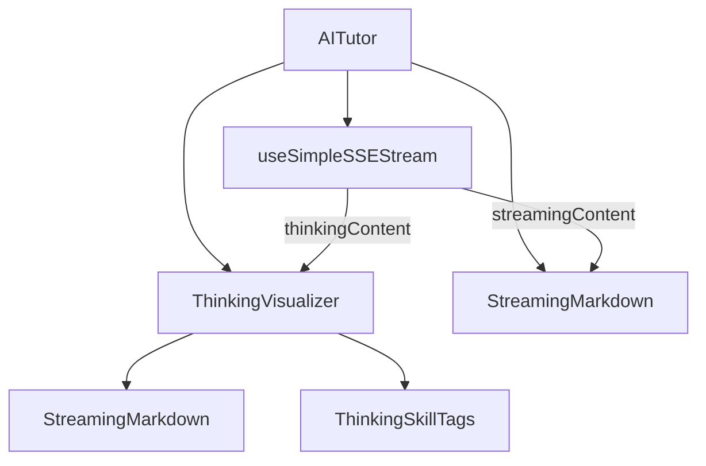

## 用户需求

为 MeetMind 教育产品实现类似腾讯元宝的 AI 思考过程展示功能，但需要加入教育产品特色，做成"思维可视化"效果。

## 产品概述

在 AI 家教回答问题时，展示 AI 的思考过程，让学生不仅看到答案，还能学习 AI 的思维方式。通过结构化的思维节点和教育特色标签，帮助学生建立正确的思考习惯。

## 核心功能

1. **思考过程可视化组件**

- 可折叠面板展示思考内容
- 支持 Markdown 格式渲染（时间戳可点击跳转）
- 脉冲动画表示思考进行中
- 思考完成后显示耗时统计

2. **教育特色增强**

- 思维技能标签（信息提取、关联分析、归纳总结等）
- 思考过程中引用的时间戳可点击跳转
- 紫色渐变主题，与正式回答区分

3. **双场景支持**

- 全局对话模式：完整课堂问答
- 困惑点模式：针对特定知识点分析

4. **代码优化**

- 提取独立可复用组件 ThinkingVisualizer
- 消除 AITutor 中约 100 行重复代码

## 技术栈

- 前端框架：Next.js + React + TypeScript
- 样式方案：Tailwind CSS
- Markdown 渲染：react-markdown + remark-gfm
- 流式处理：SSE (Server-Sent Events)

## 实现方案

### 整体策略

采用「方案 A：流式思维节点」的增强版实现。核心是提取独立的 `ThinkingVisualizer` 组件，支持 Markdown 渲染和教育特色增强，同时消除 AITutor 中的代码重复。

### 关键技术决策

1. **组件提取**：将 AITutor 中两处重复的思考展示逻辑（全局模式 1035-1085 行，困惑点模式 1489-1539 行）提取为独立组件，减少约 100 行重复代码

2. **Markdown 渲染**：复用现有 `StreamingMarkdown` 组件渲染思考内容，支持时间戳点击跳转功能

3. **思维技能标签**：基于思考内容自动识别思维类型（关键词匹配），展示对应的教育标签

4. **耗时统计**：记录思考开始到结束的时间差，展示给用户

### 数据流设计

```
useSimpleSSEStream
  ├── type: 'thinking' → thinkingContent → ThinkingVisualizer
  └── type: 'content' → streamingContent → StreamingMarkdown
```

## 实现要点

### 性能考量

- ThinkingVisualizer 使用 React.memo 优化，避免不必要的重渲染
- Markdown 渲染使用 useMemo 缓存 components 配置
- 思维技能标签检测使用简单的 includes 匹配，避免正则开销

### 兼容性

- 保持现有 SSE 格式兼容，无需修改后端
- 保持现有紫色主题（violet）色调
- 保持移动端适配（isMobile 属性）

### 代码复用

- 复用 StreamingMarkdown 组件的时间戳渲染和样式
- 复用 useSimpleSSEStream Hook 的 thinking 状态管理
- 复用现有的 Tailwind 动画类（animate-pulse, loading-dots）

## 架构设计

### 组件结构



### 组件接口设计

ThinkingVisualizer 组件接收以下属性：

- content: 思考内容文本
- isThinking: 是否正在思考
- isCollapsed: 是否折叠
- onToggleCollapse: 折叠切换回调
- onTimestampClick: 时间戳点击回调
- startTime: 思考开始时间（用于计算耗时）
- isMobile: 移动端模式
- className: 自定义样式类

## 目录结构

```
src/
├── components/
│   └── ThinkingVisualizer.tsx  # [NEW] 思考过程可视化组件。实现可折叠面板、Markdown渲染、思维技能标签、耗时统计。接收 content、isThinking、isCollapsed 等属性，复用 StreamingMarkdown 进行内容渲染。
└── components/
    └── AITutor.tsx              # [MODIFY] 引入 ThinkingVisualizer 组件，替换全局模式（1035-1085行）和困惑点模式（1489-1539行）的内联代码。添加思考开始时间记录。
```

## 关键代码结构

### ThinkingVisualizer 组件接口

```typescript
interface ThinkingVisualizerProps {
  /** 思考内容 */
  content: string;
  /** 是否正在思考 */
  isThinking: boolean;
  /** 是否折叠 */
  isCollapsed: boolean;
  /** 折叠切换回调 */
  onToggleCollapse: () => void;
  /** 时间戳点击回调 */
  onTimestampClick?: (timestampMs: number) => void;
  /** 思考开始时间（用于计算耗时） */
  startTime?: number;
  /** 移动端模式 */
  isMobile?: boolean;
  /** 自定义样式类 */
  className?: string;
}
```

### 思维技能标签类型

```typescript
type ThinkingSkillType = 
  | 'analysis'    // 信息提取
  | 'connection'  // 关联分析
  | 'summary'     // 归纳总结
  | 'reasoning'   // 逻辑推理
  | 'search';     // 信息检索
```

## Agent Extensions

### Skill

- **frontend-design**
- 目的：设计 ThinkingVisualizer 组件的视觉效果，确保与项目现有的紫色渐变主题一致
- 预期结果：生成美观的思考过程展示 UI，包含动画效果和教育特色元素

- **vercel-react-best-practices**
- 目的：确保 ThinkingVisualizer 组件遵循 React 性能最佳实践
- 预期结果：组件使用 memo、useMemo 等优化，避免不必要的重渲染

### SubAgent

- **code-explorer**
- 目的：精确定位 AITutor 中需要替换的代码位置
- 预期结果：确认全局模式和困惑点模式的具体行号和上下文