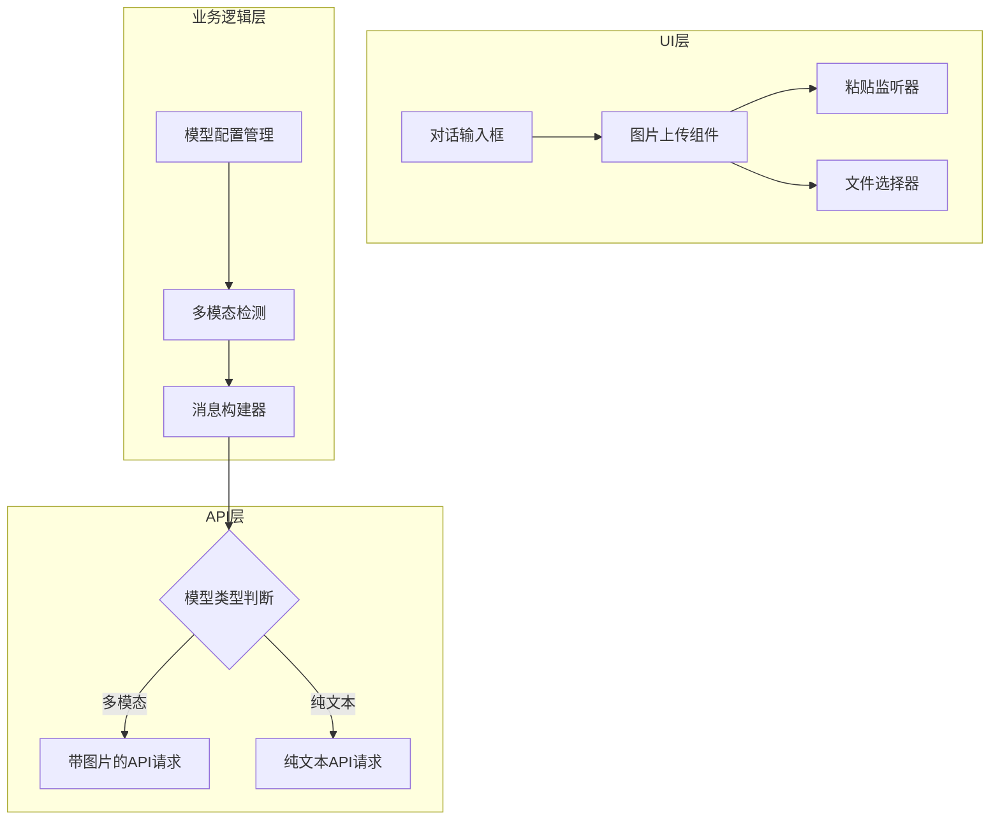

## 产品概述

更新 AI 模型列表至最新版本，并为支持多模态的模型添加图片上传功能，同时确保与现有纯文本模型的完全兼容。

## 核心功能

- 更新通义千问模型：新增 qwen3-vl-plus-2025-12-19（多模态，设为默认），保留 qwen3-max（纯文本）
- 更新 Gemini 模型：gemini-3-pro 和 gemini-3-flash（均支持多模态）
- 更新 OpenAI 模型：gpt-5.2 和 gpt-5.2-mini（均支持多模态）
- 图片上传功能：支持粘贴图片到对话框 + 点击按钮选择文件两种方式
- 兼容性保障：纯文本模型保持原有调用方式不变

## 技术方案

### 系统架构



### 模块划分

- **模型配置模块**：管理模型列表、多模态标识、默认模型设置
- **图片上传模块**：处理粘贴和文件选择两种上传方式
- **消息构建模块**：根据模型类型构建不同格式的请求消息
- **API 适配模块**：适配不同供应商的多模态 API 格式

### 数据流

用户选择模型 → 检测是否支持多模态 → 显示/隐藏图片上传按钮 → 用户输入文本/图片 → 构建请求消息 → 调用对应 API

## 实现细节

### 核心目录结构

```
src/
├── config/
│   └── models.ts          # 修改：更新模型列表配置
├── components/
│   └── ChatInput/
│       ├── index.tsx      # 修改：集成图片上传功能
│       └── ImageUpload.tsx # 新增：图片上传组件
├── services/
│   └── api/
│       └── chat.ts        # 修改：适配多模态消息格式
└── types/
    └── model.ts           # 修改：添加多模态类型定义
```

### 关键代码结构

**模型配置接口**：定义模型的基本信息和多模态支持标识

```typescript
interface ModelConfig {
  id: string;
  name: string;
  provider: 'qwen' | 'gemini' | 'openai';
  supportsMultimodal: boolean;
  isDefault?: boolean;
}
```

**多模态消息接口**：支持文本和图片混合的消息格式

```typescript
interface MultimodalMessage {
  role: 'user' | 'assistant';
  content: Array<
    | { type: 'text'; text: string }
    | { type: 'image_url'; image_url: { url: string } }
  >;
}
```

### 技术实现要点

1. **图片处理**：使用 FileReader 将图片转换为 Base64 格式
2. **粘贴监听**：监听 onPaste 事件，从 clipboardData 中提取图片
3. **条件渲染**：根据当前选中模型的 supportsMultimodal 属性决定是否显示上传按钮
4. **API 兼容**：为每个供应商维护独立的消息格式转换逻辑

## Agent Extensions

### SubAgent

- **code-explorer**
- 用途：探索现有项目结构，定位模型配置文件、聊天输入组件和 API 调用逻辑的具体位置
- 预期结果：获取需要修改的文件路径和现有代码结构，确保修改方案与项目架构一致