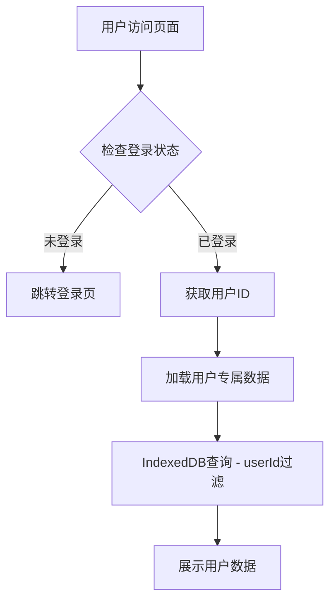

## 产品概述

为 MeetMind 应用的录音和复习功能添加用户认证限制，确保用户数据安全隔离。通过在 IndexedDB 中增加 userId 字段实现多用户数据隔离，未登录用户将被强制跳转到登录页面。

## 核心功能

- 用户认证状态检测：在录音和复习页面入口处检查用户登录状态
- 未登录强制跳转：未登录用户访问录音或复习功能时自动跳转至登录页
- 数据隔离存储：IndexedDB 数据结构增加 userId 字段，实现用户级数据隔离
- 数据查询过滤：所有录音和复习数据的查询、展示均基于当前登录用户 ID 进行过滤

## 技术栈

- 前端框架：Next.js + TypeScript
- 数据存储：IndexedDB（本地存储，增加 userId 字段）
- 认证集成：复用现有用户认证系统

## 技术架构

### 系统架构

本次修改基于现有项目架构，主要涉及数据层和路由守卫层的增强：



### 模块划分

- **认证守卫模块**：负责页面访问权限控制，检测用户登录状态
- **数据存储模块**：扩展 IndexedDB 数据结构，增加 userId 字段
- **数据访问模块**：修改数据查询逻辑，增加 userId 过滤条件

### 数据流

1. 用户访问录音/复习页面
2. 认证守卫检查登录状态
3. 未登录则重定向至登录页
4. 已登录则获取当前用户 ID
5. 使用 userId 过滤查询 IndexedDB 数据
6. 展示当前用户的专属数据

## 实现细节

### 核心目录结构

仅展示本次修改涉及的文件：

```
project-root/
├── src/
│   ├── components/
│   │   └── AuthGuard.tsx          # 新增：认证守卫组件
│   ├── hooks/
│   │   └── useAuthGuard.ts        # 新增：认证守卫 Hook
│   ├── lib/
│   │   └── indexedDB.ts           # 修改：增加 userId 字段支持
│   └── app/
│       ├── record/
│       │   └── page.tsx           # 修改：添加认证守卫
│       └── review/
│           └── page.tsx           # 修改：添加认证守卫
```

### 关键代码结构

**扩展后的录音数据接口**：在现有数据结构基础上增加 userId 字段，用于标识数据所属用户。

```typescript
interface Recording {
  id: string;
  userId: string;      // 新增：用户ID
  title: string;
  audioBlob: Blob;
  createdAt: Date;
  // ... 其他现有字段
}
```

**认证守卫 Hook**：封装登录状态检测和页面跳转逻辑，供受保护页面复用。

```typescript
function useAuthGuard(): { isAuthenticated: boolean; isLoading: boolean } {
  // 检查用户登录状态
  // 未登录时自动跳转至登录页
}
```

**数据查询函数修改**：所有查询方法增加 userId 参数，确保数据隔离。

```typescript
async function getRecordings(userId: string): Promise<Recording[]> {
  // 基于 userId 过滤查询
}
```

### 技术实现计划

1. **认证状态检测**

- 问题：需要在页面加载时判断用户是否已登录
- 方案：创建 useAuthGuard Hook，结合现有认证系统获取用户状态
- 步骤：读取认证状态 → 未登录则 router.push('/login') → 已登录则返回用户信息

2. **IndexedDB 数据结构升级**

- 问题：现有数据无 userId 字段
- 方案：修改数据存储逻辑，新数据自动关联当前用户 ID
- 步骤：修改数据接口 → 更新存储方法 → 更新查询方法增加过滤

3. **页面级权限控制**

- 问题：录音和复习页面需要登录才能访问
- 方案：在页面组件中集成 AuthGuard，加载时执行权限检查
- 步骤：包装页面组件 → 加载时检查 → 未通过则跳转

## Agent Extensions

### SubAgent

- **code-explorer**
- 用途：探索现有项目的认证系统实现、IndexedDB 数据结构和录音/复习页面代码
- 预期结果：获取现有认证逻辑、数据存储结构和页面组件的具体实现细节，为修改提供准确依据