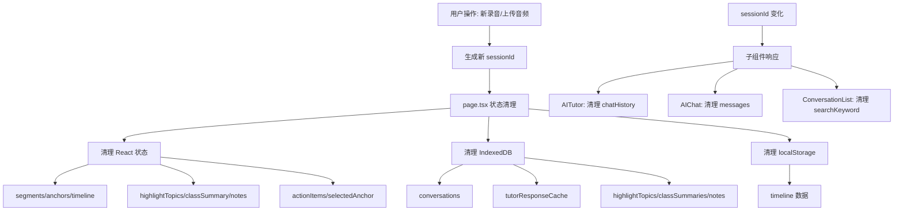

## 产品概述

全面修复 MeetMind 课堂复习应用中的状态管理和用户体验自洽性问题，确保在会话切换、数据清理、组件状态同步等场景下用户体验保持一致。

## 核心功能

1. **会话切换状态清理** - 当用户开始新录音或上传新音频时，确保旧会话的所有状态数据被正确清理
2. **AI 家教组件状态同步** - 确保 AITutor 组件的 chatHistory 在 sessionId 变化时正确重置
3. **历史对话模式清理** - 在 viewMode 切换时清理 showConversationHistory 和 selectedHistoryConversation 状态
4. **搜索状态清理** - ConversationList 组件的搜索状态在 sessionId 变化时重置
5. **AIChat 组件 sessionId 监听** - 增加对 sessionId 变化的监听以清理本地对话状态
6. **IndexedDB 数据清理完善** - 完善 clearSessionData 方法，清理 IndexedDB 中的 conversations、tutorResponseCache、highlightTopics、classSummaries、notes 等数据
7. **localStorage 数据清理** - 为 memoryService 添加 delete 方法以清理 timeline 数据
8. **缓存键冲突修复** - 修复 TutorResponseCache 以 sessionId+anchorId 作为复合键避免跨会话冲突

## 技术栈

- 前端框架：Next.js + React + TypeScript
- 状态管理：React useState/useEffect Hooks
- 数据存储：IndexedDB (Dexie.js) + localStorage
- 样式：Tailwind CSS

## 技术架构

### 系统架构

项目采用分层架构，涉及修改的核心层次：

- **展示层**：page.tsx、AITutor.tsx、AIChat.tsx、ConversationList.tsx
- **服务层**：classroom-data-service.ts、memory-service.ts
- **数据层**：db.ts (IndexedDB 操作)

### 数据流



### 模块修改

#### 1. page.tsx 状态清理增强

- `handleRecordingStart` 函数增加完整状态清理
- `viewMode` 切换时清理历史对话状态

#### 2. AITutor.tsx sessionId 响应

- 监听 sessionId 变化并清理 chatHistory
- 修复 TutorResponseCache 缓存键策略

#### 3. AIChat.tsx sessionId 监听

- 添加 useEffect 监听 sessionId 变化
- sessionId 变化时清理 messages 和 conversation 状态

#### 4. ConversationList.tsx 搜索状态清理

- 监听 sessionId 变化清理 searchKeyword 和 searchResults

#### 5. classroom-data-service.ts clearSessionData 完善

- 增加 IndexedDB 表的清理逻辑

#### 6. memory-service.ts delete 方法

- 添加 delete 方法清理 localStorage 中的 timeline

#### 7. db.ts TutorResponseCache 键策略

- 修改索引策略，使用 sessionId+anchorId 复合键

## 实现详情

### 核心目录结构

```
src/
├── app/
│   └── page.tsx              # 修改: handleRecordingStart、viewMode 切换逻辑
├── components/
│   ├── AITutor.tsx           # 修改: 添加 sessionId 监听
│   ├── AIChat.tsx            # 修改: 添加 sessionId 监听
│   └── ConversationHistory/
│       └── ConversationList.tsx  # 修改: 添加 sessionId 监听
└── lib/
    ├── db.ts                 # 修改: TutorResponseCache 索引策略
    └── services/
        ├── classroom-data-service.ts  # 修改: clearSessionData 完善
        └── memory-service.ts          # 修改: 添加 delete 方法
```

### 关键代码结构

**handleRecordingStart 状态清理增强**

```typescript
const handleRecordingStart = useCallback((newSessionId: string) => {
  // 原有清理
  setSessionId(newSessionId);
  setIsRecording(true);
  setSegments([]);
  setAnchors([]);
  setAudioUrl(null);
  
  // 新增清理项
  setHighlightTopics([]);
  setClassSummary(null);
  setNotes([]);
  setActionItems([]);
  setTimeline(null);
  setSelectedAnchor(null);
  setShowConversationHistory(false);
  setSelectedHistoryConversation(null);
  
  // ...
}, [studentId]);
```

**AITutor sessionId 监听**

```typescript
// 监听 sessionId 变化清理状态
useEffect(() => {
  setChatHistory([]);
  setResponse(null);
  setConversationId(undefined);
  setIsFromCache(false);
  previousBreakpointId.current = null;
}, [sessionId]);
```

**classroomDataService.clearSessionData 完善**

```typescript
async clearSessionData(sessionId: string): Promise<void> {
  // 原有清理...
  
  // 新增 IndexedDB 清理
  await db.conversationHistory.where('sessionId').equals(sessionId).delete();
  await db.conversationMessages.where('conversationId').anyOf(conversationIds).delete();
  await db.tutorResponseCache.where('sessionId').equals(sessionId).delete();
  await db.highlightTopics.where('sessionId').equals(sessionId).delete();
  await db.classSummaries.where('sessionId').equals(sessionId).delete();
  await db.notes.where('sessionId').equals(sessionId).delete();
}
```

**memoryService.delete 方法**

```typescript
delete(lessonId: string): void {
  if (typeof window === 'undefined') return;
  localStorage.removeItem(`meetmind_timeline_${lessonId}`);
}
```

### 技术实现方案

#### 问题1: handleRecordingStart 状态清理不完整

- **问题**: 只清理了 segments、anchors、audioUrl，缺少其他状态
- **方案**: 在 handleRecordingStart 中添加完整的状态重置逻辑

#### 问题2: AITutor chatHistory 未随 sessionId 清理

- **问题**: chatHistory 只在 breakpoint 为 null 时清理
- **方案**: 添加独立的 useEffect 监听 sessionId 变化

#### 问题3: viewMode 切换时历史对话状态未清理

- **问题**: 切换录音/复习模式时 showConversationHistory 状态保留
- **方案**: 在 setViewMode 调用处增加状态清理

#### 问题4: ConversationList 搜索状态未随 sessionId 清理

- **问题**: sessionId 变化后搜索状态保留
- **方案**: 添加 useEffect 监听 sessionId 并重置搜索状态

#### 问题5: AIChat 组件未监听 sessionId 变化

- **问题**: sessionId 变化时对话状态未重置
- **方案**: 添加 useEffect 监听 sessionId 清理 messages

#### 问题6: clearSessionData 不完整

- **问题**: 未清理 IndexedDB 中多个表的数据
- **方案**: 完善 clearSessionData 方法增加 IndexedDB 清理

#### 问题7: memoryService 缺少 delete 方法

- **问题**: localStorage 中的 timeline 无法删除
- **方案**: 添加 delete 方法

#### 问题8: TutorResponseCache 缓存键冲突

- **问题**: 不同 session 相同 anchorId 格式会覆盖
- **方案**: 使用 sessionId+anchorId 复合索引

### 测试策略

1. 手动测试: 上传新音频后验证旧会话数据是否清理
2. 手动测试: 切换 viewMode 验证历史对话状态
3. 手动测试: sessionId 变化后验证各组件状态重置

## Agent Extensions

### SubAgent

- **code-explorer**
- Purpose: 在修改前深入探索相关代码的调用链和依赖关系
- Expected outcome: 确保修改不会影响其他功能模块